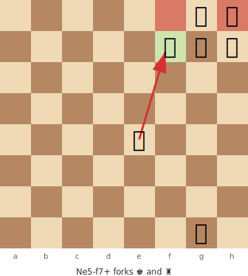
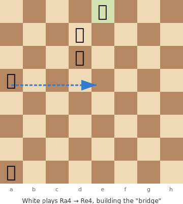

# Chess Diagram Format Comparison

## SVG Diagram — Fork Example

**White to play: Nf7+ forks king and rook**



> **FEN:** `6kr/5ppp/8/8/4N3/8/8/6K1 w - - 0 1`

---

## SVG Diagram — Lucena Position (Endgame)

**The Lucena Position — White wins with the "bridge" technique**



> **FEN:** `4K3/3P4/3k4/R7/8/8/8/r7 w - - 0 1`

---

## For comparison — the old ASCII format

```
  a b c d e f g h
8 · · · · · · ♚ ·  8
7 · · · · · ♟ ♟ ♟  7
6 · · · · · · · ·  6
5 · · · · ♘ · · ·  5
4 · · · · · · · ·  4
3 · · · · · · · ·  3
2 · · · · · · · ·  2
1 · · · · · · ♔ ·  1
  a b c d e f g h
```

The SVG version gives us: colored squares, highlighted targets (red), move destination (green), arrows showing the move, and a caption — all rendering natively in GitHub/VS Code markdown preview.
