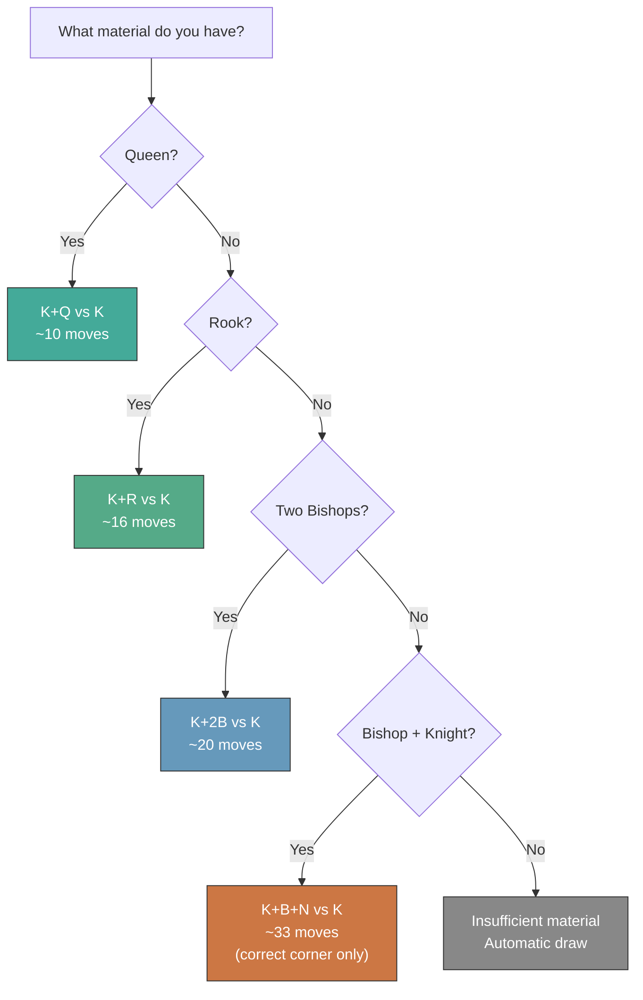
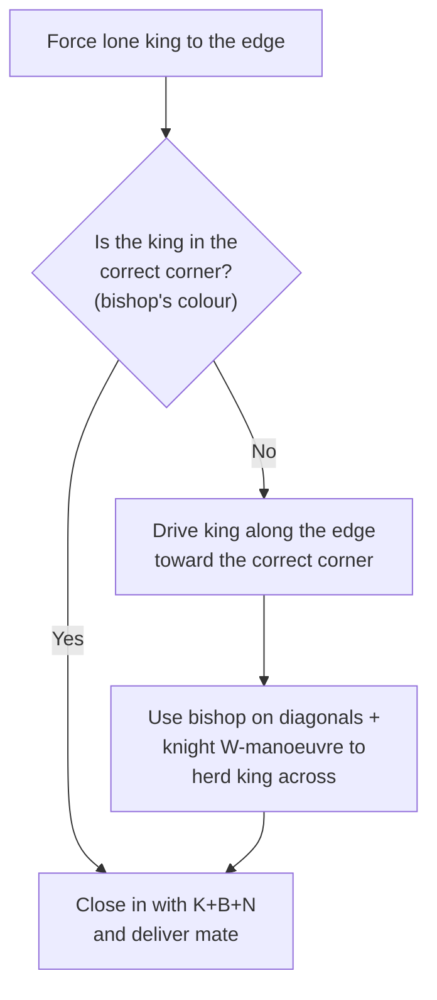

# Basic Checkmates

Every chess player must know how to deliver checkmate with basic material advantages. These are fundamental skills — failing to convert these positions means throwing away full points.

**See also:** [Tactics — Mating Patterns](../tactics/mating-patterns.md) | [Fundamentals — Piece Values](../fundamentals/piece-values.md)



---

## King + Queen vs King

The easiest basic mate. Should take **10 moves or fewer** from any position.

### Method

1. **Restrict the lone king** with the queen, pushing it toward the edge
2. **Bring your king closer** to support the queen
3. **Deliver checkmate** on the edge of the board

### Key Warning: Stalemate!

When the lone king is near the edge, be careful not to take away all its squares. Always leave a retreat square until you're ready to mate.

```
Correct: Qe7 (restricts king but leaves f8), then bring king closer.
Mistake: Qf7?? — stalemate if king is on h8 with no moves!
```

**K+Q vs K — Checkmate on the edge**

<svg viewBox="0 0 390 400" xmlns="http://www.w3.org/2000/svg" style="max-width:400px">
  <rect x="0" y="0" width="360" height="360" fill="#b58863"/>
  <rect x="0" y="0" width="45" height="45" fill="#f0d9b5"/><rect x="90" y="0" width="45" height="45" fill="#f0d9b5"/><rect x="180" y="0" width="45" height="45" fill="#f0d9b5"/><rect x="270" y="0" width="45" height="45" fill="#f0d9b5"/>
  <rect x="45" y="45" width="45" height="45" fill="#f0d9b5"/><rect x="135" y="45" width="45" height="45" fill="#f0d9b5"/><rect x="225" y="45" width="45" height="45" fill="#f0d9b5"/><rect x="315" y="45" width="45" height="45" fill="#f0d9b5"/>
  <rect x="0" y="90" width="45" height="45" fill="#f0d9b5"/><rect x="90" y="90" width="45" height="45" fill="#f0d9b5"/><rect x="180" y="90" width="45" height="45" fill="#f0d9b5"/><rect x="270" y="90" width="45" height="45" fill="#f0d9b5"/>
  <rect x="45" y="135" width="45" height="45" fill="#f0d9b5"/><rect x="135" y="135" width="45" height="45" fill="#f0d9b5"/><rect x="225" y="135" width="45" height="45" fill="#f0d9b5"/><rect x="315" y="135" width="45" height="45" fill="#f0d9b5"/>
  <rect x="0" y="180" width="45" height="45" fill="#f0d9b5"/><rect x="90" y="180" width="45" height="45" fill="#f0d9b5"/><rect x="180" y="180" width="45" height="45" fill="#f0d9b5"/><rect x="270" y="180" width="45" height="45" fill="#f0d9b5"/>
  <rect x="45" y="225" width="45" height="45" fill="#f0d9b5"/><rect x="135" y="225" width="45" height="45" fill="#f0d9b5"/><rect x="225" y="225" width="45" height="45" fill="#f0d9b5"/><rect x="315" y="225" width="45" height="45" fill="#f0d9b5"/>
  <rect x="0" y="270" width="45" height="45" fill="#f0d9b5"/><rect x="90" y="270" width="45" height="45" fill="#f0d9b5"/><rect x="180" y="270" width="45" height="45" fill="#f0d9b5"/><rect x="270" y="270" width="45" height="45" fill="#f0d9b5"/>
  <rect x="45" y="315" width="45" height="45" fill="#f0d9b5"/><rect x="135" y="315" width="45" height="45" fill="#f0d9b5"/><rect x="225" y="315" width="45" height="45" fill="#f0d9b5"/><rect x="315" y="315" width="45" height="45" fill="#f0d9b5"/>
  <!-- Pieces -->
  <text x="292" y="33" font-size="30" text-anchor="middle" font-family="sans-serif">♚</text>
  <text x="247" y="78" font-size="30" text-anchor="middle" font-family="sans-serif">♕</text>
  <text x="292" y="123" font-size="30" text-anchor="middle" font-family="sans-serif">♔</text>
  <!-- Coordinates -->
  <text x="22" y="375" font-size="11" fill="#666" text-anchor="middle" font-family="sans-serif">a</text>
  <text x="67" y="375" font-size="11" fill="#666" text-anchor="middle" font-family="sans-serif">b</text>
  <text x="112" y="375" font-size="11" fill="#666" text-anchor="middle" font-family="sans-serif">c</text>
  <text x="157" y="375" font-size="11" fill="#666" text-anchor="middle" font-family="sans-serif">d</text>
  <text x="202" y="375" font-size="11" fill="#666" text-anchor="middle" font-family="sans-serif">e</text>
  <text x="247" y="375" font-size="11" fill="#666" text-anchor="middle" font-family="sans-serif">f</text>
  <text x="292" y="375" font-size="11" fill="#666" text-anchor="middle" font-family="sans-serif">g</text>
  <text x="337" y="375" font-size="11" fill="#666" text-anchor="middle" font-family="sans-serif">h</text>
  <text x="370" y="33" font-size="11" fill="#666" font-family="sans-serif">8</text>
  <text x="370" y="78" font-size="11" fill="#666" font-family="sans-serif">7</text>
  <text x="370" y="123" font-size="11" fill="#666" font-family="sans-serif">6</text>
  <text x="370" y="168" font-size="11" fill="#666" font-family="sans-serif">5</text>
  <text x="370" y="213" font-size="11" fill="#666" font-family="sans-serif">4</text>
  <text x="370" y="258" font-size="11" fill="#666" font-family="sans-serif">3</text>
  <text x="370" y="303" font-size="11" fill="#666" font-family="sans-serif">2</text>
  <text x="370" y="348" font-size="11" fill="#666" font-family="sans-serif">1</text>
</svg>

> **FEN:** `6k1/5Q2/6K1/8/8/8/8/8 w - - 0 1`

White plays **1.Qg7#**. The queen delivers mate on the 8th rank with the king supporting from g6.

---

## King + Rook vs King

More challenging than K+Q. Should take up to **15–16 moves** from any position.

### Method

1. **Cut off the king** along a rank or file with the rook
2. **Bring your king closer**, maintaining the restriction
3. **Keep "opposition"** to force the defending king back
4. **Deliver checkmate on the edge**

### Key Pattern

The rook checks along the edge when the defending king is on the last rank and the attacking king controls the escape squares.

**K+R vs K — Checkmate on the back rank**

<svg viewBox="0 0 390 400" xmlns="http://www.w3.org/2000/svg" style="max-width:400px">
  <rect x="0" y="0" width="360" height="360" fill="#b58863"/>
  <rect x="0" y="0" width="45" height="45" fill="#f0d9b5"/><rect x="90" y="0" width="45" height="45" fill="#f0d9b5"/><rect x="180" y="0" width="45" height="45" fill="#f0d9b5"/><rect x="270" y="0" width="45" height="45" fill="#f0d9b5"/>
  <rect x="45" y="45" width="45" height="45" fill="#f0d9b5"/><rect x="135" y="45" width="45" height="45" fill="#f0d9b5"/><rect x="225" y="45" width="45" height="45" fill="#f0d9b5"/><rect x="315" y="45" width="45" height="45" fill="#f0d9b5"/>
  <rect x="0" y="90" width="45" height="45" fill="#f0d9b5"/><rect x="90" y="90" width="45" height="45" fill="#f0d9b5"/><rect x="180" y="90" width="45" height="45" fill="#f0d9b5"/><rect x="270" y="90" width="45" height="45" fill="#f0d9b5"/>
  <rect x="45" y="135" width="45" height="45" fill="#f0d9b5"/><rect x="135" y="135" width="45" height="45" fill="#f0d9b5"/><rect x="225" y="135" width="45" height="45" fill="#f0d9b5"/><rect x="315" y="135" width="45" height="45" fill="#f0d9b5"/>
  <rect x="0" y="180" width="45" height="45" fill="#f0d9b5"/><rect x="90" y="180" width="45" height="45" fill="#f0d9b5"/><rect x="180" y="180" width="45" height="45" fill="#f0d9b5"/><rect x="270" y="180" width="45" height="45" fill="#f0d9b5"/>
  <rect x="45" y="225" width="45" height="45" fill="#f0d9b5"/><rect x="135" y="225" width="45" height="45" fill="#f0d9b5"/><rect x="225" y="225" width="45" height="45" fill="#f0d9b5"/><rect x="315" y="225" width="45" height="45" fill="#f0d9b5"/>
  <rect x="0" y="270" width="45" height="45" fill="#f0d9b5"/><rect x="90" y="270" width="45" height="45" fill="#f0d9b5"/><rect x="180" y="270" width="45" height="45" fill="#f0d9b5"/><rect x="270" y="270" width="45" height="45" fill="#f0d9b5"/>
  <rect x="45" y="315" width="45" height="45" fill="#f0d9b5"/><rect x="135" y="315" width="45" height="45" fill="#f0d9b5"/><rect x="225" y="315" width="45" height="45" fill="#f0d9b5"/><rect x="315" y="315" width="45" height="45" fill="#f0d9b5"/>
  <!-- Pieces -->
  <text x="202" y="33" font-size="30" text-anchor="middle" font-family="sans-serif">♚</text>
  <text x="247" y="123" font-size="30" text-anchor="middle" font-family="sans-serif">♔</text>
  <text x="157" y="348" font-size="30" text-anchor="middle" font-family="sans-serif">♖</text>
  <!-- Coordinates -->
  <text x="22" y="375" font-size="11" fill="#666" text-anchor="middle" font-family="sans-serif">a</text>
  <text x="67" y="375" font-size="11" fill="#666" text-anchor="middle" font-family="sans-serif">b</text>
  <text x="112" y="375" font-size="11" fill="#666" text-anchor="middle" font-family="sans-serif">c</text>
  <text x="157" y="375" font-size="11" fill="#666" text-anchor="middle" font-family="sans-serif">d</text>
  <text x="202" y="375" font-size="11" fill="#666" text-anchor="middle" font-family="sans-serif">e</text>
  <text x="247" y="375" font-size="11" fill="#666" text-anchor="middle" font-family="sans-serif">f</text>
  <text x="292" y="375" font-size="11" fill="#666" text-anchor="middle" font-family="sans-serif">g</text>
  <text x="337" y="375" font-size="11" fill="#666" text-anchor="middle" font-family="sans-serif">h</text>
  <text x="370" y="33" font-size="11" fill="#666" font-family="sans-serif">8</text>
  <text x="370" y="78" font-size="11" fill="#666" font-family="sans-serif">7</text>
  <text x="370" y="123" font-size="11" fill="#666" font-family="sans-serif">6</text>
  <text x="370" y="168" font-size="11" fill="#666" font-family="sans-serif">5</text>
  <text x="370" y="213" font-size="11" fill="#666" font-family="sans-serif">4</text>
  <text x="370" y="258" font-size="11" fill="#666" font-family="sans-serif">3</text>
  <text x="370" y="303" font-size="11" fill="#666" font-family="sans-serif">2</text>
  <text x="370" y="348" font-size="11" fill="#666" font-family="sans-serif">1</text>
</svg>

> **FEN:** `4k3/8/5K2/8/8/8/8/3R4 w - - 0 1`

White plays **1.Rd8#**. The king on f6 controls e7 and f7; the rook mates along the 8th rank.

---

## King + Two Bishops vs King

Force the lone king to a corner. Under **20 moves**.

### Method

1. **Centralise** your bishops and king
2. **Create a diagonal barrier** that pushes the enemy king toward a corner
3. The bishops form a wall on adjacent diagonals; advance it step by step
4. **Deliver checkmate in the corner**

### Key Principle

The bishops must work together, controlling adjacent diagonals. The king assists by controlling squares the bishops don't.

**K+2B vs K — Checkmate in the corner**

<svg viewBox="0 0 390 400" xmlns="http://www.w3.org/2000/svg" style="max-width:400px">
  <rect x="0" y="0" width="360" height="360" fill="#b58863"/>
  <rect x="0" y="0" width="45" height="45" fill="#f0d9b5"/><rect x="90" y="0" width="45" height="45" fill="#f0d9b5"/><rect x="180" y="0" width="45" height="45" fill="#f0d9b5"/><rect x="270" y="0" width="45" height="45" fill="#f0d9b5"/>
  <rect x="45" y="45" width="45" height="45" fill="#f0d9b5"/><rect x="135" y="45" width="45" height="45" fill="#f0d9b5"/><rect x="225" y="45" width="45" height="45" fill="#f0d9b5"/><rect x="315" y="45" width="45" height="45" fill="#f0d9b5"/>
  <rect x="0" y="90" width="45" height="45" fill="#f0d9b5"/><rect x="90" y="90" width="45" height="45" fill="#f0d9b5"/><rect x="180" y="90" width="45" height="45" fill="#f0d9b5"/><rect x="270" y="90" width="45" height="45" fill="#f0d9b5"/>
  <rect x="45" y="135" width="45" height="45" fill="#f0d9b5"/><rect x="135" y="135" width="45" height="45" fill="#f0d9b5"/><rect x="225" y="135" width="45" height="45" fill="#f0d9b5"/><rect x="315" y="135" width="45" height="45" fill="#f0d9b5"/>
  <rect x="0" y="180" width="45" height="45" fill="#f0d9b5"/><rect x="90" y="180" width="45" height="45" fill="#f0d9b5"/><rect x="180" y="180" width="45" height="45" fill="#f0d9b5"/><rect x="270" y="180" width="45" height="45" fill="#f0d9b5"/>
  <rect x="45" y="225" width="45" height="45" fill="#f0d9b5"/><rect x="135" y="225" width="45" height="45" fill="#f0d9b5"/><rect x="225" y="225" width="45" height="45" fill="#f0d9b5"/><rect x="315" y="225" width="45" height="45" fill="#f0d9b5"/>
  <rect x="0" y="270" width="45" height="45" fill="#f0d9b5"/><rect x="90" y="270" width="45" height="45" fill="#f0d9b5"/><rect x="180" y="270" width="45" height="45" fill="#f0d9b5"/><rect x="270" y="270" width="45" height="45" fill="#f0d9b5"/>
  <rect x="45" y="315" width="45" height="45" fill="#f0d9b5"/><rect x="135" y="315" width="45" height="45" fill="#f0d9b5"/><rect x="225" y="315" width="45" height="45" fill="#f0d9b5"/><rect x="315" y="315" width="45" height="45" fill="#f0d9b5"/>
  <!-- Pieces -->
  <text x="22" y="33" font-size="30" text-anchor="middle" font-family="sans-serif">♚</text>
  <text x="22" y="78" font-size="30" text-anchor="middle" font-family="sans-serif">♗</text>
  <text x="67" y="78" font-size="30" text-anchor="middle" font-family="sans-serif">♗</text>
  <text x="112" y="123" font-size="30" text-anchor="middle" font-family="sans-serif">♔</text>
  <!-- Coordinates -->
  <text x="22" y="375" font-size="11" fill="#666" text-anchor="middle" font-family="sans-serif">a</text>
  <text x="67" y="375" font-size="11" fill="#666" text-anchor="middle" font-family="sans-serif">b</text>
  <text x="112" y="375" font-size="11" fill="#666" text-anchor="middle" font-family="sans-serif">c</text>
  <text x="157" y="375" font-size="11" fill="#666" text-anchor="middle" font-family="sans-serif">d</text>
  <text x="202" y="375" font-size="11" fill="#666" text-anchor="middle" font-family="sans-serif">e</text>
  <text x="247" y="375" font-size="11" fill="#666" text-anchor="middle" font-family="sans-serif">f</text>
  <text x="292" y="375" font-size="11" fill="#666" text-anchor="middle" font-family="sans-serif">g</text>
  <text x="337" y="375" font-size="11" fill="#666" text-anchor="middle" font-family="sans-serif">h</text>
  <text x="370" y="33" font-size="11" fill="#666" font-family="sans-serif">8</text>
  <text x="370" y="78" font-size="11" fill="#666" font-family="sans-serif">7</text>
  <text x="370" y="123" font-size="11" fill="#666" font-family="sans-serif">6</text>
  <text x="370" y="168" font-size="11" fill="#666" font-family="sans-serif">5</text>
  <text x="370" y="213" font-size="11" fill="#666" font-family="sans-serif">4</text>
  <text x="370" y="258" font-size="11" fill="#666" font-family="sans-serif">3</text>
  <text x="370" y="303" font-size="11" fill="#666" font-family="sans-serif">2</text>
  <text x="370" y="348" font-size="11" fill="#666" font-family="sans-serif">1</text>
</svg>

> **FEN:** `k7/BB6/2K5/8/8/8/8/8 w - - 0 1`

Checkmate. The bishop on b7 (light-squared) controls the a8-c6 diagonal, delivering check. The bishop on a7 (dark-squared) covers b8 and the a7 square. The king on a8 has no escape.

---

## King + Bishop + Knight vs King

The most difficult basic mate. Checkmate can only occur in the corner **the same colour as the bishop**.

### Method (The "W-Manoeuvre")

1. **Force the lone king to the edge**
2. If the king is in the "wrong" corner (opposite colour from bishop), **drive it to the correct corner**
3. Use the bishop to control diagonals, the knight to control key squares, the king to restrict retreat
4. The knight performs a characteristic manoeuvre to herd the king across



### Important

- Must be done within the **50-move rule** — with perfect play it takes up to 33 moves, so margin for error is thin
- This must be **studied and memorised** — it appears rarely but is essential knowledge
- Many strong players have failed this in tournaments

---

## Insufficient Mating Material

These positions are **automatic draws**:
- King vs King
- King + Bishop vs King
- King + Knight vs King
- King + Bishop vs King + Bishop (same colour bishops)

King + two knights vs King is theoretically a draw (you can't force mate), but K+2N vs K+pawn can sometimes be won — one of chess's curiosities.

---

**Next:** [King & Pawn Endings](king-pawn-endings.md) | **Back to:** [Endgames Index](index.md)
