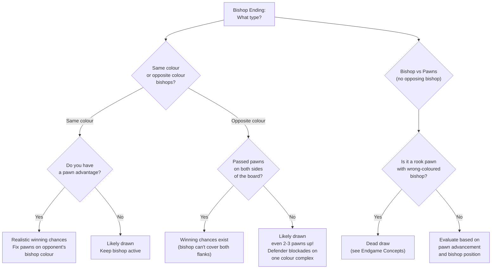

# Bishop Endings

Bishop endgames have unique characteristics determined by the bishops' colour complexes. Whether the bishops are on the same or opposite colours fundamentally changes the nature of the position.

**See also:** [Middlegame — Good vs Bad Bishops](../middlegame/piece-activity.md) | [Endgame Concepts](endgame-concepts.md)

---

## Same-Coloured Bishop Endings

When both sides have bishops on the same colour, the stronger side has genuine winning chances because the bishop can contest the opponent's bishop.

### Key Principles

1. **Active bishop** — place it on the longest diagonal, targeting weak pawns
2. **Fix pawns on the opponent's bishop colour** — this restricts their bishop
3. With a pawn advantage, same-coloured bishops offer realistic winning chances
4. The concept of [good vs bad bishop](../middlegame/piece-activity.md) is especially important here

---

## Opposite-Coloured Bishop Endings

The most drawish material configuration in chess. **Even two or three extra pawns may not be enough to win.**

### Why They Draw

- The defending bishop controls squares the attacking bishop **cannot**
- The defender creates an impenetrable blockade on their bishop's colour
- The attacker cannot contest the blockade

### Drawing Technique

Place pawns and bishop to create a "fortress" on one colour complex. The opponent's extra pawns become irrelevant if permanently blockaded.

### When Opposite-Coloured Bishops WIN

If the stronger side has passed pawns on **both sides** of the board. A single bishop cannot cover both flanks — two widely separated passed pawns usually win.

### In the Middlegame

Opposite-coloured bishops **favour the attacker** — the attacking bishop controls squares the defensive bishop cannot, effectively creating an extra attacking piece. See [Attacking the King](../middlegame/attacking-the-king.md).

---

## Bishop vs Pawns

- **Bishop vs one pawn:** Usually drawn unless the pawn is very advanced and the bishop is far away or on the wrong colour
- **Bishop vs two connected pawns:** Depends on advancement — two pawns on the 6th rank usually beat a lone bishop
- A bishop cannot stop a rook pawn if it **doesn't control the promotion square** — see [Endgame Concepts — Wrong Bishop](endgame-concepts.md)

---

**Next:** [Knight Endings](knight-endings.md) | **Back to:** [Endgames Index](index.md)
