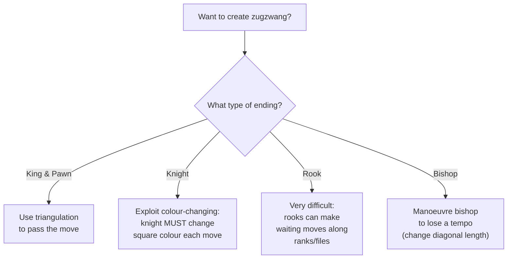
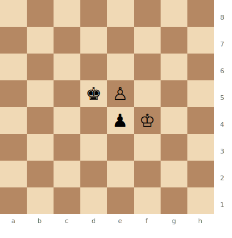
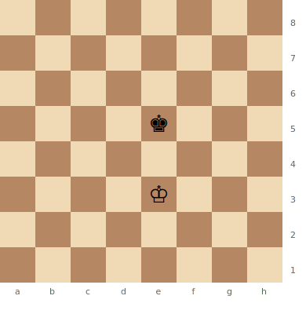
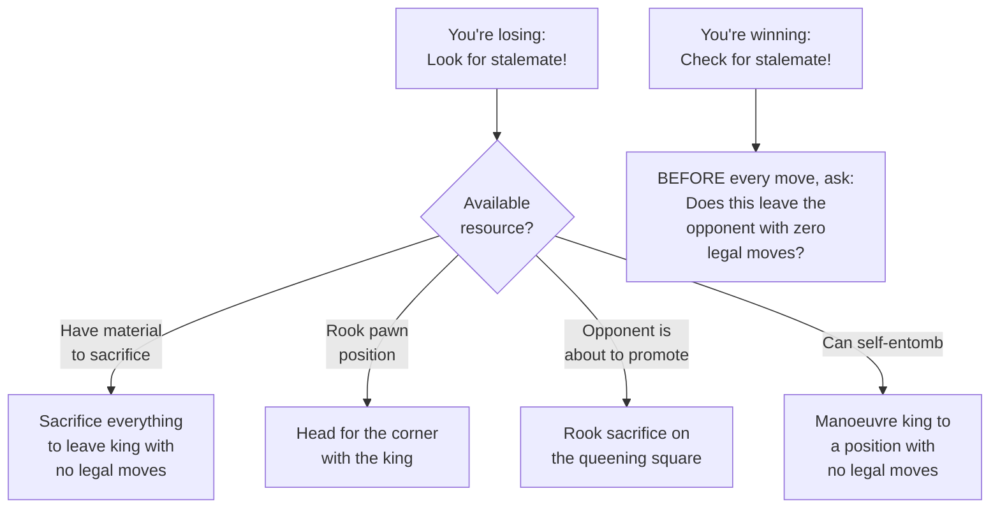
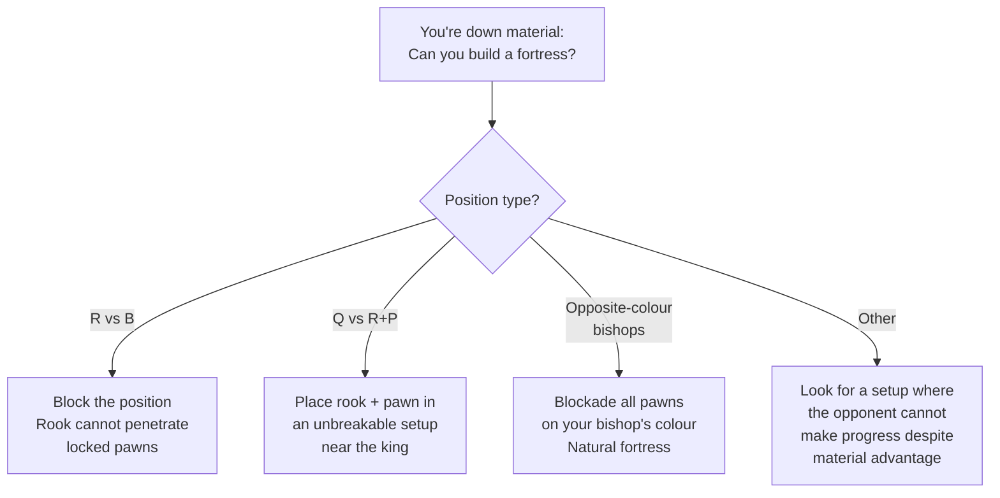
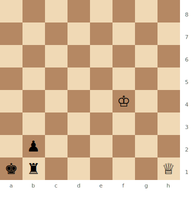
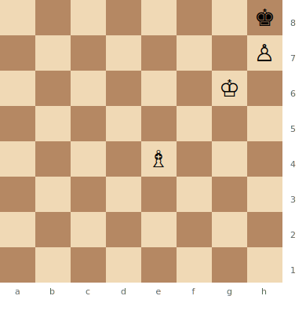

# Endgame Concepts

Key concepts that apply across all endgame types.

**See also:** [King & Pawn Endings](king-pawn-endings.md) | [Rook Endings](rook-endings.md) | [Fundamentals](../fundamentals/index.md)

---

## Zugzwang

**Zugzwang** (German: "compulsion to move") — a situation where **any move worsens** the player's position. They would prefer to pass, but passing isn't allowed.

### Types

- **Full zugzwang (mutual/reciprocal):** Whoever is to move **loses** (also called **trébuchet** in pawn endings)
- **One-sided zugzwang:** Only one side suffers; the other benefits

### Where It Occurs

| Frequency | Endgame Type |
|-----------|-------------|
| Extremely common | [King and pawn endings](king-pawn-endings.md) |
| Common | [Knight endings](knight-endings.md) (knights always change colour) |
| Rare | [Rook endings](rook-endings.md) (rooks can make waiting moves) |
| Very rare | Middlegames (famous example: Sämisch vs Nimzowitsch, 1923) |

**Zugzwang — Whoever moves loses (trébuchet)**

> **FEN:** `8/8/8/3kP3/4pK2/8/8/8 w - - 0 1`

This is a classic **trébuchet** (mutual zugzwang). If White moves, Kf3/Kg3 allows ...Kxe5 and Black wins. If Black moves, Kc4/Ke4 allows Kxe4 and White wins. Whoever has to move loses.

### Creating Zugzwang

Use **triangulation** (in king endings) or manoeuvring to "pass the move" to the opponent. See [King & Pawn Endings — Triangulation](king-pawn-endings.md).

---

## Corresponding Squares

An advanced concept extending [opposition](king-pawn-endings.md) to complex positions.

**Definition:** Two squares are corresponding if, when one king occupies one square, the other king must occupy the other square to maintain the position.

### Method

1. Identify the critical "entry points" the attacking king wants to reach
2. Determine which squares the defending king must occupy to prevent this
3. Number or label these pairs
4. Analyse whether the defender can always reach the corresponding square

Opposition is the simplest case (one pair). Complex positions may involve 5–6+ pairs.

**Direct opposition — White holds the draw**

> **FEN:** `8/8/8/4k3/8/4K3/8/8 w - - 0 1`

The kings are in direct opposition (same file, one square apart). With Black to move, Black must step aside (Kd5, Kf5, Kd4, etc.) and White mirrors to maintain opposition. This is the most basic defensive technique in king and pawn endings.

---

## Stalemate Tricks

Stalemate is the primary drawing resource for the weaker side.

### Common Tricks

1. **Sacrifice all remaining material** to create stalemate
2. **King in the corner** — especially with rook pawns
3. **Rook sacrifice on the queening square** — after the opponent promotes, stalemate results
4. **Deliberate self-entombment** — manoeuvre the king to a position with no legal moves

### Practical Advice

When winning, **always check for stalemate** before making your move. When losing, **always look for stalemate** as a saving resource.

---

## Fortress

A position where the weaker side creates an impregnable defensive configuration that the stronger side cannot breach, despite a material advantage.

### Classic Examples

- **Rook vs bishop (blocked position):** The rook cannot penetrate
- **Queen vs rook + well-placed pawn:** The rook + pawn create an unbreakable setup
- **Opposite-coloured bishops:** A natural fortress on one colour complex — see [Bishop Endings](bishop-endings.md)

**Principle:** Fortresses work because the stronger side **cannot make progress**. Material advantage becomes meaningless due to positional factors.

**Fortress — Queen vs Rook + pawn (drawn)**

> **FEN:** `8/8/8/8/5K2/8/1p6/kr5Q w - - 0 1`

Despite White's queen and well-placed king, this is a fortress. The Black king sits on a1, the rook on b1, and the pawn on b2 creates an unbreakable shelter. The queen cannot penetrate — if it checks, the rook interposes on b1. The rook and pawn defend each other, and White cannot make progress.

---

## Wrong-Coloured Bishop + Rook Pawn

One of the most important drawn positions to know:

### The Position

The stronger side has a bishop and a rook pawn (a-pawn or h-pawn), but the bishop **does NOT control the promotion square**.

**Wrong-coloured bishop — Dead draw**

> **FEN:** `7k/7P/6K1/8/4B3/8/8/8 w - - 0 1`

White has a light-squared bishop (on e4) and an h-pawn, but the h8 promotion square is **dark**. The bishop can never control it. Black's king simply stays on h8 and cannot be evicted.

**This is a dead draw** regardless of where the pieces start, as long as the defending king reaches the corner.

### Practical Implication

In the middlegame, when considering pawn structure and bishop trades, you must be aware that your remaining bishop may be the "wrong" colour for your remaining pawns.

---

## Pawn Races and Calculation

When both sides have passed pawns racing to promote:

### Tools

1. **Count the moves** each pawn needs to promote
2. **[Rule of the square](king-pawn-endings.md)** — can the king intervene?
3. **Promotion with check** — gaining a critical tempo
4. **Intermediate moves** — checks, captures, or threats that gain time

### Critical Factors

- Who promotes **first** — even one tempo is usually decisive
- **Promotion with check** gains a critical tempo
- **Sacrifices to deflect the king** out of the "square" may be decisive

---

**Back to:** [Endgames Index](index.md)
