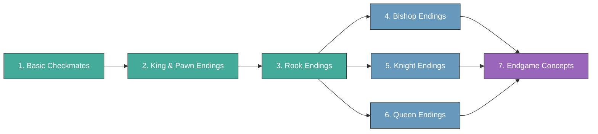

# Chess Endgames

Endgame knowledge is the foundation of strong chess. Unlike openings (which change with fashion) and middlegames (which are infinitely varied), endgame principles are **permanent and universal**. Learning endgames improves every phase of your game.

## Topics

- [Basic Checkmates](basic-checkmates.md) — K+Q, K+R, K+2B, K+B+N vs lone king
- [King & Pawn Endings](king-pawn-endings.md) — opposition, key squares, triangulation, breakthrough
- [Rook Endings](rook-endings.md) — Lucena, Philidor, Tarrasch's rule, active rook
- [Bishop Endings](bishop-endings.md) — same-colour, opposite-colour, fortresses
- [Knight Endings](knight-endings.md) — knight vs pawns, zugzwang
- [Queen Endings](queen-endings.md) — queen vs pawn, queen vs rook
- [Endgame Concepts](endgame-concepts.md) — zugzwang, corresponding squares, stalemate, fortress

---

**Study priority:** Basic checkmates first, then king & pawn endings, then rook endings (the most common type). Bishop, knight, and queen endings come later.

**See also:** [Fundamentals — How to Study](../fundamentals/how-to-study.md) | [Famous Games — Carlsen's Endgames](../famous-games/carlsen-endgames.md)
