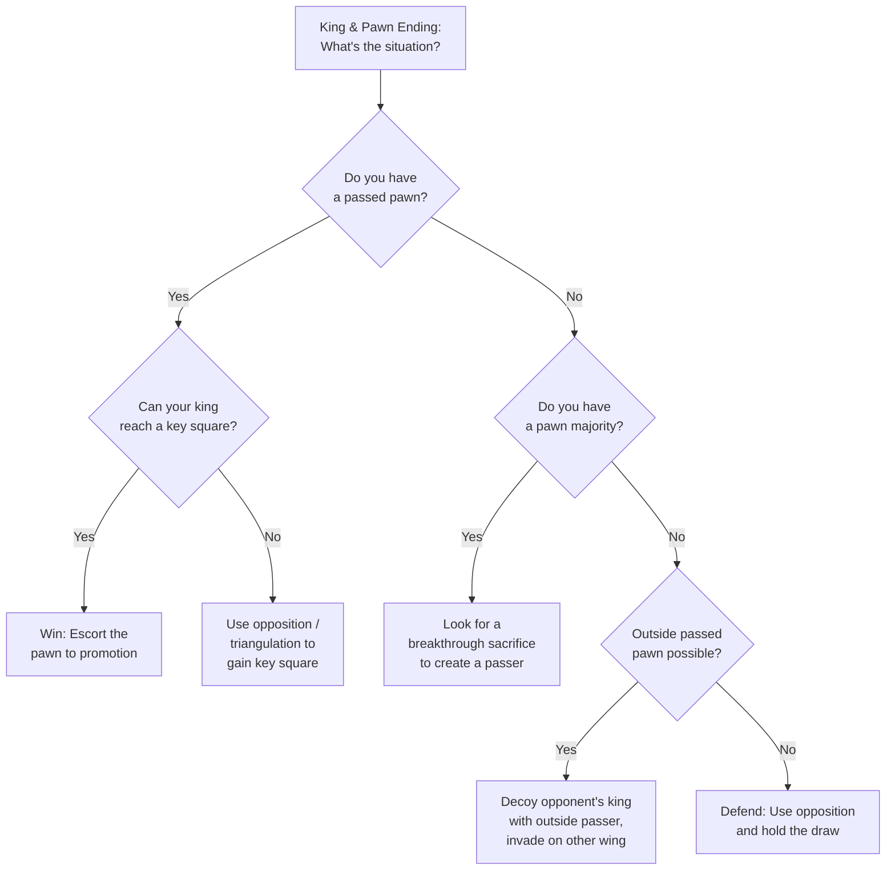

# King & Pawn Endings

King and pawn endgames are the foundation of all endgame knowledge. The principles learned here apply across every endgame type — understanding them deeply will transform your chess.

**See also:** [Endgame Concepts](endgame-concepts.md) | [Rook Endings](rook-endings.md) | [Fundamentals — Pawn Structures](../fundamentals/pawn-structure-basics.md)



---

## Opposition

The most fundamental concept. Two kings stand in **direct opposition** when they face each other on the same rank or file with exactly one square between them.

**The side NOT to move holds the opposition** — the other player must yield ground.

### Types of Opposition

| Type | Description |
|------|-------------|
| **Direct** | Same rank or file, 1 square apart (e.g., Ke4 vs Ke6) |
| **Distant** | Same rank or file, 3 or 5 squares apart (odd number) |
| **Diagonal** | Same diagonal, 1 square apart |

### Key Example

```
White Ke5, Pd5 vs Black Ke7.
White to move: CANNOT win (Black holds opposition after 1.d6+ Kd7 2.Kd5 Kd8! — opposition).
Black to move: LOSES (1...Kd7 2.Kf6! outflanking, or 1...Kf7 2.Kd6 winning).
```

---

## Key Squares (Critical Squares)

Key squares are the squares the advancing side's king must reach to guarantee pawn promotion, regardless of the defending king's position.

| Pawn Rank | Key Squares |
|-----------|-------------|
| 2nd–4th | Three squares **two ranks ahead** of the pawn |
| 5th | Three squares one rank ahead AND three squares on the pawn's rank |
| 6th | Three squares one rank ahead |

**Principle:** If the stronger side's king occupies a key square, the pawn promotes by force.

**Exception — Rook pawns (a/h):** Rook pawns have fewer key squares and are harder to promote. The edge of the board limits manoeuvring space. See [Endgame Concepts — Wrong Bishop + Rook Pawn](endgame-concepts.md).

---

## Triangulation

A king manoeuvre using three moves to return to the same square, losing a tempo to transfer the move to the opponent.

```
White king on d5 needs to reach d5 again with Black to move.
Kd5→Kd4→Kc4→Kd5 (triangle) — now Black must move in the critical position.
```

Used to create [zugzwang](endgame-concepts.md) — the opponent is forced to make a weakening move.

---

## Rule of the Square

A quick method to determine if a king can catch a passed pawn:

1. Count the squares the pawn needs to promote
2. Draw a "square" from the pawn to the promotion square
3. If the defending king can step **inside** the square on its turn, it catches the pawn

**Remember:** A pawn on its starting rank can advance two squares on the first move, effectively shrinking the square by one rank.

---

## Outside Passed Pawn

A passed pawn far from the main action. Its value: it **decoys** the opposing king.

### Strategy

1. Advance the outside passed pawn
2. The opponent's king must chase it (kings move slowly — one square per turn)
3. Your king invades on the **other** side and captures pawns

This is often a decisive advantage in king and pawn endings.

---

## Protected Passed Pawn

A passed pawn defended by another pawn. Extremely valuable because:

1. Cannot be captured without giving up a piece
2. Ties down the opponent's king to blockade duty
3. Your king is free to operate elsewhere

### Classic Technique

Establish a protected passed pawn, then use your king on the opposite wing to win material.

---

## Breakthrough

A pawn sacrifice (or series of sacrifices) that forces creation of a passed pawn.

### Classic Example

```
White: a5, b5, c5 vs Black: a7, b7, c7.

1.b6! — and whatever Black captures, White creates an unstoppable passer:
- 1...axb6 2.c6! bxc6 3.a6 — the a-pawn promotes
- 1...cxb6 2.a6! bxa6 3.c6 — the c-pawn promotes
```

Always look for breakthrough possibilities when you have a pawn majority.

---

**Next:** [Rook Endings](rook-endings.md) | **Back to:** [Endgames Index](index.md)
