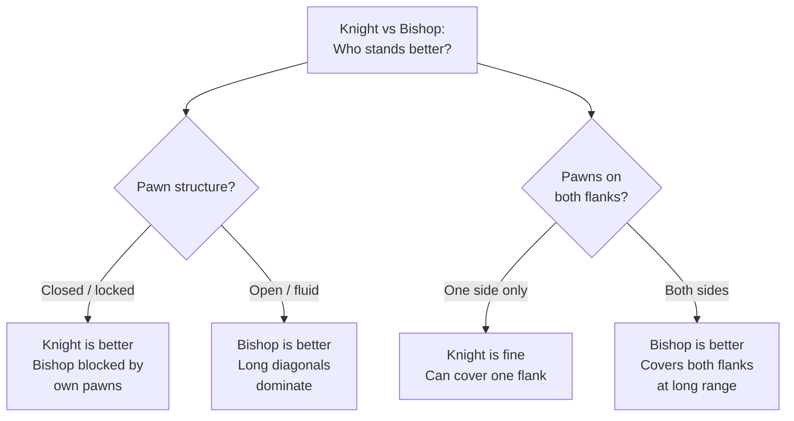

# Knight Endings

Knights are short-range pieces with unique movement properties that create distinctive endgame characteristics.

**See also:** [Bishop Endings](bishop-endings.md) | [Middlegame — Knight vs Bishop](../middlegame/piece-activity.md) | [Endgame Concepts — Zugzwang](endgame-concepts.md)

---

## Knight Characteristics in Endings

1. **Cannot lose a tempo** — a knight always changes square colour. This makes [zugzwang](endgame-concepts.md) situations more common
2. **Short-range** — knights struggle against widely separated passed pawns
3. **Poor against rook pawns** — the edge limits manoeuvrability
4. **Excellent blockaders** — a knight blockading a passed pawn doesn't lose activity (unlike a rook or bishop)
5. **Good against connected pawns** — can attack them from either side

---

## Knight vs Pawns

- Knights struggle against **widely separated** passed pawns (can't cover both flanks)
- Against **connected pawns**, knights do better — they can attack from multiple angles
- A knight on its own cannot stop a rook pawn if it's far away

---

## Knight and Pawn Endings

These share characteristics with [king and pawn endings](king-pawn-endings.md):

- **Centralised knight** controls the most squares and can influence both flanks
- **Zugzwang** is extremely common — the knight always changes colour, making tempo manipulation difficult
- Converting an extra pawn is generally straightforward with good technique

**Knight outpost on d5 — dominating the position**

<svg viewBox="0 0 390 400" xmlns="http://www.w3.org/2000/svg" style="max-width:400px">
  <rect x="0" y="0" width="360" height="360" fill="#b58863"/>
  <rect x="0" y="0" width="45" height="45" fill="#f0d9b5"/><rect x="90" y="0" width="45" height="45" fill="#f0d9b5"/><rect x="180" y="0" width="45" height="45" fill="#f0d9b5"/><rect x="270" y="0" width="45" height="45" fill="#f0d9b5"/>
  <rect x="45" y="45" width="45" height="45" fill="#f0d9b5"/><rect x="135" y="45" width="45" height="45" fill="#f0d9b5"/><rect x="225" y="45" width="45" height="45" fill="#f0d9b5"/><rect x="315" y="45" width="45" height="45" fill="#f0d9b5"/>
  <rect x="0" y="90" width="45" height="45" fill="#f0d9b5"/><rect x="90" y="90" width="45" height="45" fill="#f0d9b5"/><rect x="180" y="90" width="45" height="45" fill="#f0d9b5"/><rect x="270" y="90" width="45" height="45" fill="#f0d9b5"/>
  <rect x="45" y="135" width="45" height="45" fill="#f0d9b5"/><rect x="135" y="135" width="45" height="45" fill="#f0d9b5"/><rect x="225" y="135" width="45" height="45" fill="#f0d9b5"/><rect x="315" y="135" width="45" height="45" fill="#f0d9b5"/>
  <rect x="0" y="180" width="45" height="45" fill="#f0d9b5"/><rect x="90" y="180" width="45" height="45" fill="#f0d9b5"/><rect x="180" y="180" width="45" height="45" fill="#f0d9b5"/><rect x="270" y="180" width="45" height="45" fill="#f0d9b5"/>
  <rect x="45" y="225" width="45" height="45" fill="#f0d9b5"/><rect x="135" y="225" width="45" height="45" fill="#f0d9b5"/><rect x="225" y="225" width="45" height="45" fill="#f0d9b5"/><rect x="315" y="225" width="45" height="45" fill="#f0d9b5"/>
  <rect x="0" y="270" width="45" height="45" fill="#f0d9b5"/><rect x="90" y="270" width="45" height="45" fill="#f0d9b5"/><rect x="180" y="270" width="45" height="45" fill="#f0d9b5"/><rect x="270" y="270" width="45" height="45" fill="#f0d9b5"/>
  <rect x="45" y="315" width="45" height="45" fill="#f0d9b5"/><rect x="135" y="315" width="45" height="45" fill="#f0d9b5"/><rect x="225" y="315" width="45" height="45" fill="#f0d9b5"/><rect x="315" y="315" width="45" height="45" fill="#f0d9b5"/>
  <!-- Pieces -->
  <text x="292" y="33" font-size="30" text-anchor="middle" font-family="sans-serif">♚</text>
  <text x="22" y="78" font-size="30" text-anchor="middle" font-family="sans-serif">♟</text>
  <text x="247" y="78" font-size="30" text-anchor="middle" font-family="sans-serif">♟</text>
  <text x="337" y="78" font-size="30" text-anchor="middle" font-family="sans-serif">♟</text>
  <text x="67" y="123" font-size="30" text-anchor="middle" font-family="sans-serif">♟</text>
  <text x="292" y="123" font-size="30" text-anchor="middle" font-family="sans-serif">♟</text>
  <text x="157" y="168" font-size="30" text-anchor="middle" font-family="sans-serif">♘</text>
  <text x="22" y="258" font-size="30" text-anchor="middle" font-family="sans-serif">♙</text>
  <text x="67" y="303" font-size="30" text-anchor="middle" font-family="sans-serif">♙</text>
  <text x="247" y="303" font-size="30" text-anchor="middle" font-family="sans-serif">♙</text>
  <text x="292" y="303" font-size="30" text-anchor="middle" font-family="sans-serif">♙</text>
  <text x="337" y="303" font-size="30" text-anchor="middle" font-family="sans-serif">♙</text>
  <text x="292" y="348" font-size="30" text-anchor="middle" font-family="sans-serif">♔</text>
  <!-- Coordinates -->
  <text x="22" y="375" font-size="11" fill="#666" text-anchor="middle" font-family="sans-serif">a</text>
  <text x="67" y="375" font-size="11" fill="#666" text-anchor="middle" font-family="sans-serif">b</text>
  <text x="112" y="375" font-size="11" fill="#666" text-anchor="middle" font-family="sans-serif">c</text>
  <text x="157" y="375" font-size="11" fill="#666" text-anchor="middle" font-family="sans-serif">d</text>
  <text x="202" y="375" font-size="11" fill="#666" text-anchor="middle" font-family="sans-serif">e</text>
  <text x="247" y="375" font-size="11" fill="#666" text-anchor="middle" font-family="sans-serif">f</text>
  <text x="292" y="375" font-size="11" fill="#666" text-anchor="middle" font-family="sans-serif">g</text>
  <text x="337" y="375" font-size="11" fill="#666" text-anchor="middle" font-family="sans-serif">h</text>
  <text x="370" y="33" font-size="11" fill="#666" font-family="sans-serif">8</text>
  <text x="370" y="78" font-size="11" fill="#666" font-family="sans-serif">7</text>
  <text x="370" y="123" font-size="11" fill="#666" font-family="sans-serif">6</text>
  <text x="370" y="168" font-size="11" fill="#666" font-family="sans-serif">5</text>
  <text x="370" y="213" font-size="11" fill="#666" font-family="sans-serif">4</text>
  <text x="370" y="258" font-size="11" fill="#666" font-family="sans-serif">3</text>
  <text x="370" y="303" font-size="11" fill="#666" font-family="sans-serif">2</text>
  <text x="370" y="348" font-size="11" fill="#666" font-family="sans-serif">1</text>
</svg>

> **FEN:** `6k1/p4p1p/1p4p1/3N4/8/P7/1P3PPP/6K1 w - - 0 1`

The knight on d5 is a powerful outpost — it cannot be attacked by Black's pawns (b6 and f7 don't control d5) and it radiates influence across the board. The centralised knight controls squares on both flanks, a key advantage in knight endings.

---

## Knight vs Bishop (with Pawns)

| Knights Prefer | Bishops Prefer |
|---------------|----------------|
| Closed positions with locked pawns | Open positions with clear diagonals |
| Pawns on one side of the board | Pawns on both flanks (long-range coverage) |
| Positions with strong outposts | Positions without fixed pawn structures |

See [Middlegame — Knight vs Bishop](../middlegame/piece-activity.md) for a detailed comparison.

---

## Rook vs Knight Endings

More difficult for the defender than [rook vs bishop](bishop-endings.md). The knight is clumsy and can be trapped on the edge.

### Drawing Technique
- Keep the knight **close to the king**
- **Stay in the centre** — avoid edges and corners
- The knight's limited movement on the board's edge allows trapping motifs

### The Stronger Side's Technique
Push the defending king to the edge, then separate the knight from the king.

---

**Next:** [Queen Endings](queen-endings.md) | **Back to:** [Endgames Index](index.md)
