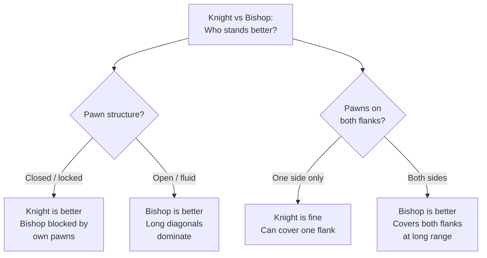

# Knight Endings

Knights are short-range pieces with unique movement properties that create distinctive endgame characteristics.

**See also:** [Bishop Endings](bishop-endings.md) | [Middlegame — Knight vs Bishop](../middlegame/piece-activity.md) | [Endgame Concepts — Zugzwang](endgame-concepts.md)

---

## Knight Characteristics in Endings

1. **Cannot lose a tempo** — a knight always changes square colour. This makes [zugzwang](endgame-concepts.md) situations more common
2. **Short-range** — knights struggle against widely separated passed pawns
3. **Poor against rook pawns** — the edge limits manoeuvrability
4. **Excellent blockaders** — a knight blockading a passed pawn doesn't lose activity (unlike a rook or bishop)
5. **Good against connected pawns** — can attack them from either side

---

## Knight vs Pawns

- Knights struggle against **widely separated** passed pawns (can't cover both flanks)
- Against **connected pawns**, knights do better — they can attack from multiple angles
- A knight on its own cannot stop a rook pawn if it's far away

---

## Knight and Pawn Endings

These share characteristics with [king and pawn endings](king-pawn-endings.md):

- **Centralised knight** controls the most squares and can influence both flanks
- **Zugzwang** is extremely common — the knight always changes colour, making tempo manipulation difficult
- Converting an extra pawn is generally straightforward with good technique

---

## Knight vs Bishop (with Pawns)

| Knights Prefer | Bishops Prefer |
|---------------|----------------|
| Closed positions with locked pawns | Open positions with clear diagonals |
| Pawns on one side of the board | Pawns on both flanks (long-range coverage) |
| Positions with strong outposts | Positions without fixed pawn structures |

See [Middlegame — Knight vs Bishop](../middlegame/piece-activity.md) for a detailed comparison.

---

## Rook vs Knight Endings

More difficult for the defender than [rook vs bishop](bishop-endings.md). The knight is clumsy and can be trapped on the edge.

### Drawing Technique
- Keep the knight **close to the king**
- **Stay in the centre** — avoid edges and corners
- The knight's limited movement on the board's edge allows trapping motifs

### The Stronger Side's Technique
Push the defending king to the edge, then separate the knight from the king.

---

**Next:** [Queen Endings](queen-endings.md) | **Back to:** [Endgames Index](index.md)
