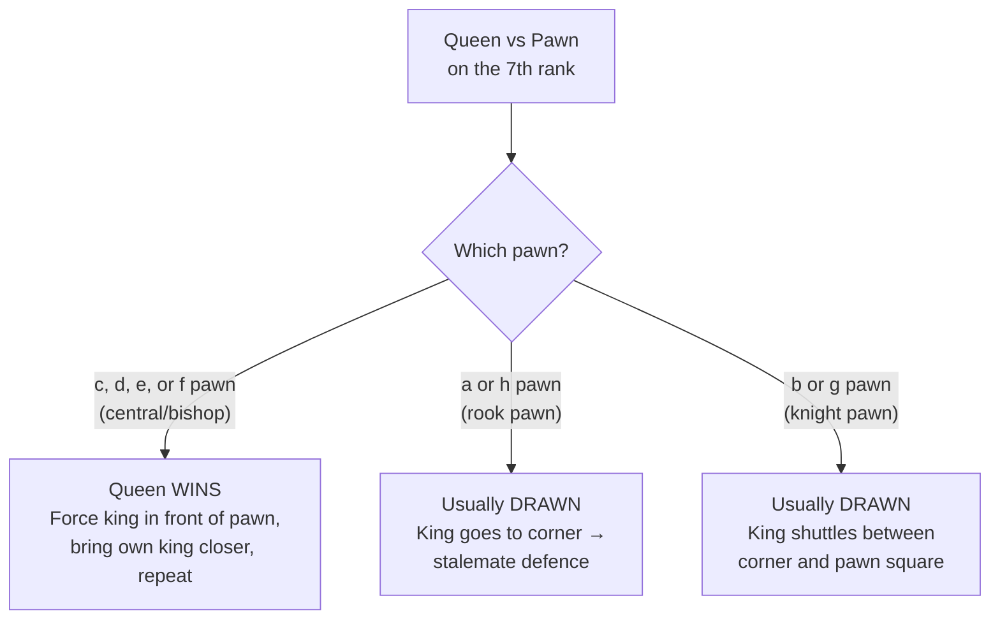

# Queen Endings

Queen endgames are complex and often decisive — the queen's power dominates the board, and small advantages are magnified.

**See also:** [Basic Checkmates](basic-checkmates.md) | [Tactics — Forks](../tactics/forks.md) | [Tactics — Skewers](../tactics/skewers.md)

---

## Queen vs Pawn on the 7th Rank

A critical theoretical endgame. The result depends on **which pawn** and **where the kings are**.

### Central or Bishop Pawn (c, d, e, f pawns)

**The queen wins** by a systematic method:

1. Give checks to force the enemy king **in front of the pawn**
2. Bring your own king **one step closer**
3. Repeat until your king arrives to help win the pawn

**Q vs d-pawn on the 7th — White wins**

<svg viewBox="0 0 390 400" xmlns="http://www.w3.org/2000/svg" style="max-width:400px">
  <rect x="0" y="0" width="360" height="360" fill="#b58863"/>
  <rect x="0" y="0" width="45" height="45" fill="#f0d9b5"/><rect x="90" y="0" width="45" height="45" fill="#f0d9b5"/><rect x="180" y="0" width="45" height="45" fill="#f0d9b5"/><rect x="270" y="0" width="45" height="45" fill="#f0d9b5"/>
  <rect x="45" y="45" width="45" height="45" fill="#f0d9b5"/><rect x="135" y="45" width="45" height="45" fill="#f0d9b5"/><rect x="225" y="45" width="45" height="45" fill="#f0d9b5"/><rect x="315" y="45" width="45" height="45" fill="#f0d9b5"/>
  <rect x="0" y="90" width="45" height="45" fill="#f0d9b5"/><rect x="90" y="90" width="45" height="45" fill="#f0d9b5"/><rect x="180" y="90" width="45" height="45" fill="#f0d9b5"/><rect x="270" y="90" width="45" height="45" fill="#f0d9b5"/>
  <rect x="45" y="135" width="45" height="45" fill="#f0d9b5"/><rect x="135" y="135" width="45" height="45" fill="#f0d9b5"/><rect x="225" y="135" width="45" height="45" fill="#f0d9b5"/><rect x="315" y="135" width="45" height="45" fill="#f0d9b5"/>
  <rect x="0" y="180" width="45" height="45" fill="#f0d9b5"/><rect x="90" y="180" width="45" height="45" fill="#f0d9b5"/><rect x="180" y="180" width="45" height="45" fill="#f0d9b5"/><rect x="270" y="180" width="45" height="45" fill="#f0d9b5"/>
  <rect x="45" y="225" width="45" height="45" fill="#f0d9b5"/><rect x="135" y="225" width="45" height="45" fill="#f0d9b5"/><rect x="225" y="225" width="45" height="45" fill="#f0d9b5"/><rect x="315" y="225" width="45" height="45" fill="#f0d9b5"/>
  <rect x="0" y="270" width="45" height="45" fill="#f0d9b5"/><rect x="90" y="270" width="45" height="45" fill="#f0d9b5"/><rect x="180" y="270" width="45" height="45" fill="#f0d9b5"/><rect x="270" y="270" width="45" height="45" fill="#f0d9b5"/>
  <rect x="45" y="315" width="45" height="45" fill="#f0d9b5"/><rect x="135" y="315" width="45" height="45" fill="#f0d9b5"/><rect x="225" y="315" width="45" height="45" fill="#f0d9b5"/><rect x="315" y="315" width="45" height="45" fill="#f0d9b5"/>
  <!-- Pieces -->
  <text x="157" y="33" font-size="30" text-anchor="middle" font-family="sans-serif">♚</text>
  <text x="157" y="78" font-size="30" text-anchor="middle" font-family="sans-serif">♟</text>
  <text x="22" y="348" font-size="30" text-anchor="middle" font-family="sans-serif">♔</text>
  <text x="337" y="348" font-size="30" text-anchor="middle" font-family="sans-serif">♕</text>
  <!-- Coordinates -->
  <text x="22" y="375" font-size="11" fill="#666" text-anchor="middle" font-family="sans-serif">a</text>
  <text x="67" y="375" font-size="11" fill="#666" text-anchor="middle" font-family="sans-serif">b</text>
  <text x="112" y="375" font-size="11" fill="#666" text-anchor="middle" font-family="sans-serif">c</text>
  <text x="157" y="375" font-size="11" fill="#666" text-anchor="middle" font-family="sans-serif">d</text>
  <text x="202" y="375" font-size="11" fill="#666" text-anchor="middle" font-family="sans-serif">e</text>
  <text x="247" y="375" font-size="11" fill="#666" text-anchor="middle" font-family="sans-serif">f</text>
  <text x="292" y="375" font-size="11" fill="#666" text-anchor="middle" font-family="sans-serif">g</text>
  <text x="337" y="375" font-size="11" fill="#666" text-anchor="middle" font-family="sans-serif">h</text>
  <text x="370" y="33" font-size="11" fill="#666" font-family="sans-serif">8</text>
  <text x="370" y="78" font-size="11" fill="#666" font-family="sans-serif">7</text>
  <text x="370" y="123" font-size="11" fill="#666" font-family="sans-serif">6</text>
  <text x="370" y="168" font-size="11" fill="#666" font-family="sans-serif">5</text>
  <text x="370" y="213" font-size="11" fill="#666" font-family="sans-serif">4</text>
  <text x="370" y="258" font-size="11" fill="#666" font-family="sans-serif">3</text>
  <text x="370" y="303" font-size="11" fill="#666" font-family="sans-serif">2</text>
  <text x="370" y="348" font-size="11" fill="#666" font-family="sans-serif">1</text>
</svg>

> **FEN:** `3k4/3p4/8/8/8/8/8/K6Q w - - 0 1`

White gives checks (e.g. 1.Qh8+ Ke7 2.Qc3! Kd8 3.Qd3!) to force the Black king in front of the pawn, then advances the White king one step closer. Repeat until the king arrives.

### Rook Pawn (a or h pawn)

Usually **drawn**. The defending king goes to the corner. After forcing the king in front of the pawn, it's **stalemate**.

**Q vs a-pawn on the 7th — Drawn (stalemate defence)**

<svg viewBox="0 0 390 400" xmlns="http://www.w3.org/2000/svg" style="max-width:400px">
  <rect x="0" y="0" width="360" height="360" fill="#b58863"/>
  <rect x="0" y="0" width="45" height="45" fill="#f0d9b5"/><rect x="90" y="0" width="45" height="45" fill="#f0d9b5"/><rect x="180" y="0" width="45" height="45" fill="#f0d9b5"/><rect x="270" y="0" width="45" height="45" fill="#f0d9b5"/>
  <rect x="45" y="45" width="45" height="45" fill="#f0d9b5"/><rect x="135" y="45" width="45" height="45" fill="#f0d9b5"/><rect x="225" y="45" width="45" height="45" fill="#f0d9b5"/><rect x="315" y="45" width="45" height="45" fill="#f0d9b5"/>
  <rect x="0" y="90" width="45" height="45" fill="#f0d9b5"/><rect x="90" y="90" width="45" height="45" fill="#f0d9b5"/><rect x="180" y="90" width="45" height="45" fill="#f0d9b5"/><rect x="270" y="90" width="45" height="45" fill="#f0d9b5"/>
  <rect x="45" y="135" width="45" height="45" fill="#f0d9b5"/><rect x="135" y="135" width="45" height="45" fill="#f0d9b5"/><rect x="225" y="135" width="45" height="45" fill="#f0d9b5"/><rect x="315" y="135" width="45" height="45" fill="#f0d9b5"/>
  <rect x="0" y="180" width="45" height="45" fill="#f0d9b5"/><rect x="90" y="180" width="45" height="45" fill="#f0d9b5"/><rect x="180" y="180" width="45" height="45" fill="#f0d9b5"/><rect x="270" y="180" width="45" height="45" fill="#f0d9b5"/>
  <rect x="45" y="225" width="45" height="45" fill="#f0d9b5"/><rect x="135" y="225" width="45" height="45" fill="#f0d9b5"/><rect x="225" y="225" width="45" height="45" fill="#f0d9b5"/><rect x="315" y="225" width="45" height="45" fill="#f0d9b5"/>
  <rect x="0" y="270" width="45" height="45" fill="#f0d9b5"/><rect x="90" y="270" width="45" height="45" fill="#f0d9b5"/><rect x="180" y="270" width="45" height="45" fill="#f0d9b5"/><rect x="270" y="270" width="45" height="45" fill="#f0d9b5"/>
  <rect x="45" y="315" width="45" height="45" fill="#f0d9b5"/><rect x="135" y="315" width="45" height="45" fill="#f0d9b5"/><rect x="225" y="315" width="45" height="45" fill="#f0d9b5"/><rect x="315" y="315" width="45" height="45" fill="#f0d9b5"/>
  <!-- Pieces -->
  <text x="22" y="33" font-size="30" text-anchor="middle" font-family="sans-serif">♚</text>
  <text x="22" y="78" font-size="30" text-anchor="middle" font-family="sans-serif">♟</text>
  <text x="22" y="348" font-size="30" text-anchor="middle" font-family="sans-serif">♔</text>
  <text x="337" y="348" font-size="30" text-anchor="middle" font-family="sans-serif">♕</text>
  <!-- Coordinates -->
  <text x="22" y="375" font-size="11" fill="#666" text-anchor="middle" font-family="sans-serif">a</text>
  <text x="67" y="375" font-size="11" fill="#666" text-anchor="middle" font-family="sans-serif">b</text>
  <text x="112" y="375" font-size="11" fill="#666" text-anchor="middle" font-family="sans-serif">c</text>
  <text x="157" y="375" font-size="11" fill="#666" text-anchor="middle" font-family="sans-serif">d</text>
  <text x="202" y="375" font-size="11" fill="#666" text-anchor="middle" font-family="sans-serif">e</text>
  <text x="247" y="375" font-size="11" fill="#666" text-anchor="middle" font-family="sans-serif">f</text>
  <text x="292" y="375" font-size="11" fill="#666" text-anchor="middle" font-family="sans-serif">g</text>
  <text x="337" y="375" font-size="11" fill="#666" text-anchor="middle" font-family="sans-serif">h</text>
  <text x="370" y="33" font-size="11" fill="#666" font-family="sans-serif">8</text>
  <text x="370" y="78" font-size="11" fill="#666" font-family="sans-serif">7</text>
  <text x="370" y="123" font-size="11" fill="#666" font-family="sans-serif">6</text>
  <text x="370" y="168" font-size="11" fill="#666" font-family="sans-serif">5</text>
  <text x="370" y="213" font-size="11" fill="#666" font-family="sans-serif">4</text>
  <text x="370" y="258" font-size="11" fill="#666" font-family="sans-serif">3</text>
  <text x="370" y="303" font-size="11" fill="#666" font-family="sans-serif">2</text>
  <text x="370" y="348" font-size="11" fill="#666" font-family="sans-serif">1</text>
</svg>

> **FEN:** `k7/p7/8/8/8/8/8/K6Q w - - 0 1`

If White forces the king in front of the pawn with checks, the result is stalemate (king on a8, pawn on a7 — no legal moves). The rook pawn draws because the corner provides a stalemate shelter.

### Knight Pawn (b or g pawn)

Usually **drawn** due to similar stalemate defences. The king shuttles between the corner and the pawn square.

---

## Queen vs Rook

The queen generally wins, but it's technically difficult (can require 30+ precise moves).

### Winning Method (Philidor's Technique)

Use the queen to deliver checks and force the rook to separate from its king. Win the rook with a [fork](../tactics/forks.md) or [skewer](../tactics/skewers.md).

### Drawing Resources for the Rook

- Certain fortress positions (especially with a pawn) can hold
- Perpetual defence — keeping the rook next to the king

---

## Queen vs Queen

Queen endgames with pawns are among the most complex in chess. Key features:

- **Perpetual check** is always a resource for the defending side
- The queen's mobility means both sides must watch for [forks](../tactics/forks.md) and [skewers](../tactics/skewers.md)
- **Centralised king + passed pawn** is the recipe for winning
- Even a single extra pawn can be very difficult to convert due to perpetual check resources

---

**Next:** [Endgame Concepts](endgame-concepts.md) | **Back to:** [Endgames Index](index.md)
