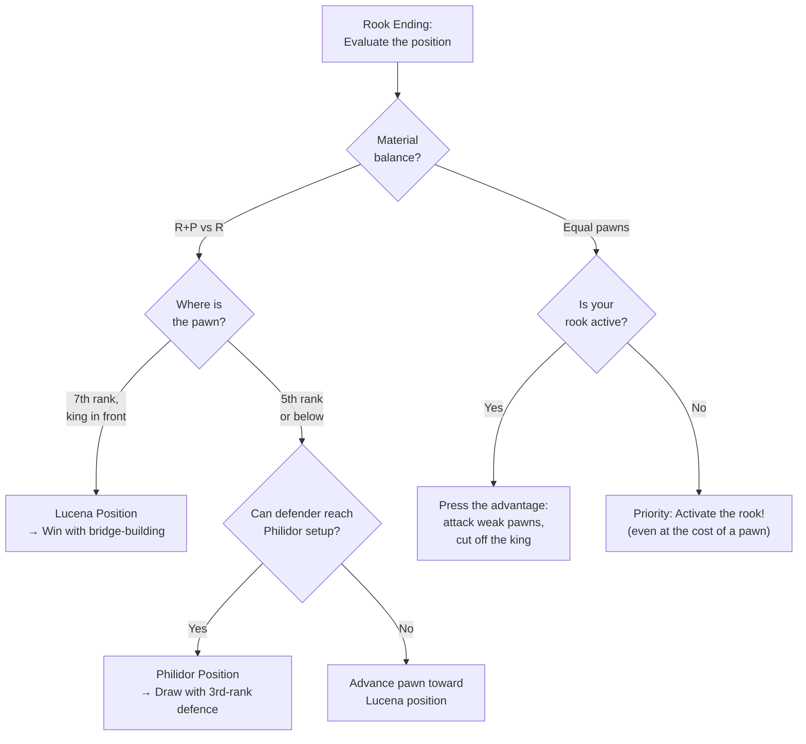

# Rook Endings

Rook endgames are the most common type and are notoriously difficult. Tartakower famously said, "All rook endgames are drawn" — an exaggeration, but it reflects their drawish tendency and the precision required.

**See also:** [King & Pawn Endings](king-pawn-endings.md) | [Endgame Concepts](endgame-concepts.md) | [Famous Games — Carlsen's Endgames](../famous-games/carlsen-endgames.md)

---

## The Lucena Position (Winning)

The most important winning technique in rook endings. The stronger side has a pawn on the 7th rank with the king on the 8th rank in front of it.

### The "Bridge-Building" Technique

**The Lucena Position — White to play and win**

<svg viewBox="0 0 390 400" xmlns="http://www.w3.org/2000/svg" style="max-width:400px">
  <rect x="0" y="0" width="360" height="360" fill="#b58863"/>
  <rect x="0" y="0" width="45" height="45" fill="#f0d9b5"/><rect x="90" y="0" width="45" height="45" fill="#f0d9b5"/><rect x="180" y="0" width="45" height="45" fill="#f0d9b5"/><rect x="270" y="0" width="45" height="45" fill="#f0d9b5"/>
  <rect x="45" y="45" width="45" height="45" fill="#f0d9b5"/><rect x="135" y="45" width="45" height="45" fill="#f0d9b5"/><rect x="225" y="45" width="45" height="45" fill="#f0d9b5"/><rect x="315" y="45" width="45" height="45" fill="#f0d9b5"/>
  <rect x="0" y="90" width="45" height="45" fill="#f0d9b5"/><rect x="90" y="90" width="45" height="45" fill="#f0d9b5"/><rect x="180" y="90" width="45" height="45" fill="#f0d9b5"/><rect x="270" y="90" width="45" height="45" fill="#f0d9b5"/>
  <rect x="45" y="135" width="45" height="45" fill="#f0d9b5"/><rect x="135" y="135" width="45" height="45" fill="#f0d9b5"/><rect x="225" y="135" width="45" height="45" fill="#f0d9b5"/><rect x="315" y="135" width="45" height="45" fill="#f0d9b5"/>
  <rect x="0" y="180" width="45" height="45" fill="#f0d9b5"/><rect x="90" y="180" width="45" height="45" fill="#f0d9b5"/><rect x="180" y="180" width="45" height="45" fill="#f0d9b5"/><rect x="270" y="180" width="45" height="45" fill="#f0d9b5"/>
  <rect x="45" y="225" width="45" height="45" fill="#f0d9b5"/><rect x="135" y="225" width="45" height="45" fill="#f0d9b5"/><rect x="225" y="225" width="45" height="45" fill="#f0d9b5"/><rect x="315" y="225" width="45" height="45" fill="#f0d9b5"/>
  <rect x="0" y="270" width="45" height="45" fill="#f0d9b5"/><rect x="90" y="270" width="45" height="45" fill="#f0d9b5"/><rect x="180" y="270" width="45" height="45" fill="#f0d9b5"/><rect x="270" y="270" width="45" height="45" fill="#f0d9b5"/>
  <rect x="45" y="315" width="45" height="45" fill="#f0d9b5"/><rect x="135" y="315" width="45" height="45" fill="#f0d9b5"/><rect x="225" y="315" width="45" height="45" fill="#f0d9b5"/><rect x="315" y="315" width="45" height="45" fill="#f0d9b5"/>
  <!-- Pieces -->
  <text x="247" y="33" font-size="30" text-anchor="middle" font-family="sans-serif">♔</text>
  <text x="157" y="78" font-size="30" text-anchor="middle" font-family="sans-serif">♚</text>
  <text x="202" y="78" font-size="30" text-anchor="middle" font-family="sans-serif">♙</text>
  <text x="22" y="348" font-size="30" text-anchor="middle" font-family="sans-serif">♜</text>
  <text x="202" y="348" font-size="30" text-anchor="middle" font-family="sans-serif">♖</text>
  <!-- Coordinates -->
  <text x="22" y="375" font-size="11" fill="#666" text-anchor="middle" font-family="sans-serif">a</text>
  <text x="67" y="375" font-size="11" fill="#666" text-anchor="middle" font-family="sans-serif">b</text>
  <text x="112" y="375" font-size="11" fill="#666" text-anchor="middle" font-family="sans-serif">c</text>
  <text x="157" y="375" font-size="11" fill="#666" text-anchor="middle" font-family="sans-serif">d</text>
  <text x="202" y="375" font-size="11" fill="#666" text-anchor="middle" font-family="sans-serif">e</text>
  <text x="247" y="375" font-size="11" fill="#666" text-anchor="middle" font-family="sans-serif">f</text>
  <text x="292" y="375" font-size="11" fill="#666" text-anchor="middle" font-family="sans-serif">g</text>
  <text x="337" y="375" font-size="11" fill="#666" text-anchor="middle" font-family="sans-serif">h</text>
  <text x="370" y="33" font-size="11" fill="#666" font-family="sans-serif">8</text>
  <text x="370" y="78" font-size="11" fill="#666" font-family="sans-serif">7</text>
  <text x="370" y="123" font-size="11" fill="#666" font-family="sans-serif">6</text>
  <text x="370" y="168" font-size="11" fill="#666" font-family="sans-serif">5</text>
  <text x="370" y="213" font-size="11" fill="#666" font-family="sans-serif">4</text>
  <text x="370" y="258" font-size="11" fill="#666" font-family="sans-serif">3</text>
  <text x="370" y="303" font-size="11" fill="#666" font-family="sans-serif">2</text>
  <text x="370" y="348" font-size="11" fill="#666" font-family="sans-serif">1</text>
</svg>

> **FEN:** `5K2/3kP3/8/8/8/8/8/r3R3 w - - 0 1`

1. **1.Re4!** (building the "bridge" — rook goes to the 4th rank)
2. **Kf7** (king steps out from in front of the pawn)
3. **Ke6** (king advances)
4. **Re5!** (when Black gives checks from the a-file, the rook interposes on e5 — the "bridge")

**Principle:** If you can reach the Lucena position, you win. Many rook endings are about reaching or preventing this.

---

## The Philidor Position (Drawing)

The fundamental defensive technique. The defending king stands on the promotion square.

### Third Rank Defence

1. Keep the rook on the **3rd rank** as a barrier (while the pawn is on the 5th rank or below)
2. Once the pawn advances to the **6th rank**, swing the rook to the **back rank**
3. Give checks from behind — the checking distance is sufficient to prevent the king from finding shelter

**The Philidor Position — Black to move and draw**

<svg viewBox="0 0 390 400" xmlns="http://www.w3.org/2000/svg" style="max-width:400px">
  <rect x="0" y="0" width="360" height="360" fill="#b58863"/>
  <rect x="0" y="0" width="45" height="45" fill="#f0d9b5"/><rect x="90" y="0" width="45" height="45" fill="#f0d9b5"/><rect x="180" y="0" width="45" height="45" fill="#f0d9b5"/><rect x="270" y="0" width="45" height="45" fill="#f0d9b5"/>
  <rect x="45" y="45" width="45" height="45" fill="#f0d9b5"/><rect x="135" y="45" width="45" height="45" fill="#f0d9b5"/><rect x="225" y="45" width="45" height="45" fill="#f0d9b5"/><rect x="315" y="45" width="45" height="45" fill="#f0d9b5"/>
  <rect x="0" y="90" width="45" height="45" fill="#f0d9b5"/><rect x="90" y="90" width="45" height="45" fill="#f0d9b5"/><rect x="180" y="90" width="45" height="45" fill="#f0d9b5"/><rect x="270" y="90" width="45" height="45" fill="#f0d9b5"/>
  <rect x="45" y="135" width="45" height="45" fill="#f0d9b5"/><rect x="135" y="135" width="45" height="45" fill="#f0d9b5"/><rect x="225" y="135" width="45" height="45" fill="#f0d9b5"/><rect x="315" y="135" width="45" height="45" fill="#f0d9b5"/>
  <rect x="0" y="180" width="45" height="45" fill="#f0d9b5"/><rect x="90" y="180" width="45" height="45" fill="#f0d9b5"/><rect x="180" y="180" width="45" height="45" fill="#f0d9b5"/><rect x="270" y="180" width="45" height="45" fill="#f0d9b5"/>
  <rect x="45" y="225" width="45" height="45" fill="#f0d9b5"/><rect x="135" y="225" width="45" height="45" fill="#f0d9b5"/><rect x="225" y="225" width="45" height="45" fill="#f0d9b5"/><rect x="315" y="225" width="45" height="45" fill="#f0d9b5"/>
  <rect x="0" y="270" width="45" height="45" fill="#f0d9b5"/><rect x="90" y="270" width="45" height="45" fill="#f0d9b5"/><rect x="180" y="270" width="45" height="45" fill="#f0d9b5"/><rect x="270" y="270" width="45" height="45" fill="#f0d9b5"/>
  <rect x="45" y="315" width="45" height="45" fill="#f0d9b5"/><rect x="135" y="315" width="45" height="45" fill="#f0d9b5"/><rect x="225" y="315" width="45" height="45" fill="#f0d9b5"/><rect x="315" y="315" width="45" height="45" fill="#f0d9b5"/>
  <!-- Pieces -->
  <text x="202" y="33" font-size="30" text-anchor="middle" font-family="sans-serif">♚</text>
  <text x="247" y="123" font-size="30" text-anchor="middle" font-family="sans-serif">♜</text>
  <text x="202" y="168" font-size="30" text-anchor="middle" font-family="sans-serif">♔</text>
  <text x="247" y="168" font-size="30" text-anchor="middle" font-family="sans-serif">♙</text>
  <!-- Coordinates -->
  <text x="22" y="375" font-size="11" fill="#666" text-anchor="middle" font-family="sans-serif">a</text>
  <text x="67" y="375" font-size="11" fill="#666" text-anchor="middle" font-family="sans-serif">b</text>
  <text x="112" y="375" font-size="11" fill="#666" text-anchor="middle" font-family="sans-serif">c</text>
  <text x="157" y="375" font-size="11" fill="#666" text-anchor="middle" font-family="sans-serif">d</text>
  <text x="202" y="375" font-size="11" fill="#666" text-anchor="middle" font-family="sans-serif">e</text>
  <text x="247" y="375" font-size="11" fill="#666" text-anchor="middle" font-family="sans-serif">f</text>
  <text x="292" y="375" font-size="11" fill="#666" text-anchor="middle" font-family="sans-serif">g</text>
  <text x="337" y="375" font-size="11" fill="#666" text-anchor="middle" font-family="sans-serif">h</text>
  <text x="370" y="33" font-size="11" fill="#666" font-family="sans-serif">8</text>
  <text x="370" y="78" font-size="11" fill="#666" font-family="sans-serif">7</text>
  <text x="370" y="123" font-size="11" fill="#666" font-family="sans-serif">6</text>
  <text x="370" y="168" font-size="11" fill="#666" font-family="sans-serif">5</text>
  <text x="370" y="213" font-size="11" fill="#666" font-family="sans-serif">4</text>
  <text x="370" y="258" font-size="11" fill="#666" font-family="sans-serif">3</text>
  <text x="370" y="303" font-size="11" fill="#666" font-family="sans-serif">2</text>
  <text x="370" y="348" font-size="11" fill="#666" font-family="sans-serif">1</text>
</svg>

> **FEN:** `4k3/8/5r2/4KP2/8/8/8/8 w - - 0 1`

Black keeps the rook on the 6th rank as a barrier. If White plays f6, Black swings the rook to the 1st rank with **Rf1** and gives endless checks from behind. The checking distance is too great for the White king to find shelter.

---

## Tarrasch's Rule

**Place the rook behind passed pawns** — your own or your opponent's.

### Behind Your Own Pawn

As the pawn advances, the rook's scope **increases**. The rook supports the advance without blocking it.

### Behind the Opponent's Pawn

As the pawn advances, the rook still has full freedom. If the rook were **in front** of the pawn, it gets pushed back as the pawn advances.

**Exceptions exist** — sometimes rook activity elsewhere outweighs strict adherence.

---

## Active vs Passive Rook

The single most important concept in rook endings:

> **Rook activity trumps material.**

- An **active rook** attacks pawns, cuts off the king, controls key ranks/files
- A **passive rook** is tied to defence (defending a weak pawn, stuck on the back rank)

**It is often worth sacrificing a pawn to activate a passive rook.** Conversely, winning a pawn at the cost of a passive rook is often a bad trade.

---

## Cutting Off the King

Using the rook to prevent the opposing king from approaching the action.

### Vertical Cut-Off

The rook on a file prevents the king from crossing. Each file of separation ≈ one tempo advantage.

### Horizontal Cut-Off

The rook on a rank keeps the king cut off. Particularly powerful when the king is cut off on the back rank.

**Rule of thumb:** Cutting off the king by two or more files is usually decisive.

---

## Practical Rook Ending Principles

1. **Activate your rook** before worrying about pawns
2. **Advance your king** — the king is a powerful piece in the endgame
3. **Create a passed pawn** on the side where you have a majority
4. **Don't rush** — rook endings require patience and precision
5. **Know the Lucena and Philidor** — they are the north star for evaluation

---

**Next:** [Bishop Endings](bishop-endings.md) | **Back to:** [Endgames Index](index.md)
