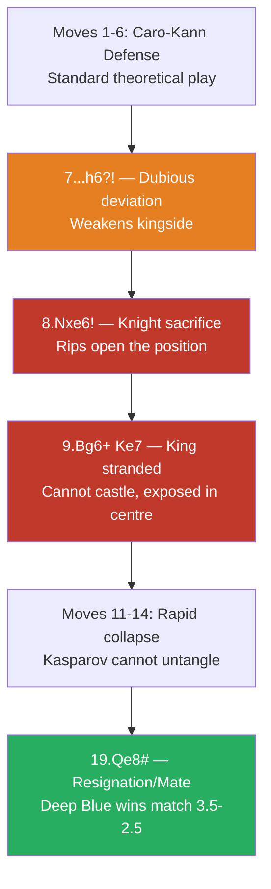
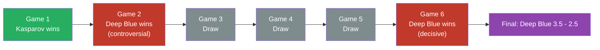

# Deep Blue vs Kasparov, Game 6, New York 1997

The game that changed history. The first time a reigning world champion lost a match to a computer under standard time controls. Game 6 was the decisive blow.

**Opening:** [Caro-Kann Defense](../openings/semi-open/caro-kann.md)

---

## The Game

```
1.e4 c6 2.d4 d5 3.Nc3 dxe4 4.Nxe4 Nd7 5.Ng5 Ngf6 6.Bd3 e6
7.N1f3 h6?! 8.Nxe6! fxe6 9.Bg6+ Ke7 10.O-O Qc7 11.Re1 Kd8?
12.Rxe6 Nd5? 13.Qe2 Nb4 14.Bf4 Bd6?? 15.Bxd6 Qxd6 16.Re8+!
Kxe8 17.Qe6+ Kd8 18.Bf7 Qc7 19.Qe8# (or Kasparov resigned here)
1-0
```

---

## Game Flow



## Key Moments

### 7...h6?! — A dubious move

Kasparov deviates from known theory. This pawn move weakens the kingside and allows the tactical blow.

### 8.Nxe6! — The sacrifice

Deep Blue sacrifices a knight on e6, ripping open the position. After fxe6 9.Bg6+ Ke7 — Black's king is stranded in the centre with no hope of castling.

### The Collapse

Kasparov, under enormous psychological pressure after the controversial Game 2 (where he resigned in a **drawn** position), never recovered. He resigned after only 19 moves.

---

## Lessons

1. **Psychology matters** — even the greatest player can be destabilised
2. **King in the centre** is a liability in open positions — see [Fundamentals — King Safety](../fundamentals/king-safety.md)
3. **Don't deviate from sound theory** without preparation — 7...h6 was the root cause
4. A watershed moment in chess and AI history

---

## Historical Context



- This was the **decisive game** — the match score was 2.5–2.5 going in
- Deep Blue won the match **3.5–2.5**
- Kasparov later alleged IBM cheated (human grandmaster intervention), but this was never proven
- IBM dismantled Deep Blue after the match and refused a rematch
- The event marked the beginning of the computer era in chess

---

**Next:** [Carlsen's Endgame Mastery](carlsen-endgames.md) | **Back to:** [Famous Games Index](index.md)
