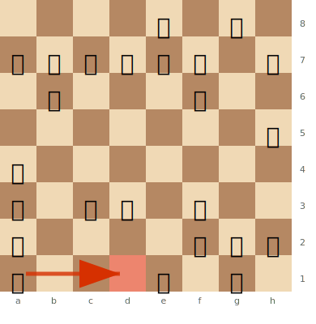

# The Evergreen Game

**Anderssen vs Dufresne, Berlin 1852**

Another Anderssen masterpiece — perhaps more impressive than the Immortal Game because modern analysis considers it **sound**. The combination features quiet preparation followed by an explosive finish.

**Opening:** [Evans Gambit](../openings/open-games/italian-game.md) (Italian Game)

---

## The Game

```
1.e4 e5 2.Nf3 Nc6 3.Bc4 Bc5 4.b4 Bxb4 5.c3 Ba5 6.d4 exd4 7.O-O d3
8.Qb3 Qf6 9.e5 Qg6 10.Re1 Nge7 11.Ba3 b5 12.Qxb5 Rb8 13.Qa4 Bb6
14.Nbd2 Bb7 15.Ne4 Qf5 16.Bxd3 Qh5 17.Nf6+ gxf6 18.exf6 Rg8
19.Rad1! Qxf3 20.Rxe7+! Nxe7 21.Qxd7+!! Kxd7 22.Bf5+ Ke8
23.Bd7+ Kf8 24.Bxe7#
```

---

## Key Moments

### Position before 19.Rad1! — The quiet move that sets up everything

White's rook on a1 is the only piece not yet in the attack. The pawn on f6 cramps Black's kingside, and Black's king is stuck in the centre. One quiet rook move will complete White's development and unleash the combination.



> **FEN:** `4k1r1/pbppnp1p/1b3P2/7q/Q7/B1PB1N2/P4PPP/R3R1K1 w - - 0 1`

After 19.Rad1!, the a1 rook joins the d-file and the full combination begins: 19...Qxf3 20.Rxe7+! Nxe7 21.Qxd7+!! Kxd7 22.Bf5+ Ke8 23.Bd7+ Kf8 24.Bxe7# — a criss-cross bishop mate.

---

### 19.Rad1! — Quiet before the storm

A calm rook move — not a sacrifice, not a check. But it brings the last piece into the attack. **Setting up a combination is as important as executing it.**

### 20.Rxe7+! — Rook sacrifice

Smashing open the position around Black's king.

### 21.Qxd7+!! — The queen sacrifice

Spectacular — White gives up the queen to clear the way for a bishop mate. After 21...Kxd7 22.Bf5+ Ke8 23.Bd7+ Kf8 24.Bxe7# — mate with two bishops in a beautiful criss-cross pattern (related to [Boden's Mate](../tactics/mating-patterns.md)).

---

## Lessons

1. **Quiet preparatory moves** can be more powerful than flashy sacrifices
2. **All pieces must participate** — the Rad1 move brings the last piece to the fight
3. The [Evans Gambit](../openings/open-games/italian-game.md) demonstrates how initiative compensates for material

---

## Historical Note

Called "The Evergreen Game" because its beauty never withers — it is eternal. Unlike the Immortal Game, this game is considered **sound** by modern standards.

---

**Next:** [The Opera Game](opera-game.md) | **Back to:** [Famous Games Index](index.md)
