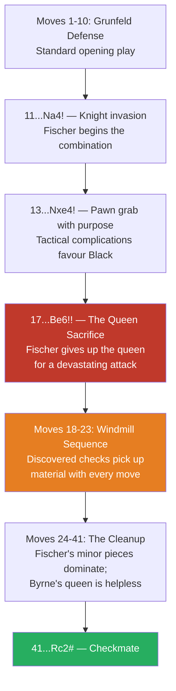

# The Game of the Century

**Fischer vs Byrne, New York 1956**

A 13-year-old Bobby Fischer defeats International Master Donald Byrne with a stunning queen sacrifice. Hans Kmoch dubbed it "The Game of the Century."

**Opening:** [Grünfeld Defense](../openings/indian-defenses/grunfeld.md)

---

## The Game

```
1.Nf3 Nf6 2.c4 g6 3.Nc3 Bg7 4.d4 O-O 5.Bf4 d5 6.Qb3 dxc4
7.Qxc4 c6 8.e4 Nbd7 9.Rd1 Nb6 10.Qc5 Bg4 11.Bg5 Na4!
12.Qa3 Nxc3 13.bxc3 Nxe4! 14.Bxe7 Qb6 15.Bc4 Nxc3!
16.Bc5 Rfe8+ 17.Kf1 Be6!! 18.Bxb6 Bxc4+ 19.Kg1 Ne2+
20.Kf1 Nxd4+ 21.Kg1 Ne2+ 22.Kf1 Nc3+ 23.Kg1 axb6
24.Qb4 Ra4 25.Qxb6 Nxd1 26.h3 Rxa2 27.Kh2 Nxf2
28.Re1 Rxe1 29.Qd8+ Bf8 30.Nxe1 Bd5 31.Nf3 Ne4
32.Qb8 b5 33.h4 h5 34.Ne5 Kg7 35.Kg1 Bc5+ 36.Kf1 Ng3+
37.Ke1 Bb4+ 38.Kd1 Bb3+ 39.Kc1 Ne2+ 40.Kb1 Nc3+
41.Kc1 Rc2# 0-1
```

---

## Game Flow



## Key Moments

### 11...Na4! — The knight invasion

Fischer's knight jumps into White's position, beginning the combination.

### 17...Be6!! — The queen sacrifice

The most famous move of the game. Fischer places his bishop on e6, seemingly allowing 18.Bxb6 (capturing the queen). But after 18...Bxc4+ 19.Kg1 Ne2+ 20.Kf1 Nxd4+ (a [discovered check](../tactics/discovered-attacks.md)) — Fischer's pieces swarm White's position, winning back far more than the queen.

### The Follow-Up: Windmill-like play

After the queen sacrifice, Fischer's minor pieces dance around White's king with a series of checks and captures — reminiscent of a [windmill](../tactics/discovered-attacks.md).

---

## Lessons

1. **Piece coordination can overwhelm material** — three well-coordinated minor pieces can be stronger than a queen
2. **A 13-year-old's vision** — Fischer saw the entire combination, including the queen sacrifice and its consequences
3. **[Discovered checks](../tactics/discovered-attacks.md)** are devastating — the Ne2-d4-e2 manoeuvre picks up material with each discovery
4. The [Grünfeld Defense's](../openings/indian-defenses/grunfeld.md) dynamic piece play in action

---

**Next:** [Deep Blue vs Kasparov](deep-blue-kasparov.md) | **Back to:** [Famous Games Index](index.md)
