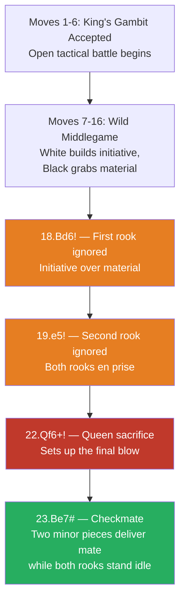

# The Immortal Game

**Anderssen vs Kieseritzky, London 1851**

The most famous attacking game in chess history. Anderssen sacrificed both rooks, a bishop, and his queen to deliver checkmate with only minor pieces.

**Opening:** [King's Gambit](../openings/open-games/kings-gambit.md) Accepted

---

## The Game

```
1.e4 e5 2.f4 exf4 3.Bc4 Qh4+ 4.Kf1 b5 5.Bxb5 Nf6 6.Nf3 Qh6
7.d3 Nh5 8.Nh4 Qg5 9.Nf5 c6 10.g4 Nf6 11.Rg1 cxb5 12.h4 Qg6
13.h5 Qg5 14.Qf3 Ng8 15.Bxf4 Qf6 16.Nc3 Bc5 17.Nd5 Qxb2
18.Bd6! Bxg1 19.e5! Qxa1+ 20.Ke2 Na6 21.Nxg7+ Kd8
22.Qf6+! Nxf6 23.Be7#
```

---

## Game Flow



## Key Moments

### 18.Bd6! — Ignoring the rook

Anderssen leaves the rook on g1 hanging. The bishop on d6 cuts off Black's development and creates mating threats. **Initiative over material.**

### 19.e5! — Ignoring the second rook

Both rooks are now en prise! But White's pieces are swarming the king. The pawn on e5 opens the position for White's minor pieces.

### 22.Qf6+! — The queen sacrifice

Anderssen gives up his queen to set up the final bishop mate. After 22...Nxf6 23.Be7# — checkmate with just two minor pieces while both rooks stand untouched.

---

## Lessons

1. **Development and initiative can be worth more than material** — see [Fundamentals — Development](../fundamentals/development.md)
2. **Piece coordination** produces devastating attacks — see [Middlegame — Attacking the King](../middlegame/attacking-the-king.md)
3. The Romantic era valued sacrifice and beauty; this game epitomises that spirit

---

## Historical Note

Named "The Immortal Game" by Austrian master Ernst Falkbeer. While modern analysis shows some of Black's choices were poor, the game remains the most celebrated attacking display ever played.

---

**Next:** [The Evergreen Game](evergreen-game.md) | **Back to:** [Famous Games Index](index.md)
