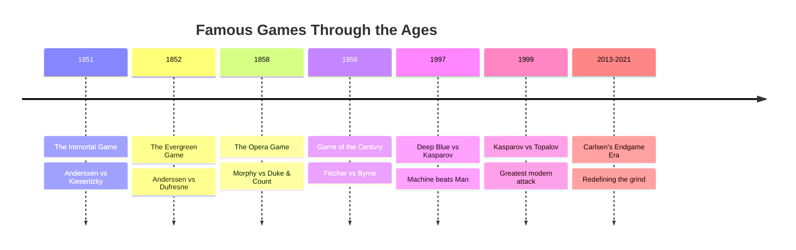

# Famous Games

Landmark games that every chess player should study. Each game illustrates fundamental principles brought to life at the highest level.

## Timeline

## The Games

- [The Immortal Game](immortal-game.md) — Anderssen vs Kieseritzky, 1851
- [The Evergreen Game](evergreen-game.md) — Anderssen vs Dufresne, 1852
- [The Opera Game](opera-game.md) — Morphy vs Duke of Brunswick & Count Isouard, 1858
- [Kasparov vs Topalov](kasparov-topalov.md) — Wijk aan Zee, 1999
- [The Game of the Century](game-of-century.md) — Fischer vs Byrne, 1956
- [Deep Blue vs Kasparov](deep-blue-kasparov.md) — Game 6, 1997
- [Carlsen's Endgame Mastery](carlsen-endgames.md) — the art of the grind

---

**See also:** [Tactics](../tactics/index.md) | [Openings](../openings/index.md) | [Fundamentals](../fundamentals/index.md)
