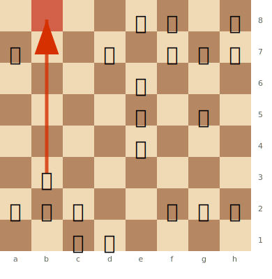

# The Opera Game

**Morphy vs Duke of Brunswick & Count Isouard, Paris 1858**

The most-taught game in chess history — and for good reason. Morphy demonstrates **every opening principle** in a single, elegant game. A masterclass in development, open lines, and the power of coordinated pieces.

**Opening:** [Philidor Defense](../openings/open-games/philidor-defense.md)

---

## The Game

```
1.e4 e5 2.Nf3 d6 3.d4 Bg4 4.dxe5 Bxf3 5.Qxf3 dxe5 6.Bc4 Nf6
7.Qb3 Qe7 8.Nc3 c6 9.Bg5 b5 10.Nxb5 cxb5 11.Bxb5+ Nbd7
12.O-O-O Rd8 13.Rxd7! Rxd7 14.Rd1 Qe6 15.Bxd7+ Nxd7
16.Qb8+!! Nxb8 17.Rd8#
```

---

## Key Moments

### Position before 16.Qb8+!! — The queen sacrifice and back rank mate

White has total control of the d-file. Black's pieces are cramped on the back rank with the king unable to escape. Morphy now plays the immortal queen sacrifice.



> **FEN:** `4kb1r/p2n1ppp/4q3/4p1B1/4P3/1Q6/PPP2PPP/2KR4 w - - 0 1`

After 16.Qb8+!! Nxb8 17.Rd8# — the rook delivers back rank mate, supported by the bishop on g5 which controls the e7 escape square. A textbook Opera Mate.

---

### Moves 3–6: Development advantage

Black wastes time with ...Bg4 and then has to recapture with the queen (5.Qxf3). Meanwhile, White develops rapidly: Bc4, Nc3, O-O-O. By move 12, White has **every piece in play**; Black's rooks, knight, and bishop are still mostly on their starting squares.

### 13.Rxd7! — Opening the d-file

Sacrificing the exchange to demolish Black's defences. The d-file becomes White's highway into the position.

### 16.Qb8+!! — The queen sacrifice

The crown jewel. After 16...Nxb8 17.Rd8# — a [back rank mate](../tactics/back-rank.md) with the bishop supporting from d7 (an [Opera Mate](../tactics/mating-patterns.md) pattern).

The queen sacrifice works because it **deflects** the knight from defending d8. See [Tactics — Deflection](../tactics/deflection-decoy.md).

---

## Lessons

1. **Development wins games** — when ahead in development, **open the position** — see [Fundamentals — Development](../fundamentals/development.md)
2. **Every piece should participate** — Morphy developed everything; his opponents left pieces on the back rank
3. **Open lines for your rooks** — the d-file was the key to the attack
4. **Don't waste time in the opening** — Black's early ...Bg4 was unproductive

---

## Historical Note

Played during an opera performance at the Italian Opera House in Paris. Morphy was seated in a box and played against two consulting amateurs between acts. The game took only a few minutes.

---

**Next:** [Kasparov vs Topalov](kasparov-topalov.md) | **Back to:** [Famous Games Index](index.md)
