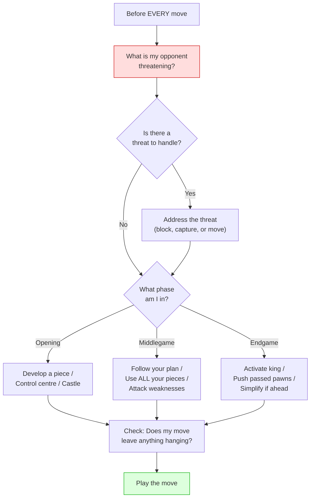

# Common Beginner Mistakes

Avoiding these pitfalls will accelerate your improvement faster than almost anything else.

**See also:** [Development](development.md) | [King Safety](king-safety.md) | [Tactics — Back Rank](../tactics/back-rank.md)

---

## The Twelve Deadly Sins

1. **Moving the same piece multiple times** in the opening instead of developing others — see [Development](development.md)

2. **Bringing the queen out too early** — she gets harassed, you lose tempo

3. **Not castling** or castling too late — the king in the centre is a target — see [King Safety](king-safety.md)

4. **Ignoring the opponent's threats** — always ask: *"What is my opponent threatening?"* before each move

5. **Chasing material at the cost of development** — grabbing a "poisoned" pawn while falling behind

6. **Not controlling the centre** — playing exclusively on the flanks without central influence — see [Centre Control](centre-control.md)

7. **Moving pawns in front of the castled king** — creating weaknesses that invite attacks

8. **Not using all pieces** — leaving a rook or bishop undeveloped while attacking with two or three pieces

9. **Trading pieces when behind in material** — when down material, keep pieces on for counterplay; trade when you're ahead

10. **Not having a plan** — making random moves without purpose. Even a bad plan is better than no plan (though a good plan is better still)

11. **Neglecting the endgame** — failing to study [basic endgames](../endgames/basic-checkmates.md) leads to throwing away won positions

12. **Fear of sacrificing** — sometimes giving up material is correct for positional compensation or attack — see [Tactics — Sacrifices](../tactics/sacrifices.md)

---

## The Fix

For each mistake, the fix is simple:

- **Before each move:** Check what the opponent threatens
- **In the opening:** Develop, control centre, castle
- **In the middlegame:** Make a plan, use all your pieces
- **In the endgame:** Activate the king, push passed pawns
- **Always:** Study [tactics](../tactics/index.md)

---

**Next:** [Time Management](time-management.md) | **Back to:** [Fundamentals Index](index.md)
