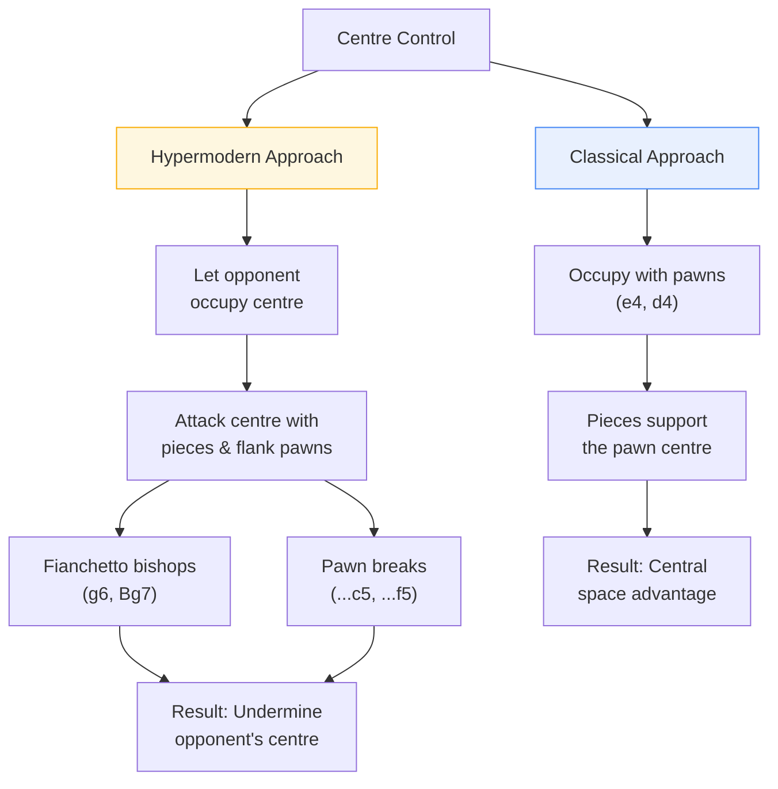

# Centre Control

The centre of the board (e4, d4, e5, d5) is the most important area in chess. Controlling it gives your pieces maximum range and flexibility.

**See also:** [Development](development.md) | [Pawn Structure Basics](pawn-structure-basics.md) | [Openings Index](../openings/index.md)

---

## Why the Centre Matters

- **Pieces in the centre control the most squares** — a knight on e5 controls 8 squares; on a1, only 2
- **Central control provides flexibility** — pieces can shift to either flank
- **It restricts the opponent** — controlling the centre limits their piece mobility

---

## Types of Centre

| Type | Description | Key Implications |
|------|-------------|-----------------|
| **Open** | Pawns exchanged | Piece play dominates; rapid development critical |
| **Closed** | Locked pawn chains | Flank play; knights often better than bishops |
| **Fixed** | Some tension resolved | Play dictated by pawn structure |
| **Dynamic/Fluid** | Pawn tension unresolved | Both sides must be alert to captures and breaks |

---

## Methods of Centre Control

### Classical Approach

**Occupy** the centre with pawns (e4, d4). The opening moves 1.e4 and 1.d4 follow this philosophy.

### Hypermodern Approach

**Control from a distance** — let the opponent occupy the centre, then attack it with pieces and flank pawns. Fianchettoed bishops (...g6, Bg7) and pawn breaks (...c5, ...f5) are the tools.

Both approaches are valid and are used in modern chess. Openings like the [King's Indian](../openings/indian-defenses/kings-indian.md), [Grünfeld](../openings/indian-defenses/grunfeld.md), and [English](../openings/flank-openings/english.md) follow hypermodern principles.

---

**Next:** [King Safety & Castling](king-safety.md) | **Back to:** [Fundamentals Index](index.md)
