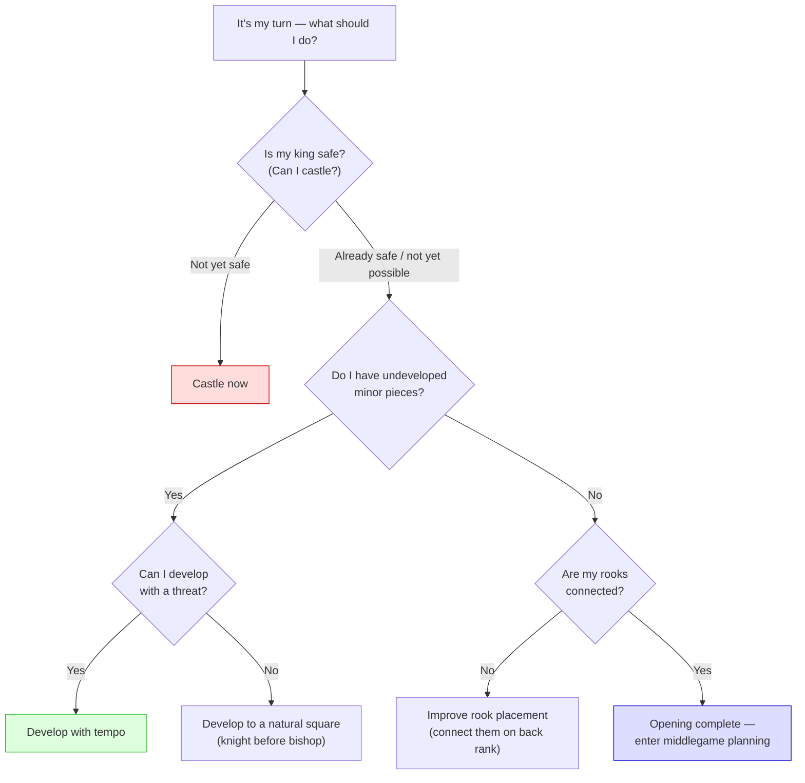
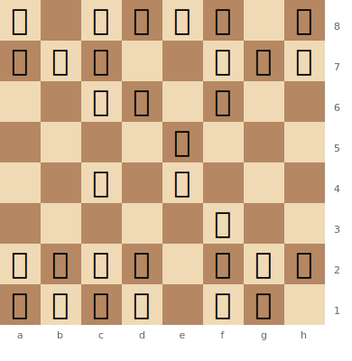
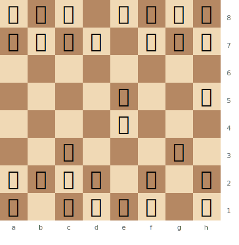

# Development Principles

Development means bringing pieces from their starting squares to active squares where they control the centre and are ready for action.

**See also:** [Centre Control](centre-control.md) | [King Safety](king-safety.md) | [Openings Index](../openings/index.md)

---

## Core Principles

1. **Move each piece once** before moving any piece twice in the opening
2. **Develop knights before bishops** — knights have fewer good squares, so optimal placement is clearer early
3. **Don't move the queen too early** — she's vulnerable to harassment by lesser pieces, losing tempo
4. **Control the centre with pawns** (e4, d4) to give pieces room
5. **Castle early** — connects rooks and secures the king
6. **Connect the rooks** — once all minor pieces are developed and the king is castled, the rooks should "see" each other on the back rank
7. **Develop with threats** when possible to gain tempo

---

## Tempo

Every move counts. If you waste a move (moving a developed piece back, making a useless pawn move), you fall behind in development.

**A lead in development is temporary** — it must be exploited before the opponent catches up. This usually means **opening the position** (exchanging pawns, creating open lines) while you have more pieces in play.

### Opening Move Decision Checklist

Use this flowchart before each move in the opening:

---

## Well-Developed vs Poorly Developed

**Good development:** White has castled, developed all minor pieces, and the rooks are nearly connected. Every piece is active.

> **FEN:** `r1bqkb1r/ppp2ppp/2np1n2/4p3/2B1P3/5N2/PPPP1PPP/RNBQ1RK1 w - - 0 1`

White (after 1.e4 e5 2.Nf3 Nc6 3.Bc4 Nf6 4.O-O) has castled and developed two pieces. Black has developed knights but the bishops and king remain on their starting squares.

**Poor development:** White has wasted time pushing flank pawns and moving the queen early. Only one piece is developed.

> **FEN:** `rnb1kbnr/pppp1ppp/8/4p2q/4P3/2N3P1/PPPP1P1P/R1BQKB1R w - - 0 1`

Black has brought the queen out early to h5 and only moved one pawn. White can gain tempo with moves like Nc3 threatening the queen, while developing naturally.

---

## Common Development Mistakes

- **Too many pawn moves** in the opening — pawns don't develop pieces
- **Moving the same piece twice** without a concrete reason
- **Queen adventures** — 1.e4 e5 2.Qh5?! is tempting but loses time
- **Ignoring development to grab pawns** — "poisoned pawn" positions punish greed

---

## The Opera Game Principle

[The Opera Game](../famous-games/opera-game.md) (Morphy, 1858) is the ultimate lesson in development. Morphy developed every piece while his opponents left theirs on the back rank. The result: a devastating attack.

**Key lesson:** When you're ahead in development, **open the position** to exploit it.

---

**Next:** [Centre Control](centre-control.md) | **Back to:** [Fundamentals Index](index.md)
