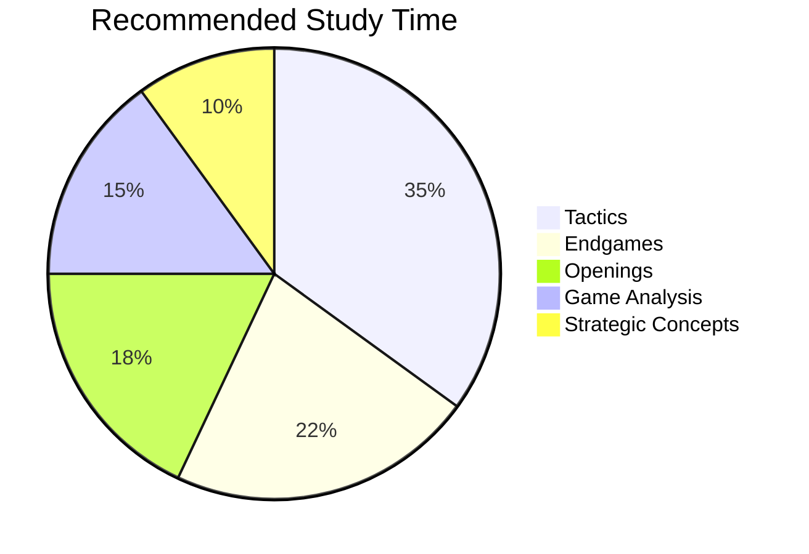
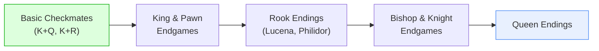
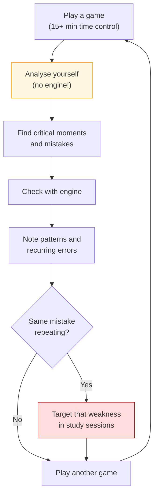

# How to Study Chess Effectively

A structured approach to chess improvement, applicable at every level.

**See also:** [Tactics Index](../tactics/index.md) | [Endgames Index](../endgames/index.md) | [Openings Index](../openings/index.md)

---

## Recommended Study Balance

| Area | Time % | Priority |
|------|--------|----------|
| [Tactics](../tactics/index.md) | 30–40% | Pattern recognition is the foundation |
| [Endgames](../endgames/index.md) | 20–25% | Permanent knowledge; doesn't change with fashion |
| [Openings](../openings/index.md) | 15–20% | Focus on ideas, not memorisation |
| Game Analysis | 15–20% | Analyse your own games — find your weaknesses |
| [Strategic Concepts](../middlegame/index.md) | 10% | Study annotated master games |

---

## Tactics Training

- **Solve puzzles daily** — consistency beats intensity
- Start with simple 1–2 move combinations
- Gradually increase difficulty
- Focus on [pattern recognition](../tactics/index.md): forks, pins, skewers, discovered attacks, back rank mates, deflection
- Speed comes naturally with repetition

---

## Endgame Study

- Learn [basic checkmates](../endgames/basic-checkmates.md) first
- Then [key theoretical positions](../endgames/rook-endings.md) (Lucena, Philidor)
- Endgame knowledge is **cumulative and permanent**
- Priority: King & pawn → Rook endings → Bishop/Knight → Queen

---

## Opening Study

- **Understand ideas and plans**, not long variations
- Learn 1–2 openings well for each colour
- Understand the typical middlegame positions that arise
- Don't memorise — understand

---

## Game Analysis

**The single most productive improvement method:**

1. Play a game (preferably long time control, 15+ minutes)
2. Analyse it yourself first — **without an engine**
3. Find critical moments, mistakes, and missed opportunities
4. Then check with an engine to see what you missed
5. Note patterns and recurring errors

---

## General Tips

1. **Play long time-control games** — blitz is fun but doesn't build understanding
2. **Study consistently** rather than in long sporadic sessions
3. **Focus on understanding**, not memorisation
4. **Play slightly stronger opponents** for the most learning
5. **Review and repeat** — spaced repetition works
6. **Study annotated master games** — Nimzowitsch's *My System*, Silman's *How to Reassess Your Chess*

---

**Next:** [Common Beginner Mistakes](beginner-mistakes.md) | **Back to:** [Fundamentals Index](index.md)
