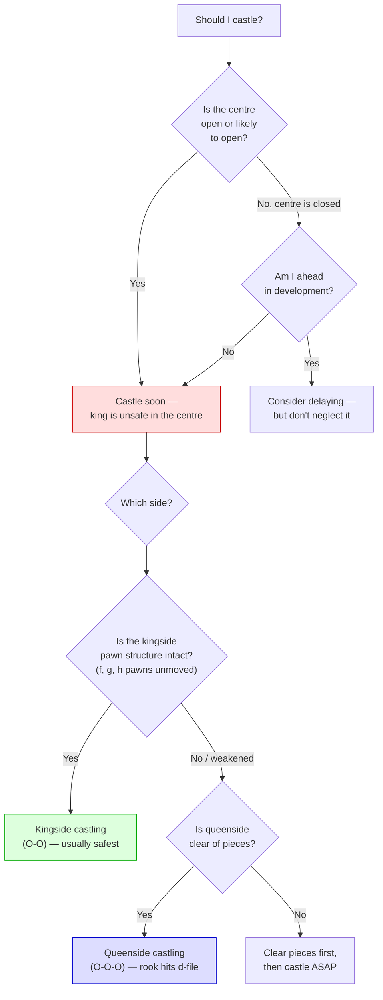

# King Safety & Castling

The king is the most important piece — the game ends when it's checkmated. Keeping the king safe is a fundamental priority throughout the game.

**See also:** [Attacking the Castled King](../middlegame/attacking-the-king.md) | [Tactics — Back Rank](../tactics/back-rank.md) | [Development](development.md)

---

## Castling

### Purpose

- Moves the king from the vulnerable centre to safety
- Activates the rook (brings it toward the centre)

### Kingside Castling (O-O)

More common. The king ends up behind f, g, h pawns. Safer because fewer pawns need to be moved.

### Queenside Castling (O-O-O)

King is slightly less safe (a-pawn unprotected, king more exposed on c1/c8), but the rook goes to d1/d8 — often an open or important file.

### Requirements

1. No pieces between king and rook
2. Neither the king nor the rook has moved previously
3. The king is not in check
4. The king does not pass through or land on an attacked square

---

## King Safety Principles

1. **Don't move the pawns in front of your castled king** unless necessary — each move creates weaknesses
2. **One pawn move (h3/h6)** may be useful (preventing back-rank mates, stopping Bg4 pins), but multiple pawn moves are dangerous
3. **Castle early** — an exposed king in the centre invites attacks
4. **Opposite-side castling** leads to sharp, tactical play where both sides storm pawns toward the enemy king

### Should I Castle? Which Side?

---

## Safe King vs Exposed King

**Safely castled king:** White has castled kingside with the f, g, h pawns intact. The king is tucked away and the rook is active.

<svg viewBox="0 0 390 400" xmlns="http://www.w3.org/2000/svg" style="max-width:400px">
  <rect x="0" y="0" width="360" height="360" fill="#b58863"/>
  <rect x="0" y="0" width="45" height="45" fill="#f0d9b5"/><rect x="90" y="0" width="45" height="45" fill="#f0d9b5"/><rect x="180" y="0" width="45" height="45" fill="#f0d9b5"/><rect x="270" y="0" width="45" height="45" fill="#f0d9b5"/>
  <rect x="45" y="45" width="45" height="45" fill="#f0d9b5"/><rect x="135" y="45" width="45" height="45" fill="#f0d9b5"/><rect x="225" y="45" width="45" height="45" fill="#f0d9b5"/><rect x="315" y="45" width="45" height="45" fill="#f0d9b5"/>
  <rect x="0" y="90" width="45" height="45" fill="#f0d9b5"/><rect x="90" y="90" width="45" height="45" fill="#f0d9b5"/><rect x="180" y="90" width="45" height="45" fill="#f0d9b5"/><rect x="270" y="90" width="45" height="45" fill="#f0d9b5"/>
  <rect x="45" y="135" width="45" height="45" fill="#f0d9b5"/><rect x="135" y="135" width="45" height="45" fill="#f0d9b5"/><rect x="225" y="135" width="45" height="45" fill="#f0d9b5"/><rect x="315" y="135" width="45" height="45" fill="#f0d9b5"/>
  <rect x="0" y="180" width="45" height="45" fill="#f0d9b5"/><rect x="90" y="180" width="45" height="45" fill="#f0d9b5"/><rect x="180" y="180" width="45" height="45" fill="#f0d9b5"/><rect x="270" y="180" width="45" height="45" fill="#f0d9b5"/>
  <rect x="45" y="225" width="45" height="45" fill="#f0d9b5"/><rect x="135" y="225" width="45" height="45" fill="#f0d9b5"/><rect x="225" y="225" width="45" height="45" fill="#f0d9b5"/><rect x="315" y="225" width="45" height="45" fill="#f0d9b5"/>
  <rect x="0" y="270" width="45" height="45" fill="#f0d9b5"/><rect x="90" y="270" width="45" height="45" fill="#f0d9b5"/><rect x="180" y="270" width="45" height="45" fill="#f0d9b5"/><rect x="270" y="270" width="45" height="45" fill="#f0d9b5"/>
  <rect x="45" y="315" width="45" height="45" fill="#f0d9b5"/><rect x="135" y="315" width="45" height="45" fill="#f0d9b5"/><rect x="225" y="315" width="45" height="45" fill="#f0d9b5"/><rect x="315" y="315" width="45" height="45" fill="#f0d9b5"/>
  <!-- Pieces -->
  <text x="22" y="33" text-anchor="middle" font-size="32" font-family="serif">♜</text>
  <text x="157" y="33" text-anchor="middle" font-size="32" font-family="serif">♛</text>
  <text x="247" y="33" text-anchor="middle" font-size="32" font-family="serif">♜</text>
  <text x="292" y="33" text-anchor="middle" font-size="32" font-family="serif">♚</text>
  <text x="22" y="78" text-anchor="middle" font-size="32" font-family="serif">♟</text>
  <text x="67" y="78" text-anchor="middle" font-size="32" font-family="serif">♟</text>
  <text x="112" y="78" text-anchor="middle" font-size="32" font-family="serif">♟</text>
  <text x="247" y="78" text-anchor="middle" font-size="32" font-family="serif">♟</text>
  <text x="292" y="78" text-anchor="middle" font-size="32" font-family="serif">♟</text>
  <text x="337" y="78" text-anchor="middle" font-size="32" font-family="serif">♟</text>
  <text x="112" y="123" text-anchor="middle" font-size="32" font-family="serif">♞</text>
  <text x="157" y="123" text-anchor="middle" font-size="32" font-family="serif">♟</text>
  <text x="247" y="123" text-anchor="middle" font-size="32" font-family="serif">♞</text>
  <text x="202" y="168" text-anchor="middle" font-size="32" font-family="serif">♟</text>
  <text x="112" y="213" text-anchor="middle" font-size="32" font-family="serif">♗</text>
  <text x="202" y="213" text-anchor="middle" font-size="32" font-family="serif">♙</text>
  <text x="247" y="258" text-anchor="middle" font-size="32" font-family="serif">♘</text>
  <text x="22" y="303" text-anchor="middle" font-size="32" font-family="serif">♙</text>
  <text x="67" y="303" text-anchor="middle" font-size="32" font-family="serif">♙</text>
  <text x="112" y="303" text-anchor="middle" font-size="32" font-family="serif">♙</text>
  <text x="157" y="303" text-anchor="middle" font-size="32" font-family="serif">♙</text>
  <text x="247" y="303" text-anchor="middle" font-size="32" font-family="serif">♙</text>
  <text x="292" y="303" text-anchor="middle" font-size="32" font-family="serif">♙</text>
  <text x="337" y="303" text-anchor="middle" font-size="32" font-family="serif">♙</text>
  <text x="22" y="348" text-anchor="middle" font-size="32" font-family="serif">♖</text>
  <text x="112" y="348" text-anchor="middle" font-size="32" font-family="serif">♗</text>
  <text x="157" y="348" text-anchor="middle" font-size="32" font-family="serif">♕</text>
  <text x="247" y="348" text-anchor="middle" font-size="32" font-family="serif">♖</text>
  <text x="292" y="348" text-anchor="middle" font-size="32" font-family="serif">♔</text>
  <!-- Coordinates -->
  <text x="22" y="375" font-size="11" fill="#666" text-anchor="middle" font-family="sans-serif">a</text>
  <text x="67" y="375" font-size="11" fill="#666" text-anchor="middle" font-family="sans-serif">b</text>
  <text x="112" y="375" font-size="11" fill="#666" text-anchor="middle" font-family="sans-serif">c</text>
  <text x="157" y="375" font-size="11" fill="#666" text-anchor="middle" font-family="sans-serif">d</text>
  <text x="202" y="375" font-size="11" fill="#666" text-anchor="middle" font-family="sans-serif">e</text>
  <text x="247" y="375" font-size="11" fill="#666" text-anchor="middle" font-family="sans-serif">f</text>
  <text x="292" y="375" font-size="11" fill="#666" text-anchor="middle" font-family="sans-serif">g</text>
  <text x="337" y="375" font-size="11" fill="#666" text-anchor="middle" font-family="sans-serif">h</text>
  <text x="370" y="33" font-size="11" fill="#666" font-family="sans-serif">8</text>
  <text x="370" y="78" font-size="11" fill="#666" font-family="sans-serif">7</text>
  <text x="370" y="123" font-size="11" fill="#666" font-family="sans-serif">6</text>
  <text x="370" y="168" font-size="11" fill="#666" font-family="sans-serif">5</text>
  <text x="370" y="213" font-size="11" fill="#666" font-family="sans-serif">4</text>
  <text x="370" y="258" font-size="11" fill="#666" font-family="sans-serif">3</text>
  <text x="370" y="303" font-size="11" fill="#666" font-family="sans-serif">2</text>
  <text x="370" y="348" font-size="11" fill="#666" font-family="sans-serif">1</text>
</svg>

> **FEN:** `r2q1rk1/ppp2ppp/2np1n2/4p3/2B1P3/5N2/PPPP1PPP/R1BQ1RK1 w - - 0 1`

Both kings have castled kingside with intact pawn shields. This is a solid, safe configuration.

**Exposed king in the centre:** White failed to castle and the centre has opened. The king on e1 is a sitting target.

<svg viewBox="0 0 390 400" xmlns="http://www.w3.org/2000/svg" style="max-width:400px">
  <rect x="0" y="0" width="360" height="360" fill="#b58863"/>
  <rect x="0" y="0" width="45" height="45" fill="#f0d9b5"/><rect x="90" y="0" width="45" height="45" fill="#f0d9b5"/><rect x="180" y="0" width="45" height="45" fill="#f0d9b5"/><rect x="270" y="0" width="45" height="45" fill="#f0d9b5"/>
  <rect x="45" y="45" width="45" height="45" fill="#f0d9b5"/><rect x="135" y="45" width="45" height="45" fill="#f0d9b5"/><rect x="225" y="45" width="45" height="45" fill="#f0d9b5"/><rect x="315" y="45" width="45" height="45" fill="#f0d9b5"/>
  <rect x="0" y="90" width="45" height="45" fill="#f0d9b5"/><rect x="90" y="90" width="45" height="45" fill="#f0d9b5"/><rect x="180" y="90" width="45" height="45" fill="#f0d9b5"/><rect x="270" y="90" width="45" height="45" fill="#f0d9b5"/>
  <rect x="45" y="135" width="45" height="45" fill="#f0d9b5"/><rect x="135" y="135" width="45" height="45" fill="#f0d9b5"/><rect x="225" y="135" width="45" height="45" fill="#f0d9b5"/><rect x="315" y="135" width="45" height="45" fill="#f0d9b5"/>
  <rect x="0" y="180" width="45" height="45" fill="#f0d9b5"/><rect x="90" y="180" width="45" height="45" fill="#f0d9b5"/><rect x="180" y="180" width="45" height="45" fill="#f0d9b5"/><rect x="270" y="180" width="45" height="45" fill="#f0d9b5"/>
  <rect x="45" y="225" width="45" height="45" fill="#f0d9b5"/><rect x="135" y="225" width="45" height="45" fill="#f0d9b5"/><rect x="225" y="225" width="45" height="45" fill="#f0d9b5"/><rect x="315" y="225" width="45" height="45" fill="#f0d9b5"/>
  <rect x="0" y="270" width="45" height="45" fill="#f0d9b5"/><rect x="90" y="270" width="45" height="45" fill="#f0d9b5"/><rect x="180" y="270" width="45" height="45" fill="#f0d9b5"/><rect x="270" y="270" width="45" height="45" fill="#f0d9b5"/>
  <rect x="45" y="315" width="45" height="45" fill="#f0d9b5"/><rect x="135" y="315" width="45" height="45" fill="#f0d9b5"/><rect x="225" y="315" width="45" height="45" fill="#f0d9b5"/><rect x="315" y="315" width="45" height="45" fill="#f0d9b5"/>
  <!-- Pieces -->
  <text x="22" y="33" text-anchor="middle" font-size="32" font-family="serif">♜</text>
  <text x="157" y="33" text-anchor="middle" font-size="32" font-family="serif">♛</text>
  <text x="247" y="33" text-anchor="middle" font-size="32" font-family="serif">♜</text>
  <text x="292" y="33" text-anchor="middle" font-size="32" font-family="serif">♚</text>
  <text x="22" y="78" text-anchor="middle" font-size="32" font-family="serif">♟</text>
  <text x="67" y="78" text-anchor="middle" font-size="32" font-family="serif">♟</text>
  <text x="112" y="78" text-anchor="middle" font-size="32" font-family="serif">♟</text>
  <text x="247" y="78" text-anchor="middle" font-size="32" font-family="serif">♟</text>
  <text x="292" y="78" text-anchor="middle" font-size="32" font-family="serif">♟</text>
  <text x="337" y="78" text-anchor="middle" font-size="32" font-family="serif">♟</text>
  <text x="112" y="123" text-anchor="middle" font-size="32" font-family="serif">♞</text>
  <text x="247" y="123" text-anchor="middle" font-size="32" font-family="serif">♞</text>
  <text x="157" y="168" text-anchor="middle" font-size="32" font-family="serif">♟</text>
  <text x="112" y="213" text-anchor="middle" font-size="32" font-family="serif">♗</text>
  <text x="247" y="258" text-anchor="middle" font-size="32" font-family="serif">♘</text>
  <text x="22" y="303" text-anchor="middle" font-size="32" font-family="serif">♙</text>
  <text x="67" y="303" text-anchor="middle" font-size="32" font-family="serif">♙</text>
  <text x="112" y="303" text-anchor="middle" font-size="32" font-family="serif">♙</text>
  <text x="247" y="303" text-anchor="middle" font-size="32" font-family="serif">♙</text>
  <text x="292" y="303" text-anchor="middle" font-size="32" font-family="serif">♙</text>
  <text x="337" y="303" text-anchor="middle" font-size="32" font-family="serif">♙</text>
  <text x="22" y="348" text-anchor="middle" font-size="32" font-family="serif">♖</text>
  <text x="112" y="348" text-anchor="middle" font-size="32" font-family="serif">♗</text>
  <text x="157" y="348" text-anchor="middle" font-size="32" font-family="serif">♕</text>
  <text x="202" y="348" text-anchor="middle" font-size="32" font-family="serif">♔</text>
  <text x="337" y="348" text-anchor="middle" font-size="32" font-family="serif">♖</text>
  <!-- Coordinates -->
  <text x="22" y="375" font-size="11" fill="#666" text-anchor="middle" font-family="sans-serif">a</text>
  <text x="67" y="375" font-size="11" fill="#666" text-anchor="middle" font-family="sans-serif">b</text>
  <text x="112" y="375" font-size="11" fill="#666" text-anchor="middle" font-family="sans-serif">c</text>
  <text x="157" y="375" font-size="11" fill="#666" text-anchor="middle" font-family="sans-serif">d</text>
  <text x="202" y="375" font-size="11" fill="#666" text-anchor="middle" font-family="sans-serif">e</text>
  <text x="247" y="375" font-size="11" fill="#666" text-anchor="middle" font-family="sans-serif">f</text>
  <text x="292" y="375" font-size="11" fill="#666" text-anchor="middle" font-family="sans-serif">g</text>
  <text x="337" y="375" font-size="11" fill="#666" text-anchor="middle" font-family="sans-serif">h</text>
  <text x="370" y="33" font-size="11" fill="#666" font-family="sans-serif">8</text>
  <text x="370" y="78" font-size="11" fill="#666" font-family="sans-serif">7</text>
  <text x="370" y="123" font-size="11" fill="#666" font-family="sans-serif">6</text>
  <text x="370" y="168" font-size="11" fill="#666" font-family="sans-serif">5</text>
  <text x="370" y="213" font-size="11" fill="#666" font-family="sans-serif">4</text>
  <text x="370" y="258" font-size="11" fill="#666" font-family="sans-serif">3</text>
  <text x="370" y="303" font-size="11" fill="#666" font-family="sans-serif">2</text>
  <text x="370" y="348" font-size="11" fill="#666" font-family="sans-serif">1</text>
</svg>

> **FEN:** `r2q1rk1/ppp2ppp/2n2n2/3p4/2B5/5N2/PPP2PPP/R1BQK2R w - - 0 1`

White's king is stuck on e1 with the e-file open. Black's rooks and queen can target the king down the centre. The d- and e-pawns have been exchanged, leaving the king dangerously exposed.

---

## Common Threats to the Castled King

- [Greek Gift sacrifice (Bxh7+)](../tactics/sacrifices.md)
- Pawn storms (g4–g5, h4–h5)
- Piece build-up on the kingside
- Opening the h-file or g-file
- [Back rank mate](../tactics/back-rank.md)

---

**Next:** [Pawn Structure Basics](pawn-structure-basics.md) | **Back to:** [Fundamentals Index](index.md)
