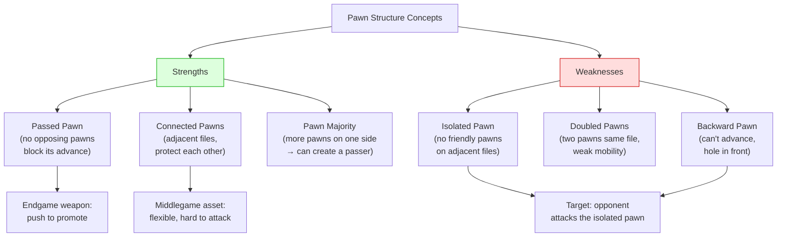

# Pawn Structure Basics

Pawns are the "soul of chess" (Philidor). The pawn structure is the skeleton that determines the character of the position. For a deep dive, see [Middlegame — Pawn Structures](../middlegame/pawn-structures.md).

**See also:** [Centre Control](centre-control.md) | [Endgames — King & Pawn](../endgames/king-pawn-endings.md)

---

## Key Pawn Concepts

| Concept | Description | Character |
|---------|-------------|-----------|
| **Isolated pawn** | No friendly pawns on adjacent files | Dynamic strength, endgame weakness |
| **Doubled pawns** | Two pawns on the same file | Weak mobility, but control extra squares |
| **Backward pawn** | Can't advance; square in front is a hole | Target for the opponent |
| **Passed pawn** | No opposing pawns blocking its advance | Very dangerous, especially in endgames |
| **Connected pawns** | Adjacent files, can protect each other | Strong and flexible |
| **Pawn chain** | Diagonal line of pawns | Attack the base (Nimzowitsch) |
| **Pawn majority** | More pawns on one side | Can create a passed pawn |
| **Pawn islands** | Groups of connected pawns | Fewer = healthier |

### Pawn Structure Relationships

---

## The Golden Rules

1. **Don't create weaknesses without a reason** — every pawn move creates a permanent change
2. **Pawns can't go backwards** — think before you push
3. **A passed pawn must be pushed** (Nimzowitsch) — or at least kept in reserve as a threat
4. **The best pawn structure is useless without piece activity** — structure and activity work together

---

**Next:** [Phases of the Game](phases.md) | **Back to:** [Fundamentals Index](index.md)
