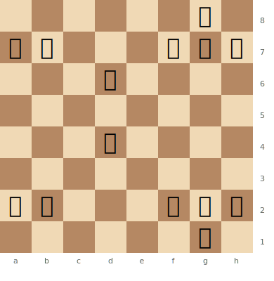
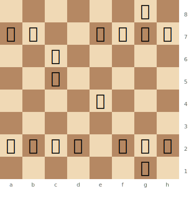
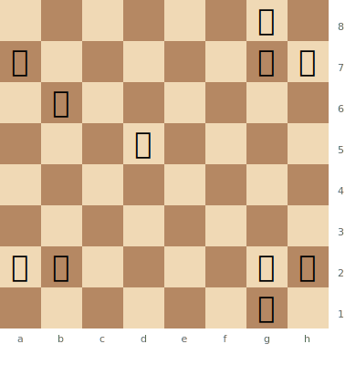
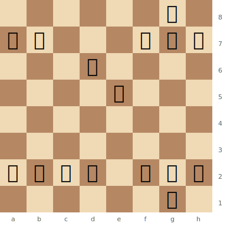

# Pawn Structure Basics

Pawns are the "soul of chess" (Philidor). The pawn structure is the skeleton that determines the character of the position. For a deep dive, see [Middlegame — Pawn Structures](../middlegame/pawn-structures.md).

**See also:** [Centre Control](centre-control.md) | [Endgames — King & Pawn](../endgames/king-pawn-endings.md)

---

## Key Pawn Concepts

| Concept | Description | Character |
|---------|-------------|-----------|
| **Isolated pawn** | No friendly pawns on adjacent files | Dynamic strength, endgame weakness |
| **Doubled pawns** | Two pawns on the same file | Weak mobility, but control extra squares |
| **Backward pawn** | Can't advance; square in front is a hole | Target for the opponent |
| **Passed pawn** | No opposing pawns blocking its advance | Very dangerous, especially in endgames |
| **Connected pawns** | Adjacent files, can protect each other | Strong and flexible |
| **Pawn chain** | Diagonal line of pawns | Attack the base (Nimzowitsch) |
| **Pawn majority** | More pawns on one side | Can create a passed pawn |
| **Pawn islands** | Groups of connected pawns | Fewer = healthier |

---

## Pawn Structure Diagrams

### Isolated Pawn

The white d4 pawn has no friendly pawns on the c- or e-files. It cannot be defended by another pawn and becomes a target.

> **FEN:** `6k1/pp3ppp/3p4/8/3P4/8/PP3PPP/6K1 w - - 0 1`

White's d4 pawn is isolated — the c- and e-pawns are gone. Black can blockade it on d5 and target it with pieces.

### Doubled Pawns

Black has doubled pawns on the c-file after a piece exchange. They are clumsy and hard to advance.

> **FEN:** `6k1/pp2pppp/2p5/2p5/4P3/8/PPPP1PPP/6K1 w - - 0 1`

Black's pawns on c5 and c6 are doubled. They block each other's advance and cannot both be defended by pawns.

### Passed Pawn

White has a passed pawn on d5 — no black pawns can stop it from advancing.

> **FEN:** `6k1/p5pp/1p6/3P4/8/8/PP4PP/6K1 w - - 0 1`

White's d5 pawn is passed — Black has no pawns on the c-, d-, or e-files that can block it. In an endgame, this pawn is a powerful asset that ties down Black's pieces.

### Backward Pawn

Black's d6 pawn is backward — it cannot safely advance because e5 is controlled by White.

> **FEN:** `6k1/pp3ppp/3p4/4P3/8/8/PPPP1PPP/6K1 w - - 0 1`

Black's d6 pawn is backward. It cannot advance to d5 because White controls that square with the e5 pawn. The square d5 becomes a "hole" — an outpost for White's pieces.

---

## The Golden Rules

1. **Don't create weaknesses without a reason** — every pawn move creates a permanent change
2. **Pawns can't go backwards** — think before you push
3. **A passed pawn must be pushed** (Nimzowitsch) — or at least kept in reserve as a threat
4. **The best pawn structure is useless without piece activity** — structure and activity work together

---

**Next:** [Phases of the Game](phases.md) | **Back to:** [Fundamentals Index](index.md)
