# Phases of the Chess Game

A chess game flows through three distinct phases, each with different priorities and skills.

**See also:** [Openings Index](../openings/index.md) | [Middlegame Index](../middlegame/index.md) | [Endgames Index](../endgames/index.md)

```mermaid
flowchart LR
    subgraph OP["Opening (moves 1–15)"]
        O1["Develop pieces"]
        O2["Control centre"]
        O3["Castle"]
    end
    subgraph MG["Middlegame (moves 15–35)"]
        M1["Execute plans"]
        M2["Attack weaknesses"]
        M3["Tactical combinations"]
    end
    subgraph EG["Endgame (few pieces left)"]
        E1["Activate king"]
        E2["Create passed pawns"]
        E3["Convert advantage"]
    end
    OP -- "Development complete\nPieces active" --> MG
    MG -- "Queens traded\nMaterial simplified" --> EG
    style OP fill:#e8f0fe,stroke:#4285f4
    style MG fill:#fef7e0,stroke:#f9ab00
    style EG fill:#e6f4ea,stroke:#34a853
```

---

## Opening (Moves 1–10/15)

**Goals:** Develop pieces, control the centre, ensure king safety, establish a sound pawn structure.

**Key principles:** Develop all pieces quickly, castle early, don't waste tempo, fight for the centre.

**Transition:** Once both sides have completed development, the middlegame begins.

See the [Openings section](../openings/index.md) for specific opening systems.

---

## Middlegame (Moves 10/15–30/40)

**Goals:** Execute plans based on the pawn structure, attack weaknesses, improve piece placement, create and exploit advantages.

**Key activities:** Tactical combinations, strategic planning, attacking the king, exploiting weak pawns/squares, manoeuvring pieces.

**Transition:** Usually marked by the exchange of queens and simplification of material.

See the [Middlegame section](../middlegame/index.md) for strategic concepts.

---

## Endgame (When queens are traded / few pieces remain)

**Goals:** Activate the king (it becomes a fighting piece), create passed pawns, convert advantages.

**Key characteristics:**
- The king is **active and centralised** — no longer needs shelter
- Pawn promotion becomes the primary concern
- **Technique** replaces tactics as the dominant factor
- Every tempo matters more than ever

See the [Endgames section](../endgames/index.md) for endgame theory.

---

**Next:** [Chess Notation](notation.md) | **Back to:** [Fundamentals Index](index.md)
