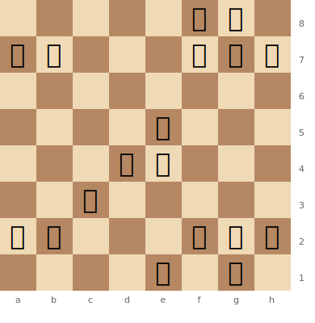
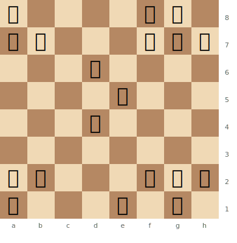

# Piece Values

Understanding the relative value of each piece is essential for making good decisions about trades, sacrifices, and exchanges.

**See also:** [Development](development.md) | [Tactics — Sacrifices](../tactics/sacrifices.md)

---

## Classical Values (Reinfeld)

| Piece | Value | Symbol |
|-------|-------|--------|
| Pawn | 1 | ♟ |
| Knight | 3 | ♞ |
| Bishop | 3 | ♝ |
| Rook | 5 | ♜ |
| Queen | 9 | ♛ |
| King | ∞ (game ends) | ♚ |

## Modern Values (Computer-Adjusted)

| Piece | Value |
|-------|-------|
| Pawn | 1.0 |
| Knight | 3.05 |
| Bishop | 3.33 |
| Rook | 5.63 |
| Queen | 9.5 |

---

## Key Insights

### The Bishop Pair Bonus

Two bishops together are worth approximately **0.5 pawns more** than bishop + knight or two knights. They control both colour complexes and work beautifully at long range. See [Middlegame — The Bishop Pair](../middlegame/piece-activity.md).

**Bishop pair dominating in an open position:** White's two bishops rake across the board, outperforming Black's two knights on an open board.

> **FEN:** `5rk1/pp3ppp/8/4p3/3PP3/2B5/PP3PPP/4R1K1 w - - 0 1`

White's bishops on c3 and (after Bd3 or Bf5) control long diagonals across the open centre, while Black's knights lack stable outposts.

### The Exchange

**Rook vs minor piece** (bishop or knight) = "the exchange," worth roughly **2 points**. "Winning the exchange" means trading a minor piece for a rook.

### Bishop vs Knight

A bishop is slightly stronger than a knight in **most** positions (especially open positions). Knights excel in **closed** positions. See [Middlegame — Knight vs Bishop](../middlegame/piece-activity.md).

### Activity Over Material

**Piece activity matters more than raw point count.** An active knight on e5 can be worth more than a passive rook on a1. Material values are guidelines, not absolutes — position, pawn structure, and king safety all modify the effective value of pieces.

**Active knight vs passive rook:** White's knight on e5 dominates the board, while Black's rook on a8 sits idle behind its own pawns.

> **FEN:** `r4rk1/pp3ppp/3p4/4N3/3P4/8/PP3PPP/R3R1K1 w - - 0 1`

---

**Next:** [Development Principles](development.md) | **Back to:** [Fundamentals Index](index.md)
