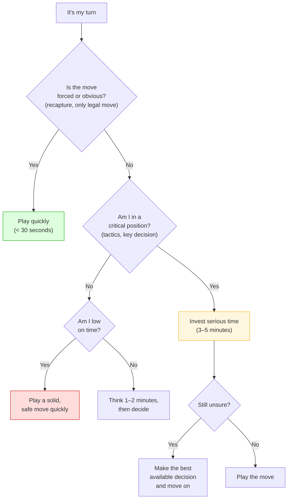

# Time Management

Using the chess clock wisely is a skill that separates good players from great ones.

---

## General Principles

1. **Spend time on critical positions** — don't spend equal time on every move
2. **Play routine moves quickly** — recaptures, forced moves, known opening theory
3. **Think on the opponent's time** — predict likely moves and calculate in advance

---

## Time Allocation (90-Minute Game)

| Phase | Time Budget | Notes |
|-------|------------|-------|
| Opening | 15–20 min | Less if you know your theory well |
| Middlegame | 45–55 min | The critical phase — invest here |
| Endgame | 15–20 min | Plus increment |

---

## Avoiding Time Trouble

1. **Set mental checkpoints** — "By move 20, I should have 60+ minutes"
2. **If stuck on a move:** Make a reasonable decision and move on. A good move played is better than a perfect move never found
3. **Practice deciding under pressure** in training games

## In Time Trouble

- **Simplify** when possible
- **Avoid complex positions** where one mistake is fatal
- **Play solid moves** — avoid sharp tactics
- **Use increment wisely** — the 30-second buffer can save you

### How Much Time Should I Spend on This Move?

---

**Back to:** [Fundamentals Index](index.md)
