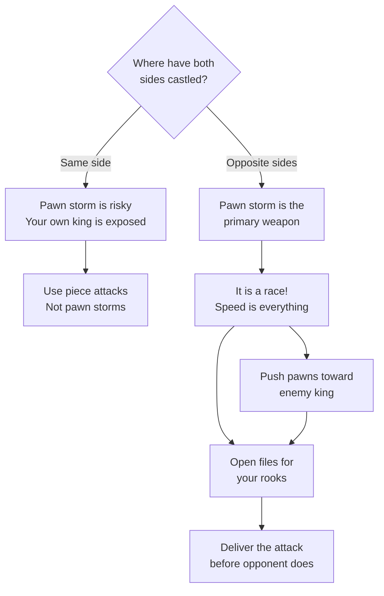
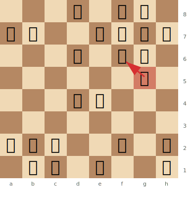
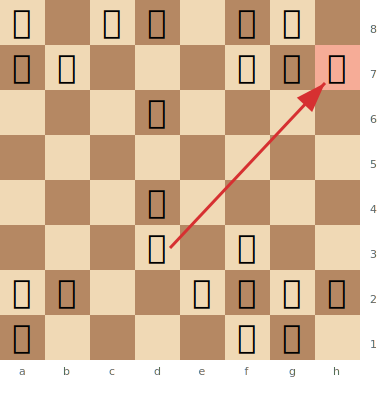
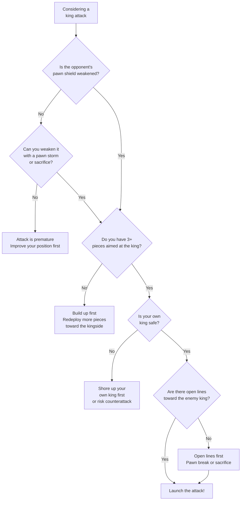

# Attacking the Castled King

The ultimate goal of a chess attack — breaking through the pawn shield and delivering checkmate or winning decisive material. This page covers the key attacking themes and patterns.

**See also:** [Sacrifices](../tactics/sacrifices.md) | [Mating Patterns](../tactics/mating-patterns.md) | [Piece Activity](piece-activity.md) | [Fundamentals — King Safety](../fundamentals/king-safety.md)

---

## The Greek Gift Sacrifice (Bxh7+)

The most famous attacking pattern. See [Tactics — Sacrifices](../tactics/sacrifices.md) for a detailed breakdown.

**Requirements:**
1. Bishop can reach h7
2. Knight can reach g5 after Bxh7+ Kxh7
3. Queen can join the attack (Qh5 or Qd3+)
4. Black's Nf6 is absent (key defender)

---

## Kingside Pawn Storms

When both sides have castled on the **same side**, a pawn storm is risky (your own king is exposed). When castled on **opposite sides**, pawn storms are the primary weapon.

### Opposite-Side Castling

```
White castles queenside, Black castles kingside (or vice versa).
Both sides storm the pawns toward the enemy king.
Speed is everything — one tempo can decide who mates first.
```



**Diagram — Opposite-Side Castling Pawn Storm:**

A Sicilian Dragon-type position. White has castled queenside and launched a kingside pawn storm with g4-g5. Black has castled kingside and is pushing queenside pawns. It is a race.



> **FEN:** `3q1rk1/pp2ppbp/3p1np1/6P1/3PP3/8/PPP2P1P/1KR1B2R w - - 0 1`

White's g5 pawn attacks the Nf6 defender. After g5xf6, the g-file rips open toward Black's king. White's rooks on d1 and h1 are ready to pour in. Meanwhile, Black's queenside pawns (a7, b7) are still far from White's king. White is winning the race.

### Key Principles

1. **Open files toward the enemy king** — push pawns to tear open the shield
2. **h4–h5 (or ...h5–h4)** — classic storm against a fianchettoed king (g6 setup)
3. **g4–g5** — attacks the Nf6 defender and opens the g-file
4. **f4–f5** — undermines the e6 pawn (in many Sicilian positions)

### Typical Plans

| Attack vs Kingside Castle | Pawn Storm Moves |
|---------------------------|-----------------|
| Against g6 setup | h4–h5, open the h-file |
| Against standard castle (f7,g7,h7) | g4–g5 to chase Nf6, then open g/h files |
| Against fianchetto | h4–h5–hxg6, then Qh5 and Rh1 |

---

## Piece Attacks (Without Pawn Storms)

### Building Up the Attack

1. **Aim pieces at the king** — bishop on the bd3–h7 diagonal, knight on e5 or g5, queen ready to swing to the kingside
2. **The rule of three:** You typically need 3+ pieces in the attack to break through
3. **Remove defenders:** Exchange or deflect the pieces protecting the king — see [Removing the Defender](../tactics/removing-the-defender.md)
4. **Open lines:** If the h-file or g-file opens, pour rooks in

**Diagram — Classic Piece Attack on the Castled King:**

White has built a textbook kingside attack. The bishop eyes h7, the knight is ready to leap to g5, and the queen can swing to h5. Black's king is about to face a Greek Gift sacrifice (Bxh7+).



> **FEN:** `r1bq1rk1/pp3ppp/3p4/8/3P4/3B1N2/PP2QPPP/R4RK1 w - - 0 1`

White plays Bxh7+! Kxh7, Ng5+ Kg8 (or Kg6), Qh5 with a devastating attack. The bishop on d3 aims at h7, the Nf3 can reach g5 in one move, and the Qe2 is poised to jump to h5. This is the classic three-piece attacking setup.

### Typical Piece Manoeuvres

- **Knight lift:** Nf3–h2–g4 (or Nf3–d2–f1–g3–h5)
- **Rook lift:** Ra1–a3–h3 (or Rf1–f3–g3/h3)
- **Queen redeployment:** Qd1–e2–h5 (or Qd1–f3–h3)
- **Bishop sacrifice:** Bxh7+, Bxg7 — see [Sacrifices](../tactics/sacrifices.md)

---

## Signs That an Attack Is Possible

1. **Opponent's king lacks defenders** — pieces are on the queenside
2. **Pawn shield is weakened** — h6 weakness, g6 weakness, missing f-pawn
3. **You have a lead in development** — more pieces ready to attack
4. **Open lines exist** — files, diagonals, or ranks leading to the king
5. **Opponent's pieces are uncoordinated** — can't defend together

---

## Signs That an Attack Is Premature

1. **Your pieces aren't ready** — insufficient attackers
2. **The opponent's defences are solid** — all pawns intact, defenders in place
3. **Your own king is weak** — a counterattack may be more dangerous
4. **The position is closed** — no lines to open toward the king

### Should I Attack? Decision Flowchart



---

## Famous Attacking Games

- [The Immortal Game](../famous-games/immortal-game.md) — sacrifice everything for the attack
- [The Evergreen Game](../famous-games/evergreen-game.md) — quiet preparation then explosive finish
- [Kasparov vs Topalov](../famous-games/kasparov-topalov.md) — modern sacrificial masterpiece
- [The Opera Game](../famous-games/opera-game.md) — textbook development into a devastating attack

---

**Back to:** [Middlegame Index](index.md)
