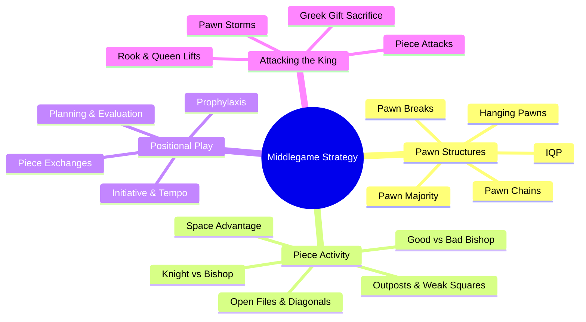

# Middlegame Strategy

The middlegame is where chess battles are won and lost. After the opening development phase, strategic planning, positional understanding, and tactical execution determine the outcome.

## Topics

- [Pawn Structures](pawn-structures.md) — the skeleton of the position
- [Piece Activity & Positional Concepts](piece-activity.md) — outposts, open files, good/bad bishops, coordination
- [Attacking the Castled King](attacking-the-king.md) — sacrifices, pawn storms, mating attacks

## How Middlegame Concepts Interconnect

---

**See also:** [Tactics](../tactics/index.md) | [Openings](../openings/index.md) | [Endgames](../endgames/index.md) | [Fundamentals](../fundamentals/index.md)
