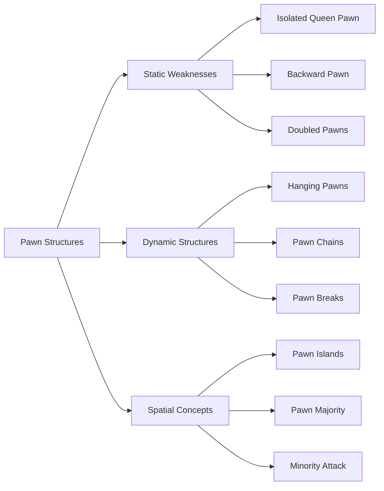
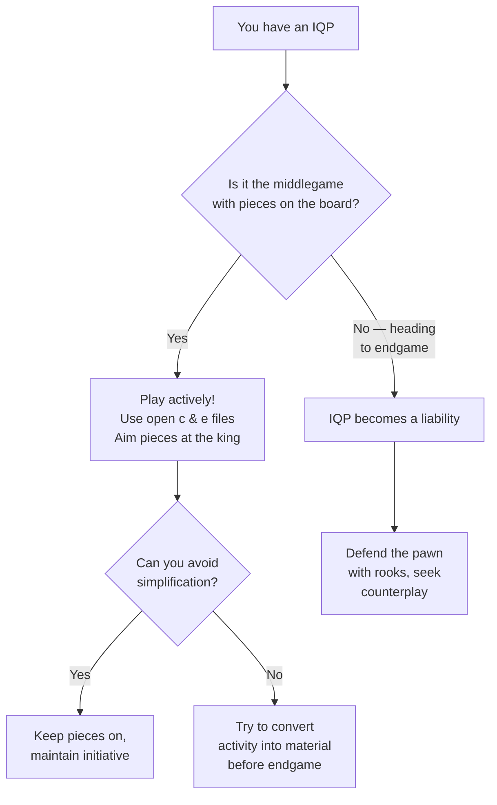
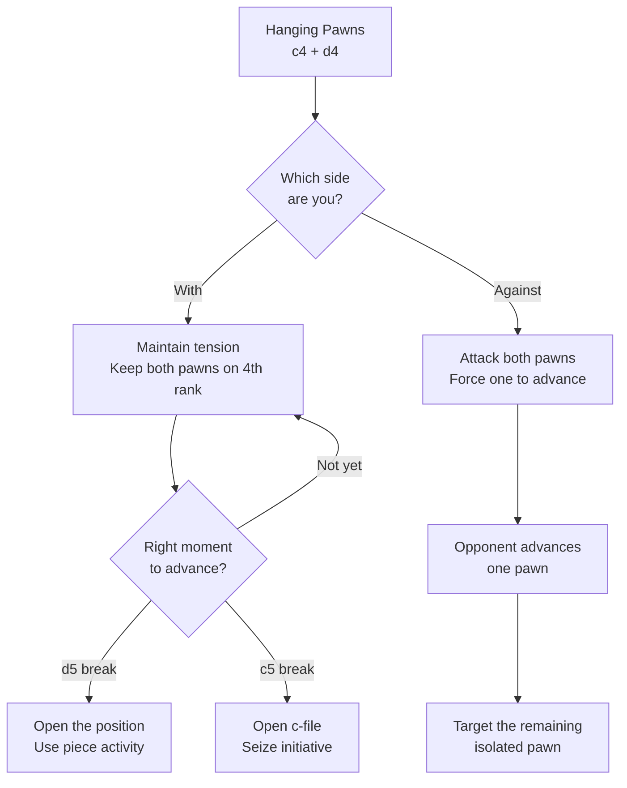
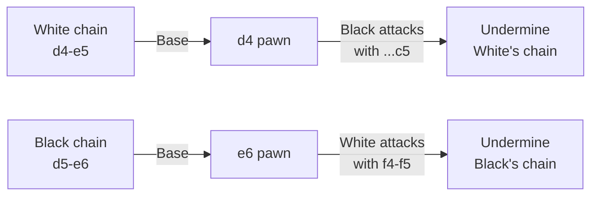

# Pawn Structures

Pawns are the "soul of chess" (Philidor). The pawn structure — the arrangement of pawns on the board — determines the character of the position and dictates which plans are available to each side.

**See also:** [Piece Activity](piece-activity.md) | [Attacking the King](attacking-the-king.md) | [Endgames — King & Pawn](../endgames/king-pawn-endings.md) | [Fundamentals — Pawn Basics](../fundamentals/pawn-structure-basics.md)

## Pawn Structure Types at a Glance



---

## Isolated Queen Pawn (IQP)

A pawn on d4 (or d5) with no friendly pawns on the c- or e-files.

### Strengths
- Controls key central squares (e5 and c5 for a d4 IQP)
- Half-open c- and e-files for rooks
- Active piece play — pieces are naturally well-placed around an IQP
- The square in front (d5) is powerful IF you control it

### Weaknesses
- Can be blockaded (a piece on d5 is very strong for the opponent)
- In the endgame, the isolated pawn becomes a target
- Must be defended by pieces, not pawns

### When It Arises
- [Queen's Gambit Accepted](../openings/closed-games/qga.md)
- [Panov-Botvinnik Attack](../openings/semi-open/caro-kann.md) (Caro-Kann)
- [Alapin Sicilian](../openings/semi-open/sicilian-defense.md) (2.c3)
- Various [French Defense](../openings/semi-open/french-defense.md) lines

### Strategy
- **With the IQP:** Play actively! Attack before the endgame. Use the open files and active pieces. Avoid exchanges that lead to a pure endgame where the IQP is weak.
- **Against the IQP:** Blockade the pawn on d5. Exchange pieces to reach an endgame. Target the pawn with heavy pieces.



---

## Hanging Pawns

Two connected pawns on the 4th rank (typically c4 and d4) without support from other pawns.

### Strengths
- Control a wide band of central squares
- Support piece activity
- Can advance to create threats (d5 or c5 break)

### Weaknesses
- Both pawns can become targets
- If one advances, the other becomes isolated (creating an IQP)
- Under pressure, the position can collapse quickly

### Strategy
- **With hanging pawns:** Maintain the tension. Look for the right moment to advance one pawn (d5 or c5) to break open the position.
- **Against hanging pawns:** Attack them! Put pressure on both pawns, forcing a decision. After one advances, target the remaining isolated pawn.



---

## Pawn Chains

A diagonal line of pawns (e.g., d4–e5 or d5–e6). Nimzowitsch's theory: **attack the base of the chain**.

### Structure
```
White chain: d4-e5 (base: d4)
Black chain: d5-e6 (base: e6)
```

### Key Principle
The base (rear pawn) is the weakest link. Black should play ...c5 to attack d4. White should play f4-f5 to attack e6.



### Where It Arises
- [French Defense](../openings/semi-open/french-defense.md) — the classic pawn chain opening
- [King's Indian Defense](../openings/indian-defenses/kings-indian.md) — after d5, locked pawn chains
- [Caro-Kann Advance](../openings/semi-open/caro-kann.md)

---

## Backward Pawns

A pawn that cannot advance because the square in front is controlled by an enemy pawn, with no friendly pawn to support the advance.

### Characteristics
- The square in front of a backward pawn is a strong **outpost** for the opponent
- The pawn itself is a target on a half-open file
- Common on d6 (in many [Sicilian](../openings/semi-open/sicilian-defense.md) positions) or c6/e6

### Strategy
- **Against:** Occupy the outpost; attack the pawn down the open file
- **With:** Aim for the pawn break to advance it (e.g., ...d5 in the Sicilian)

---

## Doubled Pawns

Two pawns of the same colour on the same file.

### Weaknesses
- Cannot protect each other
- Less mobile — harder to create a passed pawn
- Create holes (the adjacent files are half-open for the opponent)

### Strengths (yes, sometimes!)
- Control more squares (cover adjacent files)
- Half-open file for the rook
- In the [Nimzo-Indian](../openings/indian-defenses/nimzo-indian.md), White's doubled c-pawns control d4 and d5 while the c-file gives the rook scope

---

## Pawn Islands

Groups of connected pawns separated by open files. **Fewer pawn islands = healthier structure** (generally).

```
Example: White pawns on a2, b3, d4, f2, g2, h2 = 3 islands (ab, d, fgh)
Black pawns on a7, b7, c7, e6, f7, g7, h7 = 2 islands (abc, efgh)
Black has the healthier structure.
```

---

## Pawn Majority

Having more pawns on one side of the board. A **healthy majority** (without doubled pawns) can create a passed pawn.

### The Minority Attack

When you have **fewer** pawns on a wing, you can advance them to attack the opponent's majority. Classic in the [QGD](../openings/closed-games/qgd.md): White plays b4–b5 to create weaknesses in Black's queenside pawns.

---

## Pawn Breaks

Critical pawn advances that change the structure. Every pawn structure has characteristic breaks:

| Structure | Key Break | Purpose |
|-----------|-----------|---------|
| French/Caro-Kann chain | ...c5, ...f6 | Attack the base |
| King's Indian (locked) | ...f5 (Black), c5 (White) | Open lines for attack |
| Sicilian | ...d5 (Black), f4-f5 (White) | Central/kingside break |
| QGD | ...c5 or ...e5 (Black) | Free the position |
| Benoni | ...b5 (Black), e5 (White) | Queenside/central break |

**Principle:** In closed positions, the side that achieves a favourable pawn break first usually seizes the initiative.

---

**Next:** [Piece Activity](piece-activity.md) | **Back to:** [Middlegame Index](index.md)
