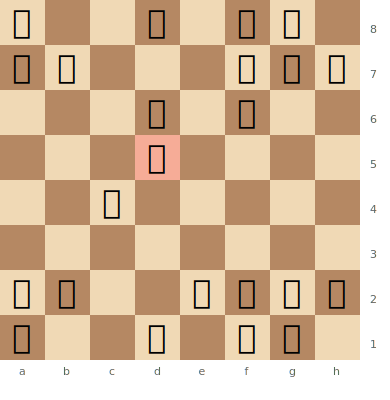
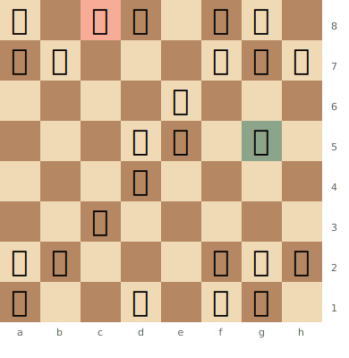
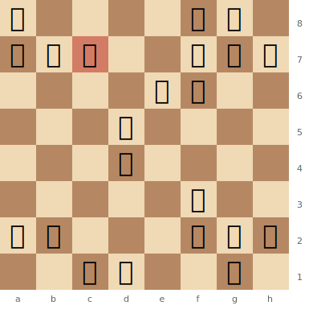
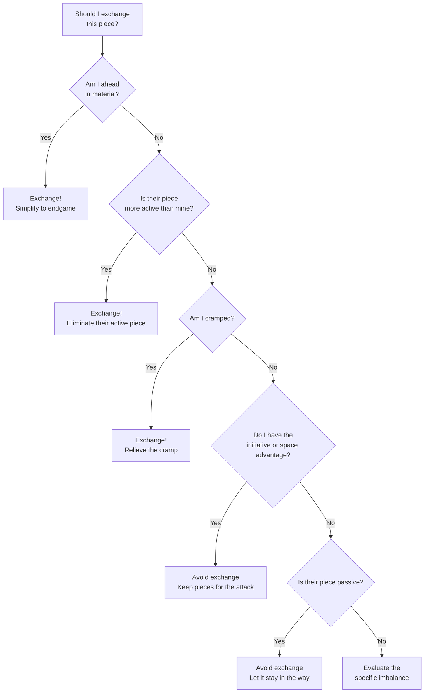

# Piece Activity & Positional Concepts

Piece activity is the single most important factor in chess evaluation. An active piece controls squares, creates threats, and coordinates with other pieces. A passive piece defends, retreats, and gets in the way.

**See also:** [Pawn Structures](pawn-structures.md) | [Attacking the King](attacking-the-king.md) | [Tactics — Overloaded Pieces](../tactics/overloaded-pieces.md) | [Fundamentals — Piece Values](../fundamentals/piece-values.md)

---

## Outposts & Weak Squares

An **outpost** is a square (typically in the opponent's half of the board) that cannot be attacked by enemy pawns. A piece occupying an outpost is very powerful because it can't be driven away cheaply.

### Identifying Outposts

A square is an outpost if:
1. No enemy pawns can attack it (no pawns on adjacent files that could advance)
2. Your own pawn supports it
3. It's in a useful part of the board (centre or near the enemy king)

### Classic Example

In the [Sicilian Defense](../openings/semi-open/sicilian-defense.md), after White plays e5 and Black plays ...d6, the d5 square often becomes a permanent outpost for a White knight. Conversely, the d4 and e5 squares can be outposts for Black.

**Diagram — Knight on a Powerful Outpost:**

White's knight is cemented on d5, supported by the c4 pawn and immune to pawn attacks. It dominates the position, controlling key squares on both flanks.

> **FEN:** `r2q1rk1/pp3ppp/3p1n2/3N4/2P5/8/PP2BPPP/R2Q1RK1 w - - 0 1`

The Nd5 cannot be challenged by any Black pawn (no pawns on c- or e-files to play ...c6 or ...e6). It radiates influence across the board -- attacking b6, c7, e7, f6, and f4. This is the ideal knight outpost.

---

## Open Files & Diagonals

### Open Files

A file with no pawns. Rooks belong on open files — they can penetrate into the opponent's position.

**Key principle:** Control the open file with a rook, then **double rooks** (stack them on the same file) for maximum pressure.

### Half-Open Files

A file where only one side has a pawn. The side without a pawn can use the file to attack the opponent's pawn.

### Open Diagonals

Same concept for bishops — a long, unobstructed diagonal is a highway for bishop activity.

---

## The Bishop Pair

Having **two bishops** when the opponent has a bishop and knight (or two knights) is an advantage worth approximately **0.5 pawns**.

### Why the Bishop Pair Is Strong

- Bishops control **both colour complexes**
- They work beautifully together at long range
- In open positions, their power increases dramatically

### When the Bishop Pair Is Less Effective

- **Closed positions** with locked pawns — bishops are blocked, knights manoeuvre
- **Symmetrical pawn structures** with few open lines
- When the opponent can blockade on one colour

---

## Good Bishop vs Bad Bishop

### Bad Bishop

A bishop whose mobility is restricted by **its own pawns** — pawns fixed on the same colour squares as the bishop.

Classic example: In the [French Defense](../openings/semi-open/french-defense.md), Black's light-squared bishop is often "bad" because pawns on e6 and d5 block the light-square diagonal.

### Good Bishop

A bishop whose own pawns are on the **opposite colour** — leaving the diagonals clear.

**Diagram — Good Bishop vs Bad Bishop:**

A French Defense structure where Black's light-squared bishop on c8 is hemmed in by its own pawns on d5 and e6, while White's dark-squared bishop on g5 operates freely on open diagonals.

> **FEN:** `r1bq1rk1/pp3ppp/4p3/3pP1B1/3P4/2N5/PP3PPP/R2Q1RK1 w - - 0 1`

Black's Bc8 is a classic "bad bishop" -- trapped behind its own pawns on e6 and d5, with no prospects. White's Bg5 pins down the kingside and has open diagonals. The contrast illustrates why pawn placement relative to your bishop matters so much.

### Strategy

- **Place your pawns on the opposite colour from your bishop** to keep it active
- **Place your pawns on the same colour as the opponent's bishop** to restrict it
- A bad bishop can sometimes be exchanged or rerouted (e.g., ...Bd7–c8–a6 in some QGD positions)

---

## Knight vs Bishop

### When Knights Are Better

- **Closed positions** with blocked pawns — the knight can hop over everything
- **Positions with outposts** — a knight on a secure outpost is a monster
- **Positions with pawns on one side** — bishops need scope, and one-sided pawns limit them

### When Bishops Are Better

- **Open positions** with clear diagonals
- **Positions with pawns on both flanks** — the bishop's long range covers both sides
- **Endgames** (generally) — bishops coordinate better over distance

---

## Rook on the 7th Rank

A rook on the 7th rank (2nd rank for Black) is extremely powerful because:

1. It attacks pawns from behind (most pawns are still on their original rank)
2. It restricts the enemy king to the back rank
3. **Two rooks on the 7th** ("pig on the 7th") is often a decisive advantage

**Diagram — Rook Dominating an Open File and the 7th Rank:**

White's rook has penetrated to the 7th rank via the open c-file, attacking Black's pawns from behind and restricting the king.

> **FEN:** `r4rk1/ppR2ppp/4pn2/3p4/3P4/5N2/PP3PPP/2RQ2K1 w - - 0 1`

White's Rc7 attacks the a7 and b7 pawns while cutting off the Black king. The second rook on c1 is ready to double on the c-file or swing to the 7th as well. This is the kind of domination that rooks achieve on open files.

---

## Prophylaxis

**Prophylaxis** is preventing your opponent's plan before executing your own. Ask: *"What does my opponent want to do? How can I stop it?"*

### Nimzowitsch's Principle

Before carrying out your own plan, first **restrain** the opponent's counterplay. This concept runs throughout Nimzowitsch's *My System* and is central to modern positional chess.

### Practical Examples

- Playing ...h6 to prevent Bg5 (a prophylactic pawn move)
- Playing a4 to prevent ...b5 expansion
- Overprotecting a key square before it can be contested

---

## Space Advantage

Having more space means your pieces have more room to manoeuvre. A space advantage is valuable because:

- Your pieces can reposition more easily
- The opponent is cramped and may struggle to defend
- You have more options for attacks on different flanks

### How to Use a Space Advantage

- **Don't rush** — the advantage is lasting
- **Avoid exchanges** — pieces in a cramped position want to be exchanged; deny them that relief
- **Play on the side where you have more space**
- **Prepare a pawn break** to open the position when ready

### How to Combat a Space Disadvantage

- **Exchange pieces** to relieve the cramp
- **Find a pawn break** to open lines and equalise space
- **Use the compact position** — your pieces are close together and can defend efficiently

---

## Initiative & Tempo

**Initiative:** The ability to create threats and dictate the flow of the game. The side with the initiative is attacking; the other side is responding.

**Tempo:** A single move's worth of time. Wasting a tempo (moving a piece that was already well-placed) is costly.

### Key Principles

- **A lead in development** is a temporary advantage — use it before the opponent catches up
- **The initiative must be maintained** — if you stop creating threats, the opponent seizes it
- **Sometimes sacrifice material to maintain initiative** — see [Sacrifices](../tactics/sacrifices.md)

---

## Piece Exchanges

### When to Exchange

- When you're **ahead in material** — simplify toward a winning endgame
- When an enemy piece is more **active** than yours — eliminate it
- When exchanges **relieve your cramped position**
- When the trade creates a **favourable imbalance** (e.g., trading knight for bad bishop)

### When to Avoid Exchanges

- When you have the **initiative** — keep pieces on for the attack
- When you have a **space advantage** — pieces are your advantage
- When the opponent's piece is **passive** — let it stay in the way
- When trading would **open lines for the opponent**

---

## Planning & Evaluation

### Steinitz's Principles

Wilhelm Steinitz, the first World Champion, established that:

1. An advantage should be converted, not left idle
2. Accumulate small advantages — they add up
3. Attack only when you have sufficient advantage
4. The side without an advantage should play defensively and seek equality

### How to Form a Plan

1. **Evaluate the position:** Material, king safety, piece activity, pawn structure, space
2. **Identify imbalances:** What advantages does each side have?
3. **Determine candidate plans:** Based on the imbalances, what plans make sense?
4. **Calculate concrete moves:** Check that your plan works tactically
5. **Execute and reassess:** After each move, re-evaluate

---

**Next:** [Attacking the Castled King](attacking-the-king.md) | **Back to:** [Middlegame Index](index.md)
