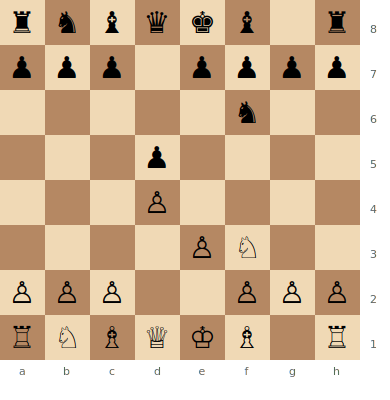

# Colle System

**1.d4 d5 2.Nf3 Nf6 3.e3**

Named after Belgian master Edgard Colle. White develops solidly with e3, Bd3, Nbd2, and then aims for the e3–e4 break to open the centre. A reliable, easy-to-learn system.

**Position after 1.d4 d5 2.Nf3 Nf6 3.e3 (Colle System)**



> **FEN:** `rnbqkb1r/ppp1pppp/5n2/3p4/3P4/4PN2/PPP2PPP/RNBQKB1R w - - 0 1`

**See also:** [London System](london-system.md) | [Queen's Gambit Declined](qgd.md) | [Fundamentals — Development](../../fundamentals/development.md)

---

## Standard Colle Setup

```
1.d4 d5 2.Nf3 Nf6 3.e3 e6 4.Bd3 c5 5.c3 Nc6 6.Nbd2 Bd6 7.O-O O-O
```

White's plan: prepare e4 with Nbd2, Re1, and then play e3–e4.

## Colle-Zukertort (Bg5 System)

```
1.d4 d5 2.Nf3 Nf6 3.e3 e6 4.Bd3 c5 5.b3 Nc6 6.Bb2
```

White fianchettoes the queen's bishop. The Bb2 aims at the kingside along the a1–h8 diagonal. More dynamic than the standard Colle.

### Strategic Ideas

| White | Black |
|-------|-------|
| Prepare the e4 break | Challenge with ...c5 and central play |
| The e4 break opens lines for an attack | Develop naturally and counter White's slow build-up |
| Colle-Zukertort: Bb2 creates a battery on the long diagonal | Active piece play before White achieves e4 |

---

## Famous Practitioners

Edgard Colle, Johannes Zukertort (for the b3 variation).

## Who Should Play It

Beginners and club players who want a straightforward system. The Colle teaches important concepts about pawn breaks and piece coordination.

---

**Next:** [Catalan Opening](catalan.md) | **Back to:** [Openings Index](../index.md)
