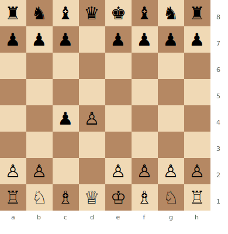

# Queen's Gambit Accepted

**1.d4 d5 2.c4 dxc4**

Black captures the c4 pawn — not to hold it permanently, but to create an asymmetric pawn structure and generate queenside counterplay. A practical, dynamic approach.

**Position after 1.d4 d5 2.c4 dxc4 (Queen's Gambit Accepted)**



> **FEN:** `rnbqkbnr/ppp1pppp/8/8/2pP4/8/PP2PPPP/RNBQKBNR w - - 0 1`

**See also:** [Queen's Gambit Declined](qgd.md) | [Slav Defense](slav.md) | [Middlegame — Pawn Structures](../../middlegame/pawn-structures.md)

---

## Main Line

```
1.d4 d5 2.c4 dxc4 3.Nf3 Nf6 4.e3 e6 5.Bxc4 c5 6.O-O a6 7.Qe2 b5 8.Bb3 Bb7
```

### Strategic Ideas

| White | Black |
|-------|-------|
| Recapture the pawn, build a strong centre | Not trying to hold c4 — play ...c5 and ...b5 instead |
| After e3–e4, White has a broad centre | Queenside pawn majority for the endgame |
| Bishop on c4 is well-placed | Dynamic play with ...Bb7 on the long diagonal |

### Typical Pawn Structures

After ...c5 and exchanges, often an IQP or symmetric structure arises. Black's queenside majority (a6, b5 vs White's a2) can be an endgame asset. See [Middlegame — Pawn Structures](../../middlegame/pawn-structures.md).

---

## Famous Practitioners

Alexander Alekhine, Viswanathan Anand, Vladimir Kramnik (used it to beat Kasparov in 2000).

## Who Should Play It

Players who prefer dynamic, imbalanced positions over the passive solidity of the [QGD](qgd.md). Good practical choice that avoids the "bad bishop" problem entirely.

---

**Next:** [Slav Defense](slav.md) | **Back to:** [Openings Index](../index.md)
