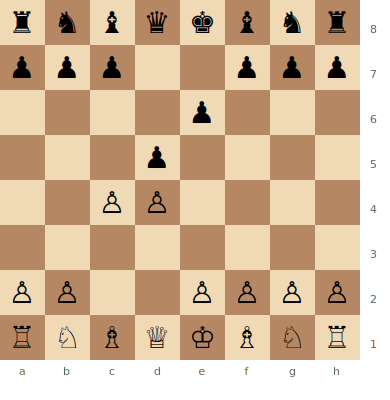
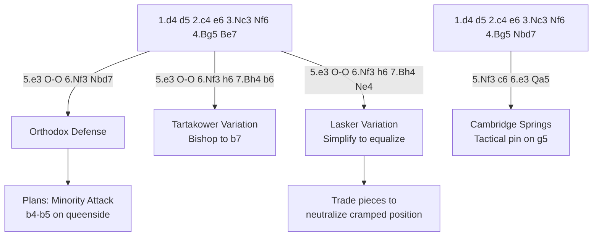

# Queen's Gambit Declined

**1.d4 d5 2.c4 e6**

The cornerstone of classical chess. Black maintains the centre with ...e6, accepting a slightly cramped but very solid position. The QGD has been a battleground for world championships for over a century.

**Position after 1.d4 d5 2.c4 e6 (Queen's Gambit Declined)**



> **FEN:** `rnbqkbnr/ppp2ppp/4p3/3p4/2PP4/8/PP2PPPP/RNBQKBNR w - - 0 1`

**See also:** [Queen's Gambit Accepted](qga.md) | [Slav Defense](slav.md) | [Catalan](catalan.md) | [Middlegame — Pawn Structures](../../middlegame/pawn-structures.md)

### Variation Tree



---

## Orthodox Defense (6...Nbd7)

```
1.d4 d5 2.c4 e6 3.Nc3 Nf6 4.Bg5 Be7 5.e3 O-O 6.Nf3 Nbd7
7.Rc1 c6 8.Bd3 dxc4 9.Bxc4 Nd5 10.Bxe7 Qxe7 11.O-O Nxc3 12.Rxc3 e5
```

### Strategic Ideas

| White | Black |
|-------|-------|
| Pressure the d5 pawn with Bg5 pin | Solid defence with ...c6 and ...Nbd7 |
| Minority attack: b4–b5 on the queenside | Aim for ...e5 or ...c5 break to free the position |
| Exploit the "bad bishop" on c8 | The light-squared bishop is the problem piece |

### The Minority Attack

White plays a4, b4, b5 to attack Black's queenside pawns. After bxc6, Black is left with an isolated c-pawn or backward b-pawn — targets for White's pieces. See [Middlegame — Pawn Structures](../../middlegame/pawn-structures.md).

### Famous Practitioners

Karpov (as White), Spassky, Petrosian, Kramnik.

---

## Tartakower Variation (...b6)

```
1.d4 d5 2.c4 e6 3.Nc3 Nf6 4.Bg5 Be7 5.e3 O-O 6.Nf3 h6 7.Bh4 b6
```

Black solves the "bad bishop" problem by fianchettoing to b7. The bishop on b7 is active on the long diagonal.

### Famous Practitioners

Savielly Tartakower (inventor), Korchnoi, Karpov.

---

## Lasker Variation (...Ne4)

```
1.d4 d5 2.c4 e6 3.Nc3 Nf6 4.Bg5 Be7 5.e3 O-O 6.Nf3 h6 7.Bh4 Ne4
8.Bxe7 Qxe7 9.Rc1 c6 10.Bd3 Nxc3 11.Rxc3 dxc4 12.Bxc4 Nd7
```

Lasker's pragmatic approach: if you're cramped, trade pieces! Simplification neutralises White's spatial advantage.

### Famous Practitioners

Emanuel Lasker (inventor), Capablanca.

---

## Cambridge Springs Variation (6...Qa5)

```
1.d4 d5 2.c4 e6 3.Nc3 Nf6 4.Bg5 Nbd7 5.Nf3 c6 6.e3 Qa5
```

The queen on a5 creates a tactical pin: if Nc3 moves, ...Qxg5 wins the bishop. This forces White into concrete play immediately.

### Famous Practitioners

Named after the 1904 Cambridge Springs tournament. Shirov, Short.

---

## The "Bad Bishop" Problem

The c8 bishop is the chronic weakness of the QGD. Solutions include:

1. **Tartakower:** ...b6, ...Bb7
2. **Lasker:** Simplify with ...Ne4
3. **...dxc4 followed by ...b5:** Open the diagonal
4. **...e5 break:** Open the centre and activate the bishop

This problem is shared with the [French Defense](../semi-open/french-defense.md).

---

**Next:** [Queen's Gambit Accepted](qga.md) | **Back to:** [Openings Index](../index.md)
