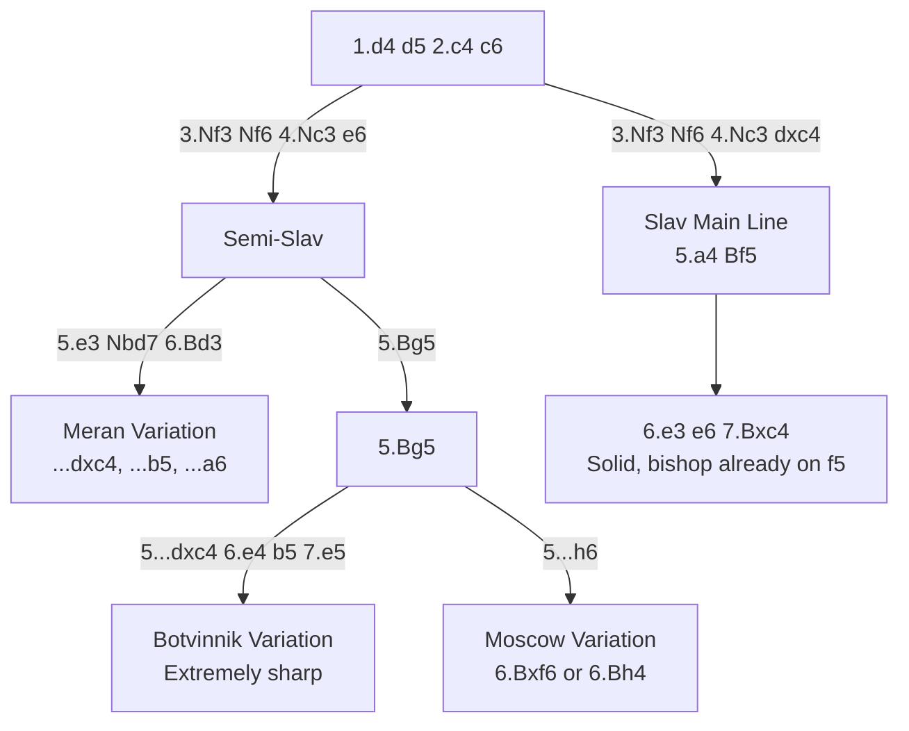

# Slav & Semi-Slav Defense

## Slav Defense

**1.d4 d5 2.c4 c6**

Black supports d5 with ...c6, keeping the light-squared bishop free to develop (unlike the [QGD](qgd.md) where ...e6 locks it in). One of the most reliable defences to 1.d4.

**Position after 1.d4 d5 2.c4 c6 (Slav Defense)**

<svg viewBox="0 0 390 400" xmlns="http://www.w3.org/2000/svg" style="max-width:400px">
  <rect x="0" y="0" width="360" height="360" fill="#b58863"/>
  <rect x="0" y="0" width="45" height="45" fill="#f0d9b5"/><rect x="90" y="0" width="45" height="45" fill="#f0d9b5"/><rect x="180" y="0" width="45" height="45" fill="#f0d9b5"/><rect x="270" y="0" width="45" height="45" fill="#f0d9b5"/>
  <rect x="45" y="45" width="45" height="45" fill="#f0d9b5"/><rect x="135" y="45" width="45" height="45" fill="#f0d9b5"/><rect x="225" y="45" width="45" height="45" fill="#f0d9b5"/><rect x="315" y="45" width="45" height="45" fill="#f0d9b5"/>
  <rect x="0" y="90" width="45" height="45" fill="#f0d9b5"/><rect x="90" y="90" width="45" height="45" fill="#f0d9b5"/><rect x="180" y="90" width="45" height="45" fill="#f0d9b5"/><rect x="270" y="90" width="45" height="45" fill="#f0d9b5"/>
  <rect x="45" y="135" width="45" height="45" fill="#f0d9b5"/><rect x="135" y="135" width="45" height="45" fill="#f0d9b5"/><rect x="225" y="135" width="45" height="45" fill="#f0d9b5"/><rect x="315" y="135" width="45" height="45" fill="#f0d9b5"/>
  <rect x="0" y="180" width="45" height="45" fill="#f0d9b5"/><rect x="90" y="180" width="45" height="45" fill="#f0d9b5"/><rect x="180" y="180" width="45" height="45" fill="#f0d9b5"/><rect x="270" y="180" width="45" height="45" fill="#f0d9b5"/>
  <rect x="45" y="225" width="45" height="45" fill="#f0d9b5"/><rect x="135" y="225" width="45" height="45" fill="#f0d9b5"/><rect x="225" y="225" width="45" height="45" fill="#f0d9b5"/><rect x="315" y="225" width="45" height="45" fill="#f0d9b5"/>
  <rect x="0" y="270" width="45" height="45" fill="#f0d9b5"/><rect x="90" y="270" width="45" height="45" fill="#f0d9b5"/><rect x="180" y="270" width="45" height="45" fill="#f0d9b5"/><rect x="270" y="270" width="45" height="45" fill="#f0d9b5"/>
  <rect x="45" y="315" width="45" height="45" fill="#f0d9b5"/><rect x="135" y="315" width="45" height="45" fill="#f0d9b5"/><rect x="225" y="315" width="45" height="45" fill="#f0d9b5"/><rect x="315" y="315" width="45" height="45" fill="#f0d9b5"/>
  <!-- Pieces -->
  <text x="22" y="33" font-size="30" text-anchor="middle" font-family="sans-serif">♜</text>
  <text x="67" y="33" font-size="30" text-anchor="middle" font-family="sans-serif">♞</text>
  <text x="112" y="33" font-size="30" text-anchor="middle" font-family="sans-serif">♝</text>
  <text x="157" y="33" font-size="30" text-anchor="middle" font-family="sans-serif">♛</text>
  <text x="202" y="33" font-size="30" text-anchor="middle" font-family="sans-serif">♚</text>
  <text x="247" y="33" font-size="30" text-anchor="middle" font-family="sans-serif">♝</text>
  <text x="292" y="33" font-size="30" text-anchor="middle" font-family="sans-serif">♞</text>
  <text x="337" y="33" font-size="30" text-anchor="middle" font-family="sans-serif">♜</text>
  <text x="22" y="78" font-size="30" text-anchor="middle" font-family="sans-serif">♟</text>
  <text x="67" y="78" font-size="30" text-anchor="middle" font-family="sans-serif">♟</text>
  <text x="202" y="78" font-size="30" text-anchor="middle" font-family="sans-serif">♟</text>
  <text x="247" y="78" font-size="30" text-anchor="middle" font-family="sans-serif">♟</text>
  <text x="292" y="78" font-size="30" text-anchor="middle" font-family="sans-serif">♟</text>
  <text x="337" y="78" font-size="30" text-anchor="middle" font-family="sans-serif">♟</text>
  <text x="112" y="123" font-size="30" text-anchor="middle" font-family="sans-serif">♟</text>
  <text x="157" y="168" font-size="30" text-anchor="middle" font-family="sans-serif">♟</text>
  <text x="112" y="213" font-size="30" text-anchor="middle" font-family="sans-serif">♙</text>
  <text x="157" y="213" font-size="30" text-anchor="middle" font-family="sans-serif">♙</text>
  <text x="22" y="303" font-size="30" text-anchor="middle" font-family="sans-serif">♙</text>
  <text x="67" y="303" font-size="30" text-anchor="middle" font-family="sans-serif">♙</text>
  <text x="202" y="303" font-size="30" text-anchor="middle" font-family="sans-serif">♙</text>
  <text x="247" y="303" font-size="30" text-anchor="middle" font-family="sans-serif">♙</text>
  <text x="292" y="303" font-size="30" text-anchor="middle" font-family="sans-serif">♙</text>
  <text x="337" y="303" font-size="30" text-anchor="middle" font-family="sans-serif">♙</text>
  <text x="22" y="348" font-size="30" text-anchor="middle" font-family="sans-serif">♖</text>
  <text x="67" y="348" font-size="30" text-anchor="middle" font-family="sans-serif">♘</text>
  <text x="112" y="348" font-size="30" text-anchor="middle" font-family="sans-serif">♗</text>
  <text x="157" y="348" font-size="30" text-anchor="middle" font-family="sans-serif">♕</text>
  <text x="202" y="348" font-size="30" text-anchor="middle" font-family="sans-serif">♔</text>
  <text x="247" y="348" font-size="30" text-anchor="middle" font-family="sans-serif">♗</text>
  <text x="292" y="348" font-size="30" text-anchor="middle" font-family="sans-serif">♘</text>
  <text x="337" y="348" font-size="30" text-anchor="middle" font-family="sans-serif">♖</text>
  <!-- Coordinates -->
  <text x="22" y="375" font-size="11" fill="#666" text-anchor="middle" font-family="sans-serif">a</text>
  <text x="67" y="375" font-size="11" fill="#666" text-anchor="middle" font-family="sans-serif">b</text>
  <text x="112" y="375" font-size="11" fill="#666" text-anchor="middle" font-family="sans-serif">c</text>
  <text x="157" y="375" font-size="11" fill="#666" text-anchor="middle" font-family="sans-serif">d</text>
  <text x="202" y="375" font-size="11" fill="#666" text-anchor="middle" font-family="sans-serif">e</text>
  <text x="247" y="375" font-size="11" fill="#666" text-anchor="middle" font-family="sans-serif">f</text>
  <text x="292" y="375" font-size="11" fill="#666" text-anchor="middle" font-family="sans-serif">g</text>
  <text x="337" y="375" font-size="11" fill="#666" text-anchor="middle" font-family="sans-serif">h</text>
  <text x="370" y="33" font-size="11" fill="#666" font-family="sans-serif">8</text>
  <text x="370" y="78" font-size="11" fill="#666" font-family="sans-serif">7</text>
  <text x="370" y="123" font-size="11" fill="#666" font-family="sans-serif">6</text>
  <text x="370" y="168" font-size="11" fill="#666" font-family="sans-serif">5</text>
  <text x="370" y="213" font-size="11" fill="#666" font-family="sans-serif">4</text>
  <text x="370" y="258" font-size="11" fill="#666" font-family="sans-serif">3</text>
  <text x="370" y="303" font-size="11" fill="#666" font-family="sans-serif">2</text>
  <text x="370" y="348" font-size="11" fill="#666" font-family="sans-serif">1</text>
</svg>

> **FEN:** `rnbqkbnr/pp2pppp/2p5/3p4/2PP4/8/PP2PPPP/RNBQKBNR w - - 0 1`

## Semi-Slav Defense

**1.d4 d5 2.c4 c6 3.Nf3 Nf6 4.Nc3 e6**

A hybrid of the Slav and QGD — Black plays both ...c6 and ...e6, creating enormous structural flexibility but temporarily locking in the bishop.

**See also:** [Queen's Gambit Declined](qgd.md) | [Queen's Gambit Accepted](qga.md) | [Middlegame — Pawn Structures](../../middlegame/pawn-structures.md)

### Variation Tree



---

## Slav Main Line (4...dxc4)

```
1.d4 d5 2.c4 c6 3.Nf3 Nf6 4.Nc3 dxc4 5.a4 Bf5 6.e3 e6 7.Bxc4 Bb4 8.O-O O-O
```

### Strategic Ideas

| White | Black |
|-------|-------|
| Recapture c4 pawn; build central advantage | Bishop is already out on f5 — no "bad bishop" problem |
| a4 prevents ...b5 expansion | Solid structure with ...c6, ...e6 |
| Central play with e4 break | Counterplay on the queenside |

---

## Meran Variation

```
1.d4 d5 2.c4 c6 3.Nf3 Nf6 4.Nc3 e6 5.e3 Nbd7 6.Bd3 dxc4 7.Bxc4 b5 8.Bd3 a6
```

Black grabs queenside space with ...b5 and ...a6. One of the richest and most complex lines in the Semi-Slav — both sides have aggressive plans.

### Key Ideas

- Black's ...b5–b4 pushes White's knight away
- White can play e4–e5 for a central/kingside attack
- Extremely sharp and deeply analysed

## Botvinnik Variation

```
1.d4 d5 2.c4 c6 3.Nf3 Nf6 4.Nc3 e6 5.Bg5 dxc4 6.e4 b5 7.e5 h6 8.Bh4 g5 9.Nxg5 hxg5 10.Bxg5
```

One of the sharpest lines in all of chess. Black grabs two pawns but faces a ferocious attack. Both sides need deep preparation.

### Famous Practitioners

Mikhail Botvinnik, Kramnik, Anand (played many Botvinnik Variation games at the highest level).

## Moscow Variation (5.Bg5)

```
1.d4 d5 2.c4 c6 3.Nf3 Nf6 4.Nc3 e6 5.Bg5 h6 6.Bxf6 (or 6.Bh4)
```

White pins the knight early. After 6.Bxf6 Qxf6, Black has the bishop pair but a slightly weakened structure.

---

## Who Should Play It

- **Slav:** Solid positional players who want to avoid the QGD's bad bishop
- **Semi-Slav:** Ambitious, well-prepared players who enjoy complex, sharp positions
- **Meran/Botvinnik:** Only for those willing to invest serious study time

---

**Next:** [London System](london-system.md) | **Back to:** [Openings Index](../index.md)
