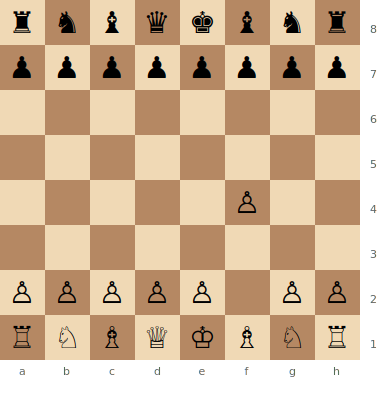

# Bird's Opening

**1.f4**

Named after Henry Bird. White stakes a claim on the kingside with the f-pawn, aiming to control e5. A reversed [Dutch Defense](../indian-defenses/dutch-defense.md). Rarely seen at the top level but a valid surprise weapon.

**Position after 1.f4 (Bird's Opening)**



> **FEN:** `rnbqkbnr/pppppppp/8/8/5P2/8/PPPPP1PP/RNBQKBNR w - - 0 1`

**See also:** [Dutch Defense](../indian-defenses/dutch-defense.md) | [King's Gambit](../open-games/kings-gambit.md)

---

## Main Lines

### Leningrad Bird (1.f4 d5 2.Nf3 g6 3.g3 Bg7 4.Bg2)

A reversed Leningrad Dutch. White fianchettoes and aims for a solid, strategic game with central control via e3–d3 and the f4 pawn.

### From's Gambit (1.f4 e5!?)

```
1.f4 e5 2.fxe5 d6 3.exd6 Bxd6
```

Black sacrifices a pawn for rapid development and kingside attack. The bishop on d6 targets h2, and ...Qh4+ ideas are annoying. White must know the theory to avoid trouble.

---

### Strategic Ideas

| White | Black |
|-------|-------|
| Control e5 with f4 | Challenge with ...d5 and central play |
| Reversed Dutch structures | From's Gambit for sharp counterplay |
| Kingside initiative | Exploit the weakened e1–h4 diagonal |

## Famous Practitioners

Henry Bird, Mikhail Chigorin, various modern GMs as a surprise weapon.

## Who Should Play It

Players who enjoy unusual positions and want to avoid mainstream theory. The Bird is offbeat but has sound strategic foundations.

---

**Next:** [King's Indian Attack](kings-indian-attack.md) | **Back to:** [Openings Index](../index.md)
