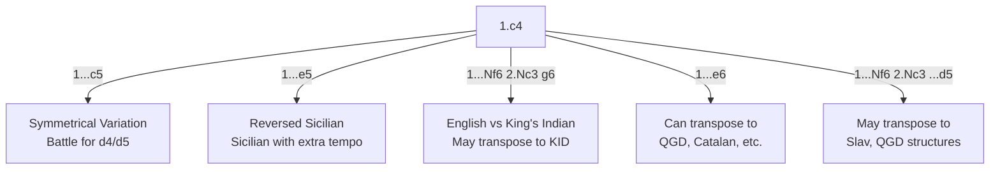

# English Opening

**1.c4**

A flexible, hypermodern opening. White controls d5 from the flank without committing the d- or e-pawn. The English can transpose into many other openings or maintain its own unique character.

**Position after 1.c4 (English Opening)**

<svg viewBox="0 0 390 400" xmlns="http://www.w3.org/2000/svg" style="max-width:400px">
  <rect x="0" y="0" width="360" height="360" fill="#b58863"/>
  <rect x="0" y="0" width="45" height="45" fill="#f0d9b5"/><rect x="90" y="0" width="45" height="45" fill="#f0d9b5"/><rect x="180" y="0" width="45" height="45" fill="#f0d9b5"/><rect x="270" y="0" width="45" height="45" fill="#f0d9b5"/>
  <rect x="45" y="45" width="45" height="45" fill="#f0d9b5"/><rect x="135" y="45" width="45" height="45" fill="#f0d9b5"/><rect x="225" y="45" width="45" height="45" fill="#f0d9b5"/><rect x="315" y="45" width="45" height="45" fill="#f0d9b5"/>
  <rect x="0" y="90" width="45" height="45" fill="#f0d9b5"/><rect x="90" y="90" width="45" height="45" fill="#f0d9b5"/><rect x="180" y="90" width="45" height="45" fill="#f0d9b5"/><rect x="270" y="90" width="45" height="45" fill="#f0d9b5"/>
  <rect x="45" y="135" width="45" height="45" fill="#f0d9b5"/><rect x="135" y="135" width="45" height="45" fill="#f0d9b5"/><rect x="225" y="135" width="45" height="45" fill="#f0d9b5"/><rect x="315" y="135" width="45" height="45" fill="#f0d9b5"/>
  <rect x="0" y="180" width="45" height="45" fill="#f0d9b5"/><rect x="90" y="180" width="45" height="45" fill="#f0d9b5"/><rect x="180" y="180" width="45" height="45" fill="#f0d9b5"/><rect x="270" y="180" width="45" height="45" fill="#f0d9b5"/>
  <rect x="45" y="225" width="45" height="45" fill="#f0d9b5"/><rect x="135" y="225" width="45" height="45" fill="#f0d9b5"/><rect x="225" y="225" width="45" height="45" fill="#f0d9b5"/><rect x="315" y="225" width="45" height="45" fill="#f0d9b5"/>
  <rect x="0" y="270" width="45" height="45" fill="#f0d9b5"/><rect x="90" y="270" width="45" height="45" fill="#f0d9b5"/><rect x="180" y="270" width="45" height="45" fill="#f0d9b5"/><rect x="270" y="270" width="45" height="45" fill="#f0d9b5"/>
  <rect x="45" y="315" width="45" height="45" fill="#f0d9b5"/><rect x="135" y="315" width="45" height="45" fill="#f0d9b5"/><rect x="225" y="315" width="45" height="45" fill="#f0d9b5"/><rect x="315" y="315" width="45" height="45" fill="#f0d9b5"/>
  <!-- Pieces -->
  <text x="22" y="33" font-size="30" text-anchor="middle" font-family="sans-serif">♜</text>
  <text x="67" y="33" font-size="30" text-anchor="middle" font-family="sans-serif">♞</text>
  <text x="112" y="33" font-size="30" text-anchor="middle" font-family="sans-serif">♝</text>
  <text x="157" y="33" font-size="30" text-anchor="middle" font-family="sans-serif">♛</text>
  <text x="202" y="33" font-size="30" text-anchor="middle" font-family="sans-serif">♚</text>
  <text x="247" y="33" font-size="30" text-anchor="middle" font-family="sans-serif">♝</text>
  <text x="292" y="33" font-size="30" text-anchor="middle" font-family="sans-serif">♞</text>
  <text x="337" y="33" font-size="30" text-anchor="middle" font-family="sans-serif">♜</text>
  <text x="22" y="78" font-size="30" text-anchor="middle" font-family="sans-serif">♟</text>
  <text x="67" y="78" font-size="30" text-anchor="middle" font-family="sans-serif">♟</text>
  <text x="112" y="78" font-size="30" text-anchor="middle" font-family="sans-serif">♟</text>
  <text x="157" y="78" font-size="30" text-anchor="middle" font-family="sans-serif">♟</text>
  <text x="202" y="78" font-size="30" text-anchor="middle" font-family="sans-serif">♟</text>
  <text x="247" y="78" font-size="30" text-anchor="middle" font-family="sans-serif">♟</text>
  <text x="292" y="78" font-size="30" text-anchor="middle" font-family="sans-serif">♟</text>
  <text x="337" y="78" font-size="30" text-anchor="middle" font-family="sans-serif">♟</text>
  <text x="112" y="213" font-size="30" text-anchor="middle" font-family="sans-serif">♙</text>
  <text x="22" y="303" font-size="30" text-anchor="middle" font-family="sans-serif">♙</text>
  <text x="67" y="303" font-size="30" text-anchor="middle" font-family="sans-serif">♙</text>
  <text x="157" y="303" font-size="30" text-anchor="middle" font-family="sans-serif">♙</text>
  <text x="202" y="303" font-size="30" text-anchor="middle" font-family="sans-serif">♙</text>
  <text x="247" y="303" font-size="30" text-anchor="middle" font-family="sans-serif">♙</text>
  <text x="292" y="303" font-size="30" text-anchor="middle" font-family="sans-serif">♙</text>
  <text x="337" y="303" font-size="30" text-anchor="middle" font-family="sans-serif">♙</text>
  <text x="22" y="348" font-size="30" text-anchor="middle" font-family="sans-serif">♖</text>
  <text x="67" y="348" font-size="30" text-anchor="middle" font-family="sans-serif">♘</text>
  <text x="112" y="348" font-size="30" text-anchor="middle" font-family="sans-serif">♗</text>
  <text x="157" y="348" font-size="30" text-anchor="middle" font-family="sans-serif">♕</text>
  <text x="202" y="348" font-size="30" text-anchor="middle" font-family="sans-serif">♔</text>
  <text x="247" y="348" font-size="30" text-anchor="middle" font-family="sans-serif">♗</text>
  <text x="292" y="348" font-size="30" text-anchor="middle" font-family="sans-serif">♘</text>
  <text x="337" y="348" font-size="30" text-anchor="middle" font-family="sans-serif">♖</text>
  <!-- Coordinates -->
  <text x="22" y="375" font-size="11" fill="#666" text-anchor="middle" font-family="sans-serif">a</text>
  <text x="67" y="375" font-size="11" fill="#666" text-anchor="middle" font-family="sans-serif">b</text>
  <text x="112" y="375" font-size="11" fill="#666" text-anchor="middle" font-family="sans-serif">c</text>
  <text x="157" y="375" font-size="11" fill="#666" text-anchor="middle" font-family="sans-serif">d</text>
  <text x="202" y="375" font-size="11" fill="#666" text-anchor="middle" font-family="sans-serif">e</text>
  <text x="247" y="375" font-size="11" fill="#666" text-anchor="middle" font-family="sans-serif">f</text>
  <text x="292" y="375" font-size="11" fill="#666" text-anchor="middle" font-family="sans-serif">g</text>
  <text x="337" y="375" font-size="11" fill="#666" text-anchor="middle" font-family="sans-serif">h</text>
  <text x="370" y="33" font-size="11" fill="#666" font-family="sans-serif">8</text>
  <text x="370" y="78" font-size="11" fill="#666" font-family="sans-serif">7</text>
  <text x="370" y="123" font-size="11" fill="#666" font-family="sans-serif">6</text>
  <text x="370" y="168" font-size="11" fill="#666" font-family="sans-serif">5</text>
  <text x="370" y="213" font-size="11" fill="#666" font-family="sans-serif">4</text>
  <text x="370" y="258" font-size="11" fill="#666" font-family="sans-serif">3</text>
  <text x="370" y="303" font-size="11" fill="#666" font-family="sans-serif">2</text>
  <text x="370" y="348" font-size="11" fill="#666" font-family="sans-serif">1</text>
</svg>

> **FEN:** `rnbqkbnr/pppppppp/8/8/2P5/8/PP1PPPPP/RNBQKBNR w - - 0 1`

**See also:** [Réti Opening](reti.md) | [King's Indian Attack](kings-indian-attack.md) | [Sicilian Defense](../semi-open/sicilian-defense.md)

### Variation Tree



---

## Symmetrical Variation (1...c5)

```
1.c4 c5 2.Nc3 Nc6 3.g3 g6 4.Bg2 Bg7 5.Nf3 Nf6 6.O-O O-O
```

Both sides fianchetto. A strategic battle for control of d4 and d5. Can resemble a reversed [Sicilian](../semi-open/sicilian-defense.md) structure.

## Reversed Sicilian (1...e5)

```
1.c4 e5 2.Nc3 Nf6 3.Nf3 Nc6 4.g3 d5 5.cxd5 Nxd5
```

White plays a Sicilian Defense with an extra tempo. Since the Sicilian is the best scoring defence for Black, having it with an extra move should be excellent — though in practice the extra tempo is less significant than it seems.

## English vs King's Indian (1...Nf6 2.Nc3 g6)

```
1.c4 Nf6 2.Nc3 g6 3.e4 d6 4.d4 Bg7
```

Often transposes to a [King's Indian Defense](../indian-defenses/kings-indian.md) with White having an extra option of delaying d4.

---

### Strategic Ideas

| White | Black |
|-------|-------|
| Flexible: can transpose or maintain English character | ...e5 (Reversed Sicilian) or ...c5 (Symmetrical) |
| Fianchetto Bg2 for long diagonal control | Mirror the fianchetto or play classical central setup |
| Play for d4 at the right moment | ...d5 break to seize the centre |
| Queenside/central focus | Active piece development |

---

## Famous Practitioners

Mikhail Botvinnik (early champion of 1.c4), Garry Kasparov, Magnus Carlsen, Fabiano Caruana.

## Who Should Play It

Strategic players who enjoy flexible positions. The English suits those who prefer to avoid well-known theoretical lines and enjoy manoeuvring.

---

**Next:** [Réti Opening](reti.md) | **Back to:** [Openings Index](../index.md)
