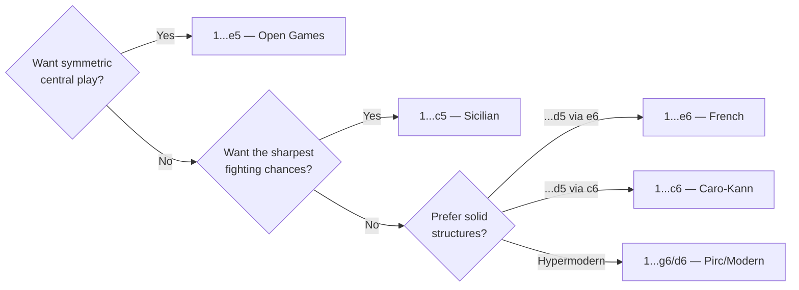

# Chess Openings

A complete guide to chess openings, organised by first-move families. Each opening page covers key move orders, strategic ideas for both sides, typical pawn structures, tactical themes, famous practitioners, and practical advice.

## Opening Classification Tree

```mermaid
flowchart TD
    Start["White's 1st Move"] --> E4["1.e4"]
    Start --> D4["1.d4"]
    Start --> C4["1.c4 — English"]
    Start --> NF3["1.Nf3 — Réti / KIA"]
    Start --> F4["1.f4 — Bird's"]

    E4 -->|"1...e5"| OPEN["Open Games"]
    E4 -->|"1...c5"| SIC["Sicilian Defense"]
    E4 -->|"1...e6"| FRE["French Defense"]
    E4 -->|"1...c6"| CK["Caro-Kann"]
    E4 -->|"1...d6/g6"| PIRC["Pirc / Modern"]
    E4 -->|"1...Nf6"| ALEK["Alekhine's"]
    E4 -->|"1...d5"| SCAN["Scandinavian"]

    OPEN -->|"3.Bc4"| ITAL["Italian Game"]
    OPEN -->|"3.Bb5"| RUY["Ruy Lopez"]
    OPEN -->|"3.d4"| SCOTCH["Scotch Game"]
    OPEN -->|"2.f4"| KG["King's Gambit"]
    OPEN -->|"2...Nf6"| PETROV["Petrov's Defense"]
    OPEN -->|"2.Nc3"| VIENNA["Vienna Game"]

    D4 -->|"1...d5"| CLOSED["Closed Games"]
    D4 -->|"1...Nf6"| INDIAN["Indian Defenses"]
    D4 -->|"1...f5"| DUTCH["Dutch Defense"]

    CLOSED -->|"2.c4 e6"| QGD["QGD"]
    CLOSED -->|"2.c4 dxc4"| QGA["QGA"]
    CLOSED -->|"2.c4 c6"| SLAV["Slav / Semi-Slav"]
    CLOSED -->|"2.Bf4"| LONDON["London System"]
    CLOSED -->|"2.Nf3 3.e3"| COLLE["Colle System"]
    CLOSED -->|"3.g3"| CATALAN["Catalan"]

    INDIAN -->|"2.c4 g6 ...d6"| KID["King's Indian"]
    INDIAN -->|"2.c4 g6 ...d5"| GRUNFELD["Grünfeld"]
    INDIAN -->|"3.Nc3 Bb4"| NIMZO["Nimzo-Indian"]
    INDIAN -->|"3.Nf3 b6"| QI["Queen's Indian"]
    INDIAN -->|"3.Nf3 Bb4+"| BOGO["Bogo-Indian"]
    INDIAN -->|"2.c4 c5 3.d5"| BENONI["Benoni"]
```

### Choosing a Response to 1.e4

## Open Games (1.e4 e5)

Classical openings where both sides contest the centre with king-pawn moves.

- [Italian Game](open-games/italian-game.md) — Giuoco Piano, Evans Gambit, Two Knights Defense
- [Ruy Lopez](open-games/ruy-lopez.md) — Berlin Defense, Marshall Attack, Closed Variations
- [Scotch Game](open-games/scotch-game.md)
- [King's Gambit](open-games/kings-gambit.md)
- [Petrov's Defense](open-games/petrovs-defense.md)
- [Vienna Game](open-games/vienna-game.md)
- [Four Knights Game](open-games/four-knights.md)
- [Philidor Defense](open-games/philidor-defense.md)

## Semi-Open Games (1.e4, Black does not play 1...e5)

Asymmetric responses to 1.e4 that create unbalanced positions.

- [Sicilian Defense](semi-open/sicilian-defense.md) — Najdorf, Dragon, Sveshnikov, and more
- [French Defense](semi-open/french-defense.md) — Winawer, Classical, Tarrasch, Advance
- [Caro-Kann Defense](semi-open/caro-kann.md) — Classical, Advance, Panov-Botvinnik
- [Pirc & Modern Defense](semi-open/pirc-modern.md)
- [Alekhine's Defense](semi-open/alekhines-defense.md)
- [Scandinavian Defense](semi-open/scandinavian.md)

## Closed Games (1.d4 d5)

Queen-pawn openings where both sides establish a solid central presence.

- [Queen's Gambit Declined](closed-games/qgd.md) — Orthodox, Tartakower, Lasker, Cambridge Springs
- [Queen's Gambit Accepted](closed-games/qga.md)
- [Slav & Semi-Slav Defense](closed-games/slav.md) — Meran, Botvinnik, Moscow
- [London System](closed-games/london-system.md)
- [Colle System](closed-games/colle-system.md)
- [Catalan Opening](closed-games/catalan.md)

## Indian Defenses (1.d4 Nf6)

Black delays ...d5, leading to rich strategic play with asymmetric pawn structures.

- [King's Indian Defense](indian-defenses/kings-indian.md) — Classical, Sämisch, Four Pawns, Fianchetto
- [Nimzo-Indian Defense](indian-defenses/nimzo-indian.md)
- [Queen's Indian Defense](indian-defenses/queens-indian.md)
- [Grünfeld Defense](indian-defenses/grunfeld.md) — Exchange, Russian System
- [Bogo-Indian Defense](indian-defenses/bogo-indian.md)
- [Benoni Defense](indian-defenses/benoni.md)
- [Dutch Defense](indian-defenses/dutch-defense.md)

## Flank Openings

White avoids an early d4 or e4, opting for a more flexible approach.

- [English Opening](flank-openings/english.md)
- [Réti Opening](flank-openings/reti.md)
- [Bird's Opening](flank-openings/birds-opening.md)
- [King's Indian Attack](flank-openings/kings-indian-attack.md)

---

**See also:** [Fundamentals — Development Principles](../fundamentals/development.md) | [Middlegame — Pawn Structures](../middlegame/pawn-structures.md)
