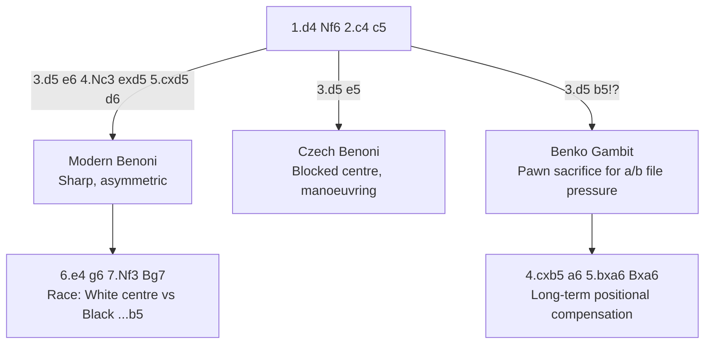

# Benoni Defense

**1.d4 Nf6 2.c4 c5 3.d5 e6 4.Nc3 exd5 5.cxd5 d6**

The Modern Benoni — one of the sharpest and most double-edged responses to 1.d4. Black creates an asymmetric pawn structure and plays for dynamic piece activity, especially on the queenside.

**Position after 1.d4 Nf6 2.c4 c5 3.d5 (Benoni Defense)**

<svg viewBox="0 0 390 400" xmlns="http://www.w3.org/2000/svg" style="max-width:400px">
  <rect x="0" y="0" width="360" height="360" fill="#b58863"/>
  <rect x="0" y="0" width="45" height="45" fill="#f0d9b5"/><rect x="90" y="0" width="45" height="45" fill="#f0d9b5"/><rect x="180" y="0" width="45" height="45" fill="#f0d9b5"/><rect x="270" y="0" width="45" height="45" fill="#f0d9b5"/>
  <rect x="45" y="45" width="45" height="45" fill="#f0d9b5"/><rect x="135" y="45" width="45" height="45" fill="#f0d9b5"/><rect x="225" y="45" width="45" height="45" fill="#f0d9b5"/><rect x="315" y="45" width="45" height="45" fill="#f0d9b5"/>
  <rect x="0" y="90" width="45" height="45" fill="#f0d9b5"/><rect x="90" y="90" width="45" height="45" fill="#f0d9b5"/><rect x="180" y="90" width="45" height="45" fill="#f0d9b5"/><rect x="270" y="90" width="45" height="45" fill="#f0d9b5"/>
  <rect x="45" y="135" width="45" height="45" fill="#f0d9b5"/><rect x="135" y="135" width="45" height="45" fill="#f0d9b5"/><rect x="225" y="135" width="45" height="45" fill="#f0d9b5"/><rect x="315" y="135" width="45" height="45" fill="#f0d9b5"/>
  <rect x="0" y="180" width="45" height="45" fill="#f0d9b5"/><rect x="90" y="180" width="45" height="45" fill="#f0d9b5"/><rect x="180" y="180" width="45" height="45" fill="#f0d9b5"/><rect x="270" y="180" width="45" height="45" fill="#f0d9b5"/>
  <rect x="45" y="225" width="45" height="45" fill="#f0d9b5"/><rect x="135" y="225" width="45" height="45" fill="#f0d9b5"/><rect x="225" y="225" width="45" height="45" fill="#f0d9b5"/><rect x="315" y="225" width="45" height="45" fill="#f0d9b5"/>
  <rect x="0" y="270" width="45" height="45" fill="#f0d9b5"/><rect x="90" y="270" width="45" height="45" fill="#f0d9b5"/><rect x="180" y="270" width="45" height="45" fill="#f0d9b5"/><rect x="270" y="270" width="45" height="45" fill="#f0d9b5"/>
  <rect x="45" y="315" width="45" height="45" fill="#f0d9b5"/><rect x="135" y="315" width="45" height="45" fill="#f0d9b5"/><rect x="225" y="315" width="45" height="45" fill="#f0d9b5"/><rect x="315" y="315" width="45" height="45" fill="#f0d9b5"/>
  <!-- Pieces -->
  <text x="22" y="33" font-size="30" text-anchor="middle" font-family="sans-serif">♜</text>
  <text x="67" y="33" font-size="30" text-anchor="middle" font-family="sans-serif">♞</text>
  <text x="112" y="33" font-size="30" text-anchor="middle" font-family="sans-serif">♝</text>
  <text x="157" y="33" font-size="30" text-anchor="middle" font-family="sans-serif">♛</text>
  <text x="202" y="33" font-size="30" text-anchor="middle" font-family="sans-serif">♚</text>
  <text x="247" y="33" font-size="30" text-anchor="middle" font-family="sans-serif">♝</text>
  <text x="337" y="33" font-size="30" text-anchor="middle" font-family="sans-serif">♜</text>
  <text x="22" y="78" font-size="30" text-anchor="middle" font-family="sans-serif">♟</text>
  <text x="67" y="78" font-size="30" text-anchor="middle" font-family="sans-serif">♟</text>
  <text x="157" y="78" font-size="30" text-anchor="middle" font-family="sans-serif">♟</text>
  <text x="202" y="78" font-size="30" text-anchor="middle" font-family="sans-serif">♟</text>
  <text x="247" y="78" font-size="30" text-anchor="middle" font-family="sans-serif">♟</text>
  <text x="292" y="78" font-size="30" text-anchor="middle" font-family="sans-serif">♟</text>
  <text x="337" y="78" font-size="30" text-anchor="middle" font-family="sans-serif">♟</text>
  <text x="247" y="123" font-size="30" text-anchor="middle" font-family="sans-serif">♞</text>
  <text x="112" y="168" font-size="30" text-anchor="middle" font-family="sans-serif">♟</text>
  <text x="157" y="168" font-size="30" text-anchor="middle" font-family="sans-serif">♙</text>
  <text x="112" y="213" font-size="30" text-anchor="middle" font-family="sans-serif">♙</text>
  <text x="22" y="303" font-size="30" text-anchor="middle" font-family="sans-serif">♙</text>
  <text x="67" y="303" font-size="30" text-anchor="middle" font-family="sans-serif">♙</text>
  <text x="202" y="303" font-size="30" text-anchor="middle" font-family="sans-serif">♙</text>
  <text x="247" y="303" font-size="30" text-anchor="middle" font-family="sans-serif">♙</text>
  <text x="292" y="303" font-size="30" text-anchor="middle" font-family="sans-serif">♙</text>
  <text x="337" y="303" font-size="30" text-anchor="middle" font-family="sans-serif">♙</text>
  <text x="22" y="348" font-size="30" text-anchor="middle" font-family="sans-serif">♖</text>
  <text x="67" y="348" font-size="30" text-anchor="middle" font-family="sans-serif">♘</text>
  <text x="112" y="348" font-size="30" text-anchor="middle" font-family="sans-serif">♗</text>
  <text x="157" y="348" font-size="30" text-anchor="middle" font-family="sans-serif">♕</text>
  <text x="202" y="348" font-size="30" text-anchor="middle" font-family="sans-serif">♔</text>
  <text x="247" y="348" font-size="30" text-anchor="middle" font-family="sans-serif">♗</text>
  <text x="292" y="348" font-size="30" text-anchor="middle" font-family="sans-serif">♘</text>
  <text x="337" y="348" font-size="30" text-anchor="middle" font-family="sans-serif">♖</text>
  <!-- Coordinates -->
  <text x="22" y="375" font-size="11" fill="#666" text-anchor="middle" font-family="sans-serif">a</text>
  <text x="67" y="375" font-size="11" fill="#666" text-anchor="middle" font-family="sans-serif">b</text>
  <text x="112" y="375" font-size="11" fill="#666" text-anchor="middle" font-family="sans-serif">c</text>
  <text x="157" y="375" font-size="11" fill="#666" text-anchor="middle" font-family="sans-serif">d</text>
  <text x="202" y="375" font-size="11" fill="#666" text-anchor="middle" font-family="sans-serif">e</text>
  <text x="247" y="375" font-size="11" fill="#666" text-anchor="middle" font-family="sans-serif">f</text>
  <text x="292" y="375" font-size="11" fill="#666" text-anchor="middle" font-family="sans-serif">g</text>
  <text x="337" y="375" font-size="11" fill="#666" text-anchor="middle" font-family="sans-serif">h</text>
  <text x="370" y="33" font-size="11" fill="#666" font-family="sans-serif">8</text>
  <text x="370" y="78" font-size="11" fill="#666" font-family="sans-serif">7</text>
  <text x="370" y="123" font-size="11" fill="#666" font-family="sans-serif">6</text>
  <text x="370" y="168" font-size="11" fill="#666" font-family="sans-serif">5</text>
  <text x="370" y="213" font-size="11" fill="#666" font-family="sans-serif">4</text>
  <text x="370" y="258" font-size="11" fill="#666" font-family="sans-serif">3</text>
  <text x="370" y="303" font-size="11" fill="#666" font-family="sans-serif">2</text>
  <text x="370" y="348" font-size="11" fill="#666" font-family="sans-serif">1</text>
</svg>

> **FEN:** `rnbqkb1r/pp1ppppp/5n2/2pP4/2P5/8/PP2PPPP/RNBQKBNR w - - 0 1`

**See also:** [King's Indian Defense](kings-indian.md) | [Grünfeld Defense](grunfeld.md) | [Middlegame — Pawn Structures](../../middlegame/pawn-structures.md)

### Variation Tree



---

## Modern Benoni — Main Line

```
1.d4 Nf6 2.c4 c5 3.d5 e6 4.Nc3 exd5 5.cxd5 d6 6.e4 g6 7.Nf3 Bg7 8.Be2 O-O 9.O-O
```

### The Benoni Pawn Structure

White has a passed d5 pawn and more central space. Black has a queenside pawn majority (a7, b7, c5 vs White's a2, b2) and the semi-open e-file.

### Strategic Ideas

| White | Black |
|-------|-------|
| The d5 pawn restricts Black | Queenside majority: ...b5 break is Black's main plan |
| Central/kingside attack: e5 break | Semi-open e-file for the rook |
| Piece pressure on d6 | Active pieces: Bg7 on the long diagonal, ...Na6–c7–b5 |
| Space advantage | ...a6, ...b5 — the thematic queenside advance |

### Key Tactical Themes

- The ...b5 break is Black's lifeblood — without it, Black suffocates
- White's e5 break can be devastating if Black isn't prepared
- The Bg7 is a powerful piece in both attack and defence
- See [Tactics — Pawn Breaks](../../middlegame/pawn-structures.md)

---

## Czech Benoni (2...e5)

```
1.d4 Nf6 2.c4 c5 3.d5 e5
```

Black locks the centre immediately. A very different character — the position is blocked and manoeuvring. Less dynamic than the Modern Benoni.

## Benko Gambit (3...b5)

```
1.d4 Nf6 2.c4 c5 3.d5 b5!?
```

Black sacrifices a pawn for long-term queenside pressure on the a- and b-files. One of the most successful pawn gambits in chess — Black's compensation lasts well into the endgame.

### Key Ideas

- After 4.cxb5 a6 5.bxa6 Bxa6, Black has the bishop pair and open a/b files
- White has an extra pawn but must defend passively
- The compensation is often enough for a draw or even a win

---

## Famous Practitioners

Mikhail Tal, Bobby Fischer, Garry Kasparov, Vugar Gashimov (Modern Benoni), Veselin Topalov.

## Who Should Play It

Ambitious, aggressive players willing to accept risk for dynamic play. The Benoni requires precise knowledge — one slip and White's central advantage becomes overwhelming.

---

**Next:** [Dutch Defense](dutch-defense.md) | **Back to:** [Openings Index](../index.md)
