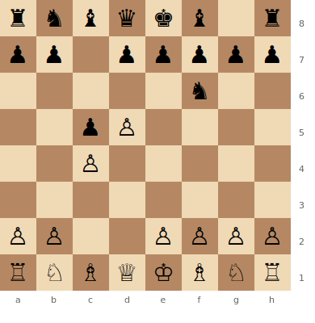
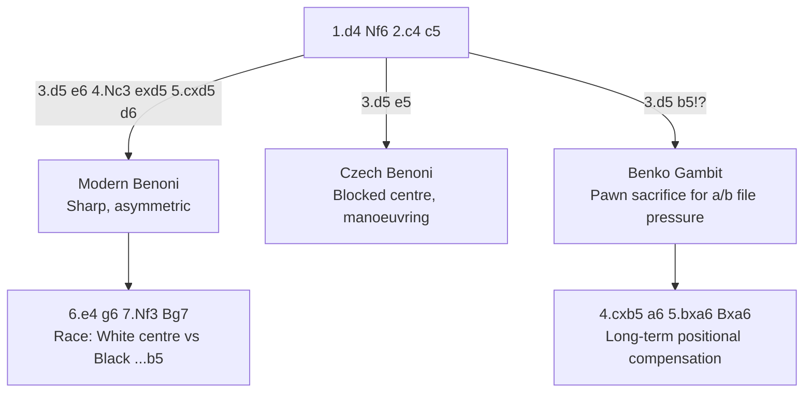

# Benoni Defense

**1.d4 Nf6 2.c4 c5 3.d5 e6 4.Nc3 exd5 5.cxd5 d6**

The Modern Benoni — one of the sharpest and most double-edged responses to 1.d4. Black creates an asymmetric pawn structure and plays for dynamic piece activity, especially on the queenside.

**Position after 1.d4 Nf6 2.c4 c5 3.d5 (Benoni Defense)**



> **FEN:** `rnbqkb1r/pp1ppppp/5n2/2pP4/2P5/8/PP2PPPP/RNBQKBNR w - - 0 1`

**See also:** [King's Indian Defense](kings-indian.md) | [Grünfeld Defense](grunfeld.md) | [Middlegame — Pawn Structures](../../middlegame/pawn-structures.md)

### Variation Tree



---

## Modern Benoni — Main Line

```
1.d4 Nf6 2.c4 c5 3.d5 e6 4.Nc3 exd5 5.cxd5 d6 6.e4 g6 7.Nf3 Bg7 8.Be2 O-O 9.O-O
```

### The Benoni Pawn Structure

White has a passed d5 pawn and more central space. Black has a queenside pawn majority (a7, b7, c5 vs White's a2, b2) and the semi-open e-file.

### Strategic Ideas

| White | Black |
|-------|-------|
| The d5 pawn restricts Black | Queenside majority: ...b5 break is Black's main plan |
| Central/kingside attack: e5 break | Semi-open e-file for the rook |
| Piece pressure on d6 | Active pieces: Bg7 on the long diagonal, ...Na6–c7–b5 |
| Space advantage | ...a6, ...b5 — the thematic queenside advance |

### Key Tactical Themes

- The ...b5 break is Black's lifeblood — without it, Black suffocates
- White's e5 break can be devastating if Black isn't prepared
- The Bg7 is a powerful piece in both attack and defence
- See [Tactics — Pawn Breaks](../../middlegame/pawn-structures.md)

---

## Czech Benoni (2...e5)

```
1.d4 Nf6 2.c4 c5 3.d5 e5
```

Black locks the centre immediately. A very different character — the position is blocked and manoeuvring. Less dynamic than the Modern Benoni.

## Benko Gambit (3...b5)

```
1.d4 Nf6 2.c4 c5 3.d5 b5!?
```

Black sacrifices a pawn for long-term queenside pressure on the a- and b-files. One of the most successful pawn gambits in chess — Black's compensation lasts well into the endgame.

### Key Ideas

- After 4.cxb5 a6 5.bxa6 Bxa6, Black has the bishop pair and open a/b files
- White has an extra pawn but must defend passively
- The compensation is often enough for a draw or even a win

---

## Famous Practitioners

Mikhail Tal, Bobby Fischer, Garry Kasparov, Vugar Gashimov (Modern Benoni), Veselin Topalov.

## Who Should Play It

Ambitious, aggressive players willing to accept risk for dynamic play. The Benoni requires precise knowledge — one slip and White's central advantage becomes overwhelming.

---

**Next:** [Dutch Defense](dutch-defense.md) | **Back to:** [Openings Index](../index.md)
