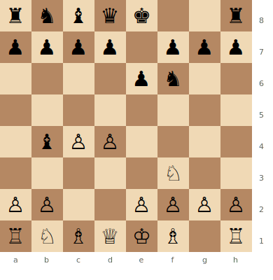

# Bogo-Indian Defense

**1.d4 Nf6 2.c4 e6 3.Nf3 Bb4+**

Named after Efim Bogoljubov. Black checks with the bishop, forcing White to block (Bd2, Nbd2, or Nc3 transposing to the [Nimzo-Indian](nimzo-indian.md)). A solid, flexible alternative when White avoids the Nimzo with 3.Nf3.

**Position after 1.d4 Nf6 2.c4 e6 3.Nf3 Bb4+ (Bogo-Indian Defense)**



> **FEN:** `rnbqk2r/pppp1ppp/4pn2/8/1bPP4/5N2/PP2PPPP/RNBQKB1R w - - 0 1`

**See also:** [Nimzo-Indian](nimzo-indian.md) | [Queen's Indian](queens-indian.md) | [Catalan](../closed-games/catalan.md)

---

## Main Lines

### 4.Bd2

```
1.d4 Nf6 2.c4 e6 3.Nf3 Bb4+ 4.Bd2 Bxd2+ (or 4...a5, 4...Qe7) 5.Qxd2 O-O 6.g3 d5 7.Bg2
```

The most common response. After the exchange, the position resembles a [Catalan](../closed-games/catalan.md) or [QGD](../closed-games/qgd.md) with slightly simplified piece structure.

### 4.Nbd2

```
4.Nbd2 O-O 5.a3 Be7 6.e4
```

White aims for a broad centre. The knight on d2 is less active but avoids doubled pawns.

### Strategic Ideas

| White | Black |
|-------|-------|
| Simple development after Bd2 exchange | Quick, flexible development |
| Aim for e4 with Nbd2 | ...d5 or ...c5 to contest the centre |
| The position is often slightly better for White | Solid equality is realistic |

---

## Famous Practitioners

Efim Bogoljubov, Viswanathan Anand, Veselin Topalov.

## Who Should Play It

Players who want a safe, simple approach against 1.d4 2.c4 3.Nf3. Less theoretical than the Nimzo-Indian or Queen's Indian.

---

**Next:** [Benoni Defense](benoni.md) | **Back to:** [Openings Index](../index.md)
