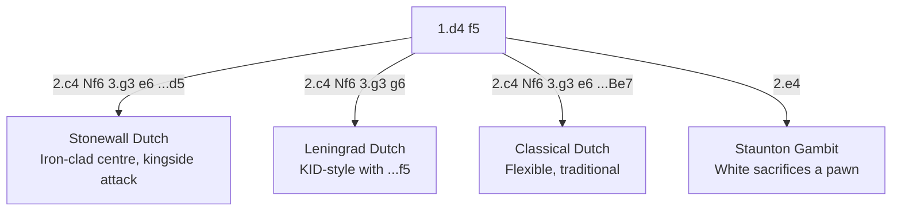

# Dutch Defense

**1.d4 f5**

An ambitious, fighting response to 1.d4. Black immediately stakes a claim on the kingside, planning to control e4 with the f-pawn. The trade-off: the king is weakened, and the e8–h5 diagonal is exposed.

**Position after 1.d4 f5 (Dutch Defense)**

<svg viewBox="0 0 390 400" xmlns="http://www.w3.org/2000/svg" style="max-width:400px">
  <rect x="0" y="0" width="360" height="360" fill="#b58863"/>
  <rect x="0" y="0" width="45" height="45" fill="#f0d9b5"/><rect x="90" y="0" width="45" height="45" fill="#f0d9b5"/><rect x="180" y="0" width="45" height="45" fill="#f0d9b5"/><rect x="270" y="0" width="45" height="45" fill="#f0d9b5"/>
  <rect x="45" y="45" width="45" height="45" fill="#f0d9b5"/><rect x="135" y="45" width="45" height="45" fill="#f0d9b5"/><rect x="225" y="45" width="45" height="45" fill="#f0d9b5"/><rect x="315" y="45" width="45" height="45" fill="#f0d9b5"/>
  <rect x="0" y="90" width="45" height="45" fill="#f0d9b5"/><rect x="90" y="90" width="45" height="45" fill="#f0d9b5"/><rect x="180" y="90" width="45" height="45" fill="#f0d9b5"/><rect x="270" y="90" width="45" height="45" fill="#f0d9b5"/>
  <rect x="45" y="135" width="45" height="45" fill="#f0d9b5"/><rect x="135" y="135" width="45" height="45" fill="#f0d9b5"/><rect x="225" y="135" width="45" height="45" fill="#f0d9b5"/><rect x="315" y="135" width="45" height="45" fill="#f0d9b5"/>
  <rect x="0" y="180" width="45" height="45" fill="#f0d9b5"/><rect x="90" y="180" width="45" height="45" fill="#f0d9b5"/><rect x="180" y="180" width="45" height="45" fill="#f0d9b5"/><rect x="270" y="180" width="45" height="45" fill="#f0d9b5"/>
  <rect x="45" y="225" width="45" height="45" fill="#f0d9b5"/><rect x="135" y="225" width="45" height="45" fill="#f0d9b5"/><rect x="225" y="225" width="45" height="45" fill="#f0d9b5"/><rect x="315" y="225" width="45" height="45" fill="#f0d9b5"/>
  <rect x="0" y="270" width="45" height="45" fill="#f0d9b5"/><rect x="90" y="270" width="45" height="45" fill="#f0d9b5"/><rect x="180" y="270" width="45" height="45" fill="#f0d9b5"/><rect x="270" y="270" width="45" height="45" fill="#f0d9b5"/>
  <rect x="45" y="315" width="45" height="45" fill="#f0d9b5"/><rect x="135" y="315" width="45" height="45" fill="#f0d9b5"/><rect x="225" y="315" width="45" height="45" fill="#f0d9b5"/><rect x="315" y="315" width="45" height="45" fill="#f0d9b5"/>
  <!-- Pieces -->
  <text x="22" y="33" font-size="30" text-anchor="middle" font-family="sans-serif">♜</text>
  <text x="67" y="33" font-size="30" text-anchor="middle" font-family="sans-serif">♞</text>
  <text x="112" y="33" font-size="30" text-anchor="middle" font-family="sans-serif">♝</text>
  <text x="157" y="33" font-size="30" text-anchor="middle" font-family="sans-serif">♛</text>
  <text x="202" y="33" font-size="30" text-anchor="middle" font-family="sans-serif">♚</text>
  <text x="247" y="33" font-size="30" text-anchor="middle" font-family="sans-serif">♝</text>
  <text x="292" y="33" font-size="30" text-anchor="middle" font-family="sans-serif">♞</text>
  <text x="337" y="33" font-size="30" text-anchor="middle" font-family="sans-serif">♜</text>
  <text x="22" y="78" font-size="30" text-anchor="middle" font-family="sans-serif">♟</text>
  <text x="67" y="78" font-size="30" text-anchor="middle" font-family="sans-serif">♟</text>
  <text x="112" y="78" font-size="30" text-anchor="middle" font-family="sans-serif">♟</text>
  <text x="157" y="78" font-size="30" text-anchor="middle" font-family="sans-serif">♟</text>
  <text x="202" y="78" font-size="30" text-anchor="middle" font-family="sans-serif">♟</text>
  <text x="292" y="78" font-size="30" text-anchor="middle" font-family="sans-serif">♟</text>
  <text x="337" y="78" font-size="30" text-anchor="middle" font-family="sans-serif">♟</text>
  <text x="247" y="168" font-size="30" text-anchor="middle" font-family="sans-serif">♟</text>
  <text x="157" y="213" font-size="30" text-anchor="middle" font-family="sans-serif">♙</text>
  <text x="22" y="303" font-size="30" text-anchor="middle" font-family="sans-serif">♙</text>
  <text x="67" y="303" font-size="30" text-anchor="middle" font-family="sans-serif">♙</text>
  <text x="112" y="303" font-size="30" text-anchor="middle" font-family="sans-serif">♙</text>
  <text x="202" y="303" font-size="30" text-anchor="middle" font-family="sans-serif">♙</text>
  <text x="247" y="303" font-size="30" text-anchor="middle" font-family="sans-serif">♙</text>
  <text x="292" y="303" font-size="30" text-anchor="middle" font-family="sans-serif">♙</text>
  <text x="337" y="303" font-size="30" text-anchor="middle" font-family="sans-serif">♙</text>
  <text x="22" y="348" font-size="30" text-anchor="middle" font-family="sans-serif">♖</text>
  <text x="67" y="348" font-size="30" text-anchor="middle" font-family="sans-serif">♘</text>
  <text x="112" y="348" font-size="30" text-anchor="middle" font-family="sans-serif">♗</text>
  <text x="157" y="348" font-size="30" text-anchor="middle" font-family="sans-serif">♕</text>
  <text x="202" y="348" font-size="30" text-anchor="middle" font-family="sans-serif">♔</text>
  <text x="247" y="348" font-size="30" text-anchor="middle" font-family="sans-serif">♗</text>
  <text x="292" y="348" font-size="30" text-anchor="middle" font-family="sans-serif">♘</text>
  <text x="337" y="348" font-size="30" text-anchor="middle" font-family="sans-serif">♖</text>
  <!-- Coordinates -->
  <text x="22" y="375" font-size="11" fill="#666" text-anchor="middle" font-family="sans-serif">a</text>
  <text x="67" y="375" font-size="11" fill="#666" text-anchor="middle" font-family="sans-serif">b</text>
  <text x="112" y="375" font-size="11" fill="#666" text-anchor="middle" font-family="sans-serif">c</text>
  <text x="157" y="375" font-size="11" fill="#666" text-anchor="middle" font-family="sans-serif">d</text>
  <text x="202" y="375" font-size="11" fill="#666" text-anchor="middle" font-family="sans-serif">e</text>
  <text x="247" y="375" font-size="11" fill="#666" text-anchor="middle" font-family="sans-serif">f</text>
  <text x="292" y="375" font-size="11" fill="#666" text-anchor="middle" font-family="sans-serif">g</text>
  <text x="337" y="375" font-size="11" fill="#666" text-anchor="middle" font-family="sans-serif">h</text>
  <text x="370" y="33" font-size="11" fill="#666" font-family="sans-serif">8</text>
  <text x="370" y="78" font-size="11" fill="#666" font-family="sans-serif">7</text>
  <text x="370" y="123" font-size="11" fill="#666" font-family="sans-serif">6</text>
  <text x="370" y="168" font-size="11" fill="#666" font-family="sans-serif">5</text>
  <text x="370" y="213" font-size="11" fill="#666" font-family="sans-serif">4</text>
  <text x="370" y="258" font-size="11" fill="#666" font-family="sans-serif">3</text>
  <text x="370" y="303" font-size="11" fill="#666" font-family="sans-serif">2</text>
  <text x="370" y="348" font-size="11" fill="#666" font-family="sans-serif">1</text>
</svg>

> **FEN:** `rnbqkbnr/ppppp1pp/8/5p2/3P4/8/PPP1PPPP/RNBQKBNR w - - 0 1`

**See also:** [King's Indian Defense](kings-indian.md) | [Fundamentals — King Safety](../../fundamentals/king-safety.md)

### Variation Tree



---

## Stonewall Dutch

```
1.d4 f5 2.c4 Nf6 3.g3 e6 4.Bg2 d5 5.Nf3 c6
```

Black builds a "stone wall" with pawns on c6, d5, e6, f5. The e4 and c4 squares are controlled, but the e5 square is a permanent hole.

### Strategic Ideas

| White | Black |
|-------|-------|
| Occupy e5 — Black's chronic weakness | Iron-clad centre; attack on the kingside |
| Target the "bad" light-squared bishop | Manoeuvre a knight to e4 (the "Stonewall knight") |
| Play on the queenside with b3, Bb2 | ...Bd6, ...Qe8–h5, ...Rf6–h6 for a kingside attack |

## Leningrad Dutch

```
1.d4 f5 2.c4 Nf6 3.g3 g6 4.Bg2 Bg7 5.Nf3 O-O 6.O-O d6
```

A [King's Indian](kings-indian.md)-style setup with ...f5. Black fianchettoes and aims for ...e5 with a dynamic position. The most popular modern Dutch system.

## Classical Dutch

```
1.d4 f5 2.c4 Nf6 3.g3 e6 4.Bg2 Be7 5.Nf3 O-O 6.O-O d6
```

Traditional development. Less committal than the Stonewall or Leningrad. Black keeps options open.

---

## Anti-Dutch: The Staunton Gambit (2.e4)

```
1.d4 f5 2.e4 fxe4 3.Nc3 Nf6 4.Bg5
```

White sacrifices a pawn to exploit the weakened e8–h5 diagonal and rapid development. Dangerous for unprepared Black players.

---

## Famous Practitioners

Mikhail Botvinnik, Hikaru Nakamura, Magnus Carlsen (occasional use), Simon Williams ("The Ginger GM").

## Who Should Play It

Aggressive players who want to fight for a win with Black from move 1. The Dutch creates unbalanced positions but requires care — the weakened king can be a liability.

---

**Back to:** [Openings Index](../index.md)
