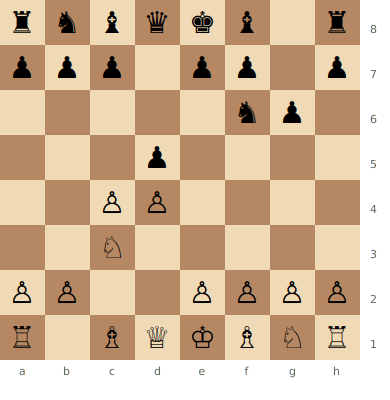
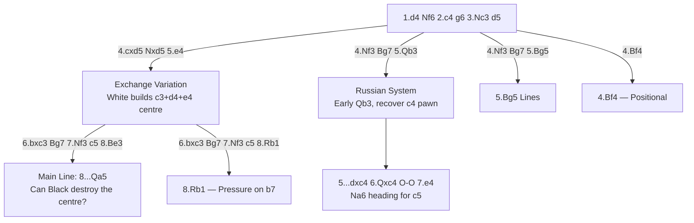

# Grünfeld Defense

**1.d4 Nf6 2.c4 g6 3.Nc3 d5**

Black strikes at the centre immediately with ...d5, then after cxd5 Nxd5, allows White to build a big centre with e4. Black's strategy: undermine and destroy that centre, typically using the fianchettoed Bg7, ...c5, and piece pressure.

**Position after 1.d4 Nf6 2.c4 g6 3.Nc3 d5 (Grunfeld Defense)**



> **FEN:** `rnbqkb1r/ppp1pp1p/5np1/3p4/2PP4/2N5/PP2PPPP/R1BQKBNR w - - 0 1`

**See also:** [King's Indian Defense](kings-indian.md) | [Middlegame — Pawn Structures](../../middlegame/pawn-structures.md) | [Famous Games — Game of the Century](../../famous-games/game-of-century.md)

### Variation Tree



---

## Exchange Variation

```
1.d4 Nf6 2.c4 g6 3.Nc3 d5 4.cxd5 Nxd5 5.e4 Nxc3 6.bxc3 Bg7 7.Nf3 c5 8.Be3 (or 8.Rb1) Qa5 9.Qd2 O-O
```

The main battleground. White has a massive pawn centre (c3, d4, e4). The critical question: can White maintain it or will Black blow it apart?

### Strategic Ideas

| White | Black |
|-------|-------|
| Maintain the centre: c3 + d4 + e4 | Destroy the centre with ...c5, ...Nc6, ...Bg4, ...Qa5 |
| Develop pieces to support the pawns | Bg7 on the long diagonal is enormously powerful |
| If the centre holds, White's space advantage wins | Piece activity and counterplay if the centre crumbles |
| Bc4 or Be2; Rb1 to pressure b7 | ...Nc6, ...Rd8 — attack d4 relentlessly |

## Russian System

```
1.d4 Nf6 2.c4 g6 3.Nc3 d5 4.Nf3 Bg7 5.Qb3 dxc4 6.Qxc4 O-O 7.e4 Na6
```

White develops the queen early to recover the pawn and support e4. The knight on a6 heads for c5 or c7.

---

## Key Themes

1. **Central Tension:** The whole opening revolves around White's centre vs Black's piece pressure
2. **The Bg7:** Often called the "Grünfeld bishop" — its power on the long diagonal defines the opening
3. **...c5 break:** The most important pawn break for Black
4. **Exchange sacrifice ...Rxc3:** Black may sacrifice the exchange to destroy White's centre
5. **Dynamic balance:** White has structure; Black has activity

## Famous Practitioners

Ernst Grünfeld (inventor), Bobby Fischer, Garry Kasparov (used it to win the 1987 World Championship match), Magnus Carlsen, Peter Svidler.

## Famous Games

- [Fischer vs Byrne, 1956](../../famous-games/game-of-century.md) — "The Game of the Century" featured the Grünfeld
- Kasparov's many Grünfeld victories in World Championship matches

## Who Should Play It

Aggressive players who enjoy dynamic, concrete play. The Grünfeld requires excellent tactical vision — you must be comfortable allowing White a big centre because you plan to destroy it.

---

**Next:** [Bogo-Indian Defense](bogo-indian.md) | **Back to:** [Openings Index](../index.md)
