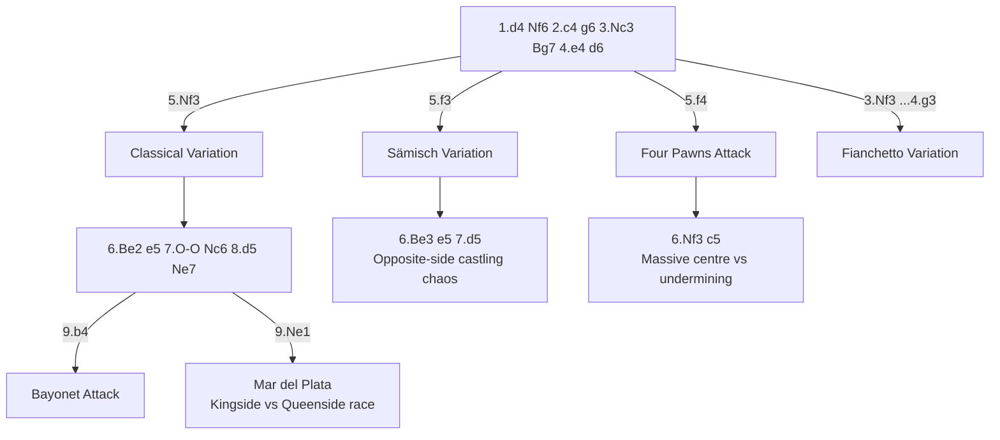

# King's Indian Defense

**1.d4 Nf6 2.c4 g6 3.Nc3 Bg7 4.e4 d6**

One of the most dynamic and double-edged openings in chess. Black allows White to build a large centre, then counterattacks with ...e5 (and sometimes ...c5). The Bg7 is a sleeping dragon that awakens in the middlegame.

**Position after 1.d4 Nf6 2.c4 g6 3.Nc3 Bg7 (King's Indian Defense)**

<svg viewBox="0 0 390 400" xmlns="http://www.w3.org/2000/svg" style="max-width:400px">
  <rect x="0" y="0" width="360" height="360" fill="#b58863"/>
  <rect x="0" y="0" width="45" height="45" fill="#f0d9b5"/><rect x="90" y="0" width="45" height="45" fill="#f0d9b5"/><rect x="180" y="0" width="45" height="45" fill="#f0d9b5"/><rect x="270" y="0" width="45" height="45" fill="#f0d9b5"/>
  <rect x="45" y="45" width="45" height="45" fill="#f0d9b5"/><rect x="135" y="45" width="45" height="45" fill="#f0d9b5"/><rect x="225" y="45" width="45" height="45" fill="#f0d9b5"/><rect x="315" y="45" width="45" height="45" fill="#f0d9b5"/>
  <rect x="0" y="90" width="45" height="45" fill="#f0d9b5"/><rect x="90" y="90" width="45" height="45" fill="#f0d9b5"/><rect x="180" y="90" width="45" height="45" fill="#f0d9b5"/><rect x="270" y="90" width="45" height="45" fill="#f0d9b5"/>
  <rect x="45" y="135" width="45" height="45" fill="#f0d9b5"/><rect x="135" y="135" width="45" height="45" fill="#f0d9b5"/><rect x="225" y="135" width="45" height="45" fill="#f0d9b5"/><rect x="315" y="135" width="45" height="45" fill="#f0d9b5"/>
  <rect x="0" y="180" width="45" height="45" fill="#f0d9b5"/><rect x="90" y="180" width="45" height="45" fill="#f0d9b5"/><rect x="180" y="180" width="45" height="45" fill="#f0d9b5"/><rect x="270" y="180" width="45" height="45" fill="#f0d9b5"/>
  <rect x="45" y="225" width="45" height="45" fill="#f0d9b5"/><rect x="135" y="225" width="45" height="45" fill="#f0d9b5"/><rect x="225" y="225" width="45" height="45" fill="#f0d9b5"/><rect x="315" y="225" width="45" height="45" fill="#f0d9b5"/>
  <rect x="0" y="270" width="45" height="45" fill="#f0d9b5"/><rect x="90" y="270" width="45" height="45" fill="#f0d9b5"/><rect x="180" y="270" width="45" height="45" fill="#f0d9b5"/><rect x="270" y="270" width="45" height="45" fill="#f0d9b5"/>
  <rect x="45" y="315" width="45" height="45" fill="#f0d9b5"/><rect x="135" y="315" width="45" height="45" fill="#f0d9b5"/><rect x="225" y="315" width="45" height="45" fill="#f0d9b5"/><rect x="315" y="315" width="45" height="45" fill="#f0d9b5"/>
  <!-- Pieces -->
  <text x="22" y="33" font-size="30" text-anchor="middle" font-family="sans-serif">♜</text>
  <text x="67" y="33" font-size="30" text-anchor="middle" font-family="sans-serif">♞</text>
  <text x="112" y="33" font-size="30" text-anchor="middle" font-family="sans-serif">♝</text>
  <text x="157" y="33" font-size="30" text-anchor="middle" font-family="sans-serif">♛</text>
  <text x="202" y="33" font-size="30" text-anchor="middle" font-family="sans-serif">♚</text>
  <text x="337" y="33" font-size="30" text-anchor="middle" font-family="sans-serif">♜</text>
  <text x="22" y="78" font-size="30" text-anchor="middle" font-family="sans-serif">♟</text>
  <text x="67" y="78" font-size="30" text-anchor="middle" font-family="sans-serif">♟</text>
  <text x="112" y="78" font-size="30" text-anchor="middle" font-family="sans-serif">♟</text>
  <text x="157" y="78" font-size="30" text-anchor="middle" font-family="sans-serif">♟</text>
  <text x="202" y="78" font-size="30" text-anchor="middle" font-family="sans-serif">♟</text>
  <text x="247" y="78" font-size="30" text-anchor="middle" font-family="sans-serif">♟</text>
  <text x="292" y="78" font-size="30" text-anchor="middle" font-family="sans-serif">♝</text>
  <text x="337" y="78" font-size="30" text-anchor="middle" font-family="sans-serif">♟</text>
  <text x="247" y="123" font-size="30" text-anchor="middle" font-family="sans-serif">♞</text>
  <text x="292" y="123" font-size="30" text-anchor="middle" font-family="sans-serif">♟</text>
  <text x="112" y="213" font-size="30" text-anchor="middle" font-family="sans-serif">♙</text>
  <text x="157" y="213" font-size="30" text-anchor="middle" font-family="sans-serif">♙</text>
  <text x="112" y="258" font-size="30" text-anchor="middle" font-family="sans-serif">♘</text>
  <text x="22" y="303" font-size="30" text-anchor="middle" font-family="sans-serif">♙</text>
  <text x="67" y="303" font-size="30" text-anchor="middle" font-family="sans-serif">♙</text>
  <text x="202" y="303" font-size="30" text-anchor="middle" font-family="sans-serif">♙</text>
  <text x="247" y="303" font-size="30" text-anchor="middle" font-family="sans-serif">♙</text>
  <text x="292" y="303" font-size="30" text-anchor="middle" font-family="sans-serif">♙</text>
  <text x="337" y="303" font-size="30" text-anchor="middle" font-family="sans-serif">♙</text>
  <text x="22" y="348" font-size="30" text-anchor="middle" font-family="sans-serif">♖</text>
  <text x="112" y="348" font-size="30" text-anchor="middle" font-family="sans-serif">♗</text>
  <text x="157" y="348" font-size="30" text-anchor="middle" font-family="sans-serif">♕</text>
  <text x="202" y="348" font-size="30" text-anchor="middle" font-family="sans-serif">♔</text>
  <text x="247" y="348" font-size="30" text-anchor="middle" font-family="sans-serif">♗</text>
  <text x="292" y="348" font-size="30" text-anchor="middle" font-family="sans-serif">♘</text>
  <text x="337" y="348" font-size="30" text-anchor="middle" font-family="sans-serif">♖</text>
  <!-- Coordinates -->
  <text x="22" y="375" font-size="11" fill="#666" text-anchor="middle" font-family="sans-serif">a</text>
  <text x="67" y="375" font-size="11" fill="#666" text-anchor="middle" font-family="sans-serif">b</text>
  <text x="112" y="375" font-size="11" fill="#666" text-anchor="middle" font-family="sans-serif">c</text>
  <text x="157" y="375" font-size="11" fill="#666" text-anchor="middle" font-family="sans-serif">d</text>
  <text x="202" y="375" font-size="11" fill="#666" text-anchor="middle" font-family="sans-serif">e</text>
  <text x="247" y="375" font-size="11" fill="#666" text-anchor="middle" font-family="sans-serif">f</text>
  <text x="292" y="375" font-size="11" fill="#666" text-anchor="middle" font-family="sans-serif">g</text>
  <text x="337" y="375" font-size="11" fill="#666" text-anchor="middle" font-family="sans-serif">h</text>
  <text x="370" y="33" font-size="11" fill="#666" font-family="sans-serif">8</text>
  <text x="370" y="78" font-size="11" fill="#666" font-family="sans-serif">7</text>
  <text x="370" y="123" font-size="11" fill="#666" font-family="sans-serif">6</text>
  <text x="370" y="168" font-size="11" fill="#666" font-family="sans-serif">5</text>
  <text x="370" y="213" font-size="11" fill="#666" font-family="sans-serif">4</text>
  <text x="370" y="258" font-size="11" fill="#666" font-family="sans-serif">3</text>
  <text x="370" y="303" font-size="11" fill="#666" font-family="sans-serif">2</text>
  <text x="370" y="348" font-size="11" fill="#666" font-family="sans-serif">1</text>
</svg>

> **FEN:** `rnbqk2r/ppppppbp/5np1/8/2PP4/2N5/PP2PPPP/R1BQKBNR w - - 0 1`

**See also:** [Grünfeld Defense](grunfeld.md) | [Pirc & Modern](../semi-open/pirc-modern.md) | [Middlegame — Pawn Structures](../../middlegame/pawn-structures.md) | [Tactics — Mating Patterns](../../tactics/mating-patterns.md)

### Variation Tree



---

## Classical Variation (5.Nf3 O-O 6.Be2 e5 7.O-O Nc6)

```
1.d4 Nf6 2.c4 g6 3.Nc3 Bg7 4.e4 d6 5.Nf3 O-O 6.Be2 e5 7.O-O Nc6 8.d5 Ne7
```

### The Mar del Plata Structure

After 8.d5 Ne7, the centre is locked. Both sides have clear plans:

| White | Black |
|-------|-------|
| Queenside attack: a4, b4, c5 | Kingside attack: f5, f4, g5, g4, Nf6–h5 |
| Break through with c5 to open lines on the queenside | Break through with ...f4 and ...g5–g4 to storm White's king |
| Use the c-file after cxd6 | ...Rf7–g7 (doubling rooks on the g-file) |
| Aim to create a passed a- or b-pawn | ...Bh6 to exchange the dark-squared bishop and weaken dark squares |

This is one of the most spectacular pawn-race structures in chess — both sides attack on opposite wings.

---

## Sämisch Variation (5.f3)

```
1.d4 Nf6 2.c4 g6 3.Nc3 Bg7 4.e4 d6 5.f3 O-O 6.Be3 e5 7.d5 Nh5
```

White fortifies the centre with f3 (supporting e4) and often castles queenside. This leads to extremely sharp, opposite-side castling positions.

### Key Ideas

- White's plan: Be3, Qd2, O-O-O, g4, h4 — kingside pawn storm
- Black's plan: ...f5, ...Nf4, ...c5 — counterplay on both flanks
- The Bg7 becomes enormously powerful if lines open

---

## Four Pawns Attack (5.f4)

```
1.d4 Nf6 2.c4 g6 3.Nc3 Bg7 4.e4 d6 5.f4 O-O 6.Nf3 c5
```

White builds a massive pawn centre (c4, d4, e4, f4). Impressive but potentially overextended. Black strikes with ...c5 to undermine it.

---

## Fianchetto Variation (3.Nf3, 4.g3)

```
1.d4 Nf6 2.c4 g6 3.Nf3 Bg7 4.g3 O-O 5.Bg2 d6 6.O-O Nbd7 7.Nc3 e5 8.e4
```

The most positional approach. White fianchettoes too, leading to a strategic battle. Less sharp than the Classical or Sämisch but solid and reliable.

---

## The Bayonet Attack (9.b4)

```
In the Classical main line: 8.d5 Ne7 9.b4
```

White immediately launches the queenside attack. This has become one of the most critical tests of the King's Indian at the top level.

---

## Famous Practitioners

Bobby Fischer, Garry Kasparov, Mikhail Tal, Teimour Radjabov, Hikaru Nakamura.

## Famous Games

- [Kasparov vs Topalov, 1999](../../famous-games/kasparov-topalov.md) — arose from a [Pirc](../semi-open/pirc-modern.md) but showcases KID-style attacking themes
- [Fischer vs Byrne, 1956](../../famous-games/game-of-century.md) — arose from a [Grünfeld](grunfeld.md) but demonstrates similar dynamic play

## Who Should Play It

Aggressive, dynamic players who enjoy complex middlegame battles. The KID demands deep understanding of pawn structures and attacking play. Not for the faint-hearted — you must be comfortable being cramped before launching a counterattack.

---

**Next:** [Nimzo-Indian Defense](nimzo-indian.md) | **Back to:** [Openings Index](../index.md)
