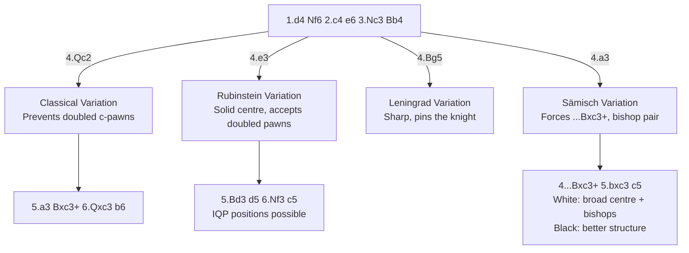

# Nimzo-Indian Defense

**1.d4 Nf6 2.c4 e6 3.Nc3 Bb4**

Named after Aron Nimzowitsch, who championed its ideas. Black pins the Nc3, preventing e4 and fighting for central control with pieces rather than pawns. One of the most respected and successful openings at all levels.

**Position after 1.d4 Nf6 2.c4 e6 3.Nc3 Bb4 (Nimzo-Indian Defense)**

<svg viewBox="0 0 390 400" xmlns="http://www.w3.org/2000/svg" style="max-width:400px">
  <rect x="0" y="0" width="360" height="360" fill="#b58863"/>
  <rect x="0" y="0" width="45" height="45" fill="#f0d9b5"/><rect x="90" y="0" width="45" height="45" fill="#f0d9b5"/><rect x="180" y="0" width="45" height="45" fill="#f0d9b5"/><rect x="270" y="0" width="45" height="45" fill="#f0d9b5"/>
  <rect x="45" y="45" width="45" height="45" fill="#f0d9b5"/><rect x="135" y="45" width="45" height="45" fill="#f0d9b5"/><rect x="225" y="45" width="45" height="45" fill="#f0d9b5"/><rect x="315" y="45" width="45" height="45" fill="#f0d9b5"/>
  <rect x="0" y="90" width="45" height="45" fill="#f0d9b5"/><rect x="90" y="90" width="45" height="45" fill="#f0d9b5"/><rect x="180" y="90" width="45" height="45" fill="#f0d9b5"/><rect x="270" y="90" width="45" height="45" fill="#f0d9b5"/>
  <rect x="45" y="135" width="45" height="45" fill="#f0d9b5"/><rect x="135" y="135" width="45" height="45" fill="#f0d9b5"/><rect x="225" y="135" width="45" height="45" fill="#f0d9b5"/><rect x="315" y="135" width="45" height="45" fill="#f0d9b5"/>
  <rect x="0" y="180" width="45" height="45" fill="#f0d9b5"/><rect x="90" y="180" width="45" height="45" fill="#f0d9b5"/><rect x="180" y="180" width="45" height="45" fill="#f0d9b5"/><rect x="270" y="180" width="45" height="45" fill="#f0d9b5"/>
  <rect x="45" y="225" width="45" height="45" fill="#f0d9b5"/><rect x="135" y="225" width="45" height="45" fill="#f0d9b5"/><rect x="225" y="225" width="45" height="45" fill="#f0d9b5"/><rect x="315" y="225" width="45" height="45" fill="#f0d9b5"/>
  <rect x="0" y="270" width="45" height="45" fill="#f0d9b5"/><rect x="90" y="270" width="45" height="45" fill="#f0d9b5"/><rect x="180" y="270" width="45" height="45" fill="#f0d9b5"/><rect x="270" y="270" width="45" height="45" fill="#f0d9b5"/>
  <rect x="45" y="315" width="45" height="45" fill="#f0d9b5"/><rect x="135" y="315" width="45" height="45" fill="#f0d9b5"/><rect x="225" y="315" width="45" height="45" fill="#f0d9b5"/><rect x="315" y="315" width="45" height="45" fill="#f0d9b5"/>
  <!-- Pieces -->
  <text x="22" y="33" font-size="30" text-anchor="middle" font-family="sans-serif">♜</text>
  <text x="67" y="33" font-size="30" text-anchor="middle" font-family="sans-serif">♞</text>
  <text x="112" y="33" font-size="30" text-anchor="middle" font-family="sans-serif">♝</text>
  <text x="157" y="33" font-size="30" text-anchor="middle" font-family="sans-serif">♛</text>
  <text x="202" y="33" font-size="30" text-anchor="middle" font-family="sans-serif">♚</text>
  <text x="337" y="33" font-size="30" text-anchor="middle" font-family="sans-serif">♜</text>
  <text x="22" y="78" font-size="30" text-anchor="middle" font-family="sans-serif">♟</text>
  <text x="67" y="78" font-size="30" text-anchor="middle" font-family="sans-serif">♟</text>
  <text x="112" y="78" font-size="30" text-anchor="middle" font-family="sans-serif">♟</text>
  <text x="157" y="78" font-size="30" text-anchor="middle" font-family="sans-serif">♟</text>
  <text x="247" y="78" font-size="30" text-anchor="middle" font-family="sans-serif">♟</text>
  <text x="292" y="78" font-size="30" text-anchor="middle" font-family="sans-serif">♟</text>
  <text x="337" y="78" font-size="30" text-anchor="middle" font-family="sans-serif">♟</text>
  <text x="202" y="123" font-size="30" text-anchor="middle" font-family="sans-serif">♟</text>
  <text x="247" y="123" font-size="30" text-anchor="middle" font-family="sans-serif">♞</text>
  <text x="67" y="213" font-size="30" text-anchor="middle" font-family="sans-serif">♝</text>
  <text x="112" y="213" font-size="30" text-anchor="middle" font-family="sans-serif">♙</text>
  <text x="157" y="213" font-size="30" text-anchor="middle" font-family="sans-serif">♙</text>
  <text x="112" y="258" font-size="30" text-anchor="middle" font-family="sans-serif">♘</text>
  <text x="22" y="303" font-size="30" text-anchor="middle" font-family="sans-serif">♙</text>
  <text x="67" y="303" font-size="30" text-anchor="middle" font-family="sans-serif">♙</text>
  <text x="202" y="303" font-size="30" text-anchor="middle" font-family="sans-serif">♙</text>
  <text x="247" y="303" font-size="30" text-anchor="middle" font-family="sans-serif">♙</text>
  <text x="292" y="303" font-size="30" text-anchor="middle" font-family="sans-serif">♙</text>
  <text x="337" y="303" font-size="30" text-anchor="middle" font-family="sans-serif">♙</text>
  <text x="22" y="348" font-size="30" text-anchor="middle" font-family="sans-serif">♖</text>
  <text x="112" y="348" font-size="30" text-anchor="middle" font-family="sans-serif">♗</text>
  <text x="157" y="348" font-size="30" text-anchor="middle" font-family="sans-serif">♕</text>
  <text x="202" y="348" font-size="30" text-anchor="middle" font-family="sans-serif">♔</text>
  <text x="247" y="348" font-size="30" text-anchor="middle" font-family="sans-serif">♗</text>
  <text x="292" y="348" font-size="30" text-anchor="middle" font-family="sans-serif">♘</text>
  <text x="337" y="348" font-size="30" text-anchor="middle" font-family="sans-serif">♖</text>
  <!-- Coordinates -->
  <text x="22" y="375" font-size="11" fill="#666" text-anchor="middle" font-family="sans-serif">a</text>
  <text x="67" y="375" font-size="11" fill="#666" text-anchor="middle" font-family="sans-serif">b</text>
  <text x="112" y="375" font-size="11" fill="#666" text-anchor="middle" font-family="sans-serif">c</text>
  <text x="157" y="375" font-size="11" fill="#666" text-anchor="middle" font-family="sans-serif">d</text>
  <text x="202" y="375" font-size="11" fill="#666" text-anchor="middle" font-family="sans-serif">e</text>
  <text x="247" y="375" font-size="11" fill="#666" text-anchor="middle" font-family="sans-serif">f</text>
  <text x="292" y="375" font-size="11" fill="#666" text-anchor="middle" font-family="sans-serif">g</text>
  <text x="337" y="375" font-size="11" fill="#666" text-anchor="middle" font-family="sans-serif">h</text>
  <text x="370" y="33" font-size="11" fill="#666" font-family="sans-serif">8</text>
  <text x="370" y="78" font-size="11" fill="#666" font-family="sans-serif">7</text>
  <text x="370" y="123" font-size="11" fill="#666" font-family="sans-serif">6</text>
  <text x="370" y="168" font-size="11" fill="#666" font-family="sans-serif">5</text>
  <text x="370" y="213" font-size="11" fill="#666" font-family="sans-serif">4</text>
  <text x="370" y="258" font-size="11" fill="#666" font-family="sans-serif">3</text>
  <text x="370" y="303" font-size="11" fill="#666" font-family="sans-serif">2</text>
  <text x="370" y="348" font-size="11" fill="#666" font-family="sans-serif">1</text>
</svg>

> **FEN:** `rnbqk2r/pppp1ppp/4pn2/8/1bPP4/2N5/PP2PPPP/R1BQKBNR w - - 0 1`

**See also:** [Queen's Indian](queens-indian.md) | [Bogo-Indian](bogo-indian.md) | [Queen's Gambit Declined](../closed-games/qgd.md) | [Middlegame — Piece Activity](../../middlegame/piece-activity.md)

### Variation Tree



---

## Classical Variation (4.Qc2)

```
1.d4 Nf6 2.c4 e6 3.Nc3 Bb4 4.Qc2 O-O 5.a3 Bxc3+ 6.Qxc3 b6 7.Bg5
```

White's most popular response. Qc2 prevents doubled c-pawns after ...Bxc3+ and controls e4. The downside: the queen is committed early.

## Rubinstein Variation (4.e3)

```
1.d4 Nf6 2.c4 e6 3.Nc3 Bb4 4.e3 O-O 5.Bd3 d5 6.Nf3 c5 7.O-O dxc4 8.Bxc4
```

White accepts that doubled c-pawns may occur and builds a solid centre. After e3, White will play Bd3, Nf3, O-O — normal development. If Black plays ...Bxc3+ bxc3, White's pawn centre (c3, c4, d4, e3) is broad and the half-open b-file can be useful.

## Leningrad Variation (4.Bg5)

```
4.Bg5 h6 5.Bh4 c5 6.d5 d6
```

White pins the knight immediately. Sharp and concrete.

## Sämisch Variation (4.a3)

```
1.d4 Nf6 2.c4 e6 3.Nc3 Bb4 4.a3 Bxc3+ 5.bxc3 c5 6.e3 (or 6.f3)
```

White forces the exchange immediately, accepting doubled c-pawns for the bishop pair and a strong centre. Botvinnik's favourite.

### Strategic Ideas

| White | Black |
|-------|-------|
| The bishop pair in an open position | Doubled c-pawns are a structural weakness for White |
| Broad pawn centre: c3, c4, d4 | Control dark squares (which the traded bishop no longer covers) |
| Play f3, e4 to build a classical centre | ...c5, ...d5 to challenge the centre |
| Long-term structural advantage if the position opens | Short-term activity and piece play |

---

## Key Themes

1. **The Pin:** ...Bb4 pins the knight, preventing e4
2. **Doubled Pawns:** After ...Bxc3+, White gets doubled c-pawns — a key structural theme
3. **Bishop Pair vs Structure:** White's bishops may dominate in the long run; Black's better structure compensates
4. **Dark-Square Control:** After trading the Bb4, Black lacks a dark-squared bishop — the remaining pieces must cover those squares

## Famous Practitioners

Aron Nimzowitsch (creator), Mikhail Botvinnik, Bobby Fischer, Garry Kasparov, Magnus Carlsen, Viswanathan Anand.

## Who Should Play It

One of the best openings for Black at any level. Suits positional players who understand structural nuances, but also works for tacticians due to the rich positions that arise.

---

**Next:** [Queen's Indian Defense](queens-indian.md) | **Back to:** [Openings Index](../index.md)
