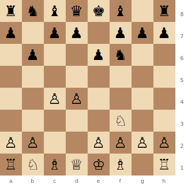
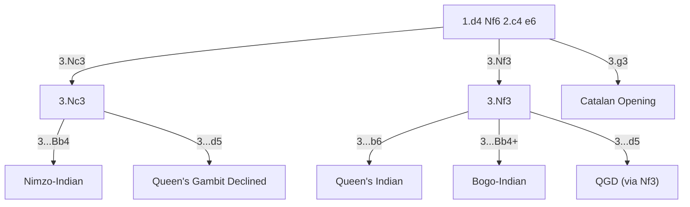

# Queen's Indian Defense

**1.d4 Nf6 2.c4 e6 3.Nf3 b6**

Black fianchettoes the queen's bishop to b7, controlling the central light squares (d5, e4) from the flank. A solid, hypermodern approach that avoids the sharper [Nimzo-Indian](nimzo-indian.md) (which requires 3.Nc3).

**Position after 1.d4 Nf6 2.c4 e6 3.Nf3 b6 (Queen's Indian Defense)**



> **FEN:** `rnbqkb1r/p1pp1ppp/1p2pn2/8/2PP4/5N2/PP2PPPP/RNBQKB1R w - - 0 1`

**See also:** [Nimzo-Indian](nimzo-indian.md) | [Bogo-Indian](bogo-indian.md) | [Catalan](../closed-games/catalan.md)

### Where the Queen's Indian Fits

After 1.d4 Nf6 2.c4 e6, White's third move determines which Indian system arises. The Queen's Indian is Black's response when White plays 3.Nf3 (avoiding the Nimzo-Indian).



---

## Main Line (4.g3)

```
1.d4 Nf6 2.c4 e6 3.Nf3 b6 4.g3 Bb7 5.Bg2 Be7 6.O-O O-O 7.Nc3 Ne4 8.Qc2
```

### Strategic Ideas

| White | Black |
|-------|-------|
| Battle for e4: both bishops target this square | Bb7 controls the long diagonal (e4, d5) |
| Bg2 creates a "battle of the fianchettoes" | Flexible development: ...Be7, ...O-O, ...d5 or ...c5 |
| Play for central expansion with d5 or e4 | Counter White's plans with timely ...d5 or ...c5 |

## Petrosian System (4.a3)

```
1.d4 Nf6 2.c4 e6 3.Nf3 b6 4.a3
```

White prevents ...Bb4 (ruling out Nimzo-Indian transpositions) and prepares a broad centre with Nc3 and e4.

---

## Famous Practitioners

Tigran Petrosian, Anatoly Karpov, Viktor Korchnoi, Viswanathan Anand.

## Who Should Play It

Positional players who want a safe, solid system against 1.d4. The Queen's Indian is less sharp than the Nimzo-Indian or [King's Indian](kings-indian.md) but offers reliable equality with chances for both sides.

---

**Next:** [Grünfeld Defense](grunfeld.md) | **Back to:** [Openings Index](../index.md)
