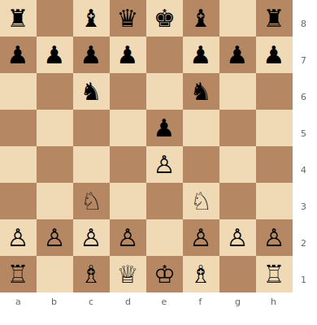
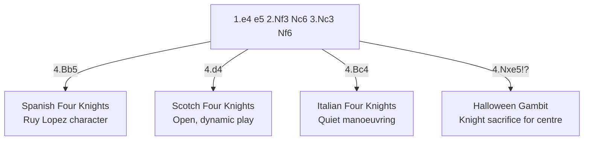

# Four Knights Game

**1.e4 e5 2.Nf3 Nc6 3.Nc3 Nf6**

A symmetrical, solid opening. Both sides develop knights naturally. Often considered "boring" but contains more venom than its reputation suggests.

**Position after 1.e4 e5 2.Nf3 Nc6 3.Nc3 Nf6 (Four Knights Game)**



> **FEN:** `r1bqkb1r/pppp1ppp/2n2n2/4p3/4P3/2N2N2/PPPP1PPP/R1BQKB1R w - - 0 1`

**See also:** [Italian Game](italian-game.md) | [Ruy Lopez](ruy-lopez.md) | [Scotch Game](scotch-game.md)

### Variation Tree



---

## Spanish Four Knights (4.Bb5)

```
1.e4 e5 2.Nf3 Nc6 3.Nc3 Nf6 4.Bb5 Bb4 5.O-O O-O 6.d3 d6
```

Resembles a [Ruy Lopez](ruy-lopez.md) with extra symmetry. White aims for a slight edge through the bishop pair or central play.

## Scotch Four Knights (4.d4)

```
1.e4 e5 2.Nf3 Nc6 3.Nc3 Nf6 4.d4 exd4 5.Nxd4 Bb4 6.Nxc6 bxc6 7.Bd3
```

More dynamic than the Spanish line. Transposes into [Scotch Game](scotch-game.md) territory with both knights developed.

## Italian Four Knights (4.Bc4)

```
4.Bc4 Bc5 5.d3 d6 6.Bg5 (or O-O)
```

A quiet but solid approach leading to manoeuvring play.

## The Halloween Gambit (4.Nxe5!?)

```
4.Nxe5!? Nxe5 5.d4
```

White sacrifices a whole knight for a massive centre. Objectively dubious but creates enormous practical problems. Named because "it's scary."

---

## Famous Practitioners

Svidler, Short, and many classical-era players.

## Who Should Play It

Players who enjoy solid, well-understood positions. Good for beginners learning opening principles. The Halloween Gambit is for the brave.

---

**Next:** [Philidor Defense](philidor-defense.md) | **Back to:** [Openings Index](../index.md)
