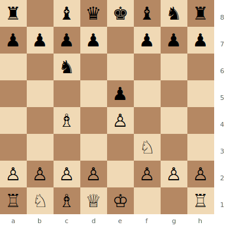
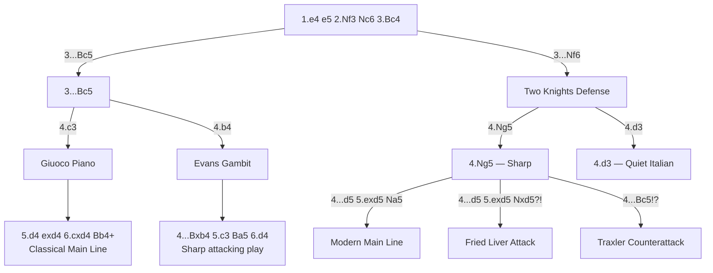

# Italian Game

**1.e4 e5 2.Nf3 Nc6 3.Bc4**

One of the oldest recorded openings, dating to the 16th century. White develops the bishop to an active diagonal aiming at the f7 weakness. The Italian Game leads to rich strategic and tactical play and has been a favourite at all levels from beginners to world champions.

**Position after 1.e4 e5 2.Nf3 Nc6 3.Bc4 (Italian Game)**



> **FEN:** `r1bqkbnr/pppp1ppp/2n5/4p3/2B1P3/5N2/PPPP1PPP/RNBQK2R w - - 0 1`

**See also:** [Ruy Lopez](ruy-lopez.md) | [Scotch Game](scotch-game.md) | [King's Gambit](kings-gambit.md) | [Fundamentals — Development](../../fundamentals/development.md)

### Variation Tree



---

## Giuoco Piano (3...Bc5 4.c3)

**Main Line:**
```
1.e4 e5 2.Nf3 Nc6 3.Bc4 Bc5 4.c3 Nf6 5.d4 exd4 6.cxd4 Bb4+ 7.Bd2 Bxd2+ 8.Nbxd2 d5 9.exd5 Nxd5 10.Qb3 Nce7 11.O-O O-O
```

### Strategic Ideas

| White | Black |
|-------|-------|
| Build a strong pawn centre with c3 and d4 | Challenge the centre with ...d5 at the right moment |
| Use the central space for a kingside attack | Develop naturally and equalise through active piece play |
| Bishop on c4 pressures f7 | If White overextends, counterattack the centre |

### Typical Pawn Structures

After the main-line exchanges, White often has an **isolated d4 pawn** (IQP). This gives dynamic piece play but can be a long-term endgame weakness. See [Middlegame — Pawn Structures](../../middlegame/pawn-structures.md) for IQP strategy.

### Key Tactical Themes

- **The fork trick:** ...Nxe4 followed by ...d5, regaining the piece with central control
- **Pins along a5–e1:** After ...Bb4+, the pin can create tactical problems
- **f7 sacrifices:** In sharp lines, White may sacrifice on f7 to expose the king

### Famous Practitioners

Anatoly Karpov, Fabiano Caruana (revived it at the top level 2014–2018), Ian Nepomniachtchi.

### Who Should Play It

Positional players who enjoy a slight but lasting edge. Good for players who like manoeuvring rather than memorising long forcing lines.

### Common Traps

The **Blackburne Shilling Gambit** (3...Nd4?!) tries to trick White with 4.Nxe5?? Qg5 winning material, but 4.Nxd4 is simply good for White.

---

## Evans Gambit (3...Bc5 4.b4)

**Main Line:**
```
1.e4 e5 2.Nf3 Nc6 3.Bc4 Bc5 4.b4 Bxb4 5.c3 Ba5 6.d4 exd4 7.O-O d6 8.cxd4
```

### Strategic Ideas

| White | Black |
|-------|-------|
| Sacrifice a pawn for rapid development and a powerful centre | Hold the extra pawn or return it to neutralise White's initiative |
| Open lines and diagonals for an attack | Play ...d6 for solidity or ...d5 for a counterattack |
| Launch a direct kingside attack | Consolidate and equalise |

### Key Tactical Themes

- Sacrifices on f7 or d5 to open lines
- Discovered attacks along the e-file
- Rapid piece mobilisation before Black consolidates
- See [Tactics — Discovered Attacks](../../tactics/discovered-attacks.md)

### Famous Practitioners

Captain William Evans (inventor), Adolf Anderssen, Garry Kasparov (surprise weapon vs Anand, Riga 1995), Nigel Short.

### Who Should Play It

Aggressive, tactical players who enjoy initiative-based play and are comfortable sacrificing material. Excellent for rapid and blitz.

### Common Traps

After 5...Ba5 6.d4 exd4 7.O-O dxc3?! — White gets a huge attack with 8.Qb3 targeting f7 and the hanging c3 pawn.

---

## Two Knights Defense (3...Nf6)

**Main Line:**
```
1.e4 e5 2.Nf3 Nc6 3.Bc4 Nf6 4.Ng5 d5 5.exd5 Na5 6.Bb5+ c6 7.dxc6 bxc6 8.Be2 h6 9.Nf3 e4 10.Ne5 Bd6
```

### Strategic Ideas

| White | Black |
|-------|-------|
| 4.Ng5 attacks f7 immediately | 3...Nf6 is a counterattacking choice, inviting sharp play |
| After 5.exd5, White has an extra pawn | After 5...Na5, Black gets excellent piece activity as compensation |
| Play concrete, forcing chess | Use the development lead to generate threats |

### The Fried Liver Attack

```
4.Ng5 d5 5.exd5 Nxd5?! 6.Nxf7! Kxf7 7.Qf3+ Ke6 8.Nc3
```

A classic trap for unprepared players — White wins with a vicious attack against the exposed king. This is why **5...Na5** is the modern main line instead of 5...Nxd5.

### The Traxler Counterattack

```
4.Ng5 Bc5!?
```

Black ignores the f7 threat and counter-threatens f2. Extremely sharp and double-edged — both sides must know the theory. See [Tactics — Deflection](../../tactics/deflection-decoy.md).

### Famous Practitioners

Bobby Fischer (as Black), Hikaru Nakamura, Alexander Morozevich.

### Who Should Play It

As Black: aggressive counterattackers. As White: the Ng5 lines suit tacticians, while the quieter 4.d3 suits positional players.

---

**Next:** [Ruy Lopez](ruy-lopez.md) — the other major response to 1.e4 e5 2.Nf3 Nc6
