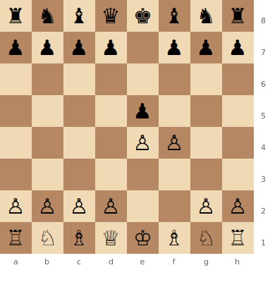
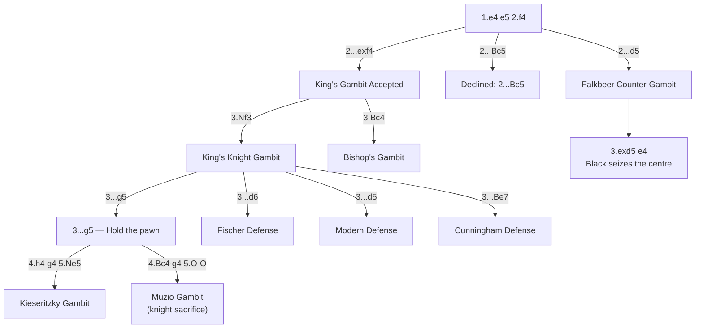

# King's Gambit

**1.e4 e5 2.f4**

The most romantic opening in chess. White sacrifices the f-pawn to open the f-file and seize the centre. Played by the greatest attacking players in history, it remains a potent weapon — especially in faster time controls.

**Position after 1.e4 e5 2.f4 (King's Gambit)**



> **FEN:** `rnbqkbnr/pppp1ppp/8/4p3/4PP2/8/PPPP2PP/RNBQKBNR w - - 0 1`

**See also:** [Italian Game](italian-game.md) | [Tactics — Sacrifices](../../tactics/sacrifices.md) | [Famous Games — The Immortal Game](../../famous-games/immortal-game.md)

### Variation Tree



---

## King's Gambit Accepted (2...exf4)

### King's Knight Gambit (3.Nf3)

```
1.e4 e5 2.f4 exf4 3.Nf3
```

Now Black chooses:

- **3...g5** — holding the pawn aggressively (leads to Kieseritzky Gambit after 4.h4 g4 5.Ne5)
- **3...d6** — the Fischer Defense (solid; Fischer's recommendation for equality)
- **3...d5** — the Modern Defense (active; leads to open play)
- **3...Be7** — the Cunningham Defense (tricky with ...Bh4+ ideas)

### Kieseritzky Gambit

```
3.Nf3 g5 4.h4 g4 5.Ne5
```

Sharp, wild play. White sacrifices a knight to open lines. This was the basis of the [Immortal Game](../../famous-games/immortal-game.md).

### Muzio Gambit

```
3.Nf3 g5 4.Bc4 g4 5.O-O gxf3 6.Qxf3
```

White sacrifices a whole knight for a devastating development lead. Spectacular but objectively dubious against best play.

---

## King's Gambit Declined (2...Bc5 or 2...d5)

### Falkbeer Counter-Gambit (2...d5)

```
1.e4 e5 2.f4 d5 3.exd5 e4
```

Black counter-sacrifices, seizing central space and opening lines. A principled way to meet the King's Gambit that gives Black active counterplay.

---

## Strategic Ideas

| White | Black |
|-------|-------|
| Open the f-file for the rook | Hold the extra pawn or return it favourably |
| Control the centre with d4 | The ...g5 advance weakens the kingside |
| Rapid development and direct attack | Modern practice prefers 3...d5 or 3...d6 for solidity |

## Typical Pawn Structure

White often has e4 + d4 vs Black's remaining pawns. The f-file is open. If Black retains the f4 pawn, an unusual structural asymmetry persists.

## Key Tactical Themes

- Attacks on f7
- Open f-file play for the rook
- Sacrifices on g5 or f7
- See [Tactics — Discovered Attacks](../../tactics/discovered-attacks.md)

## Famous Practitioners

Adolf Anderssen, Boris Spassky, David Bronstein, Nigel Short, Hikaru Nakamura (in blitz).

## Famous Games

- [The Immortal Game](../../famous-games/immortal-game.md) — Anderssen vs Kieseritzky, 1851
- Spassky vs Fischer, 1972 World Championship Game 3 (Fischer accepted the King's Gambit!)

## Who Should Play It

Romantic, swashbuckling players who love sacrificial chess. Excellent for blitz and rapid. Less common at the highest levels of classical chess but always dangerous.

---

**Next:** [Petrov's Defense](petrovs-defense.md) | **Back to:** [Openings Index](../index.md)
