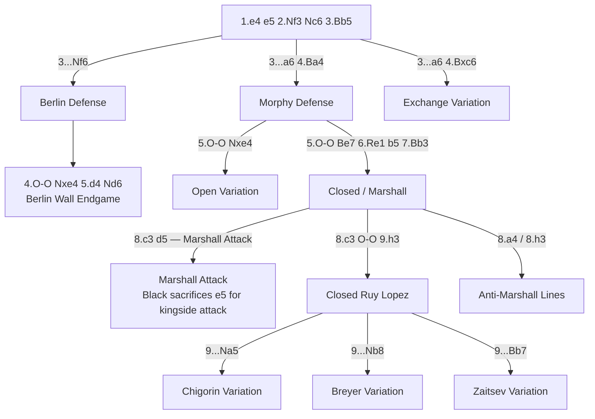

# Ruy Lopez (Spanish Game)

**1.e4 e5 2.Nf3 Nc6 3.Bb5**

The "Spanish Game" — one of the most important and deeply analysed openings in chess. Named after the 16th-century Spanish priest Ruy López de Segura. White's bishop pins the knight defending e5, creating subtle long-term pressure on Black's centre.

**Position after 1.e4 e5 2.Nf3 Nc6 3.Bb5 (Ruy Lopez)**

<svg viewBox="0 0 390 400" xmlns="http://www.w3.org/2000/svg" style="max-width:400px">
  <rect x="0" y="0" width="360" height="360" fill="#b58863"/>
  <rect x="0" y="0" width="45" height="45" fill="#f0d9b5"/><rect x="90" y="0" width="45" height="45" fill="#f0d9b5"/><rect x="180" y="0" width="45" height="45" fill="#f0d9b5"/><rect x="270" y="0" width="45" height="45" fill="#f0d9b5"/>
  <rect x="45" y="45" width="45" height="45" fill="#f0d9b5"/><rect x="135" y="45" width="45" height="45" fill="#f0d9b5"/><rect x="225" y="45" width="45" height="45" fill="#f0d9b5"/><rect x="315" y="45" width="45" height="45" fill="#f0d9b5"/>
  <rect x="0" y="90" width="45" height="45" fill="#f0d9b5"/><rect x="90" y="90" width="45" height="45" fill="#f0d9b5"/><rect x="180" y="90" width="45" height="45" fill="#f0d9b5"/><rect x="270" y="90" width="45" height="45" fill="#f0d9b5"/>
  <rect x="45" y="135" width="45" height="45" fill="#f0d9b5"/><rect x="135" y="135" width="45" height="45" fill="#f0d9b5"/><rect x="225" y="135" width="45" height="45" fill="#f0d9b5"/><rect x="315" y="135" width="45" height="45" fill="#f0d9b5"/>
  <rect x="0" y="180" width="45" height="45" fill="#f0d9b5"/><rect x="90" y="180" width="45" height="45" fill="#f0d9b5"/><rect x="180" y="180" width="45" height="45" fill="#f0d9b5"/><rect x="270" y="180" width="45" height="45" fill="#f0d9b5"/>
  <rect x="45" y="225" width="45" height="45" fill="#f0d9b5"/><rect x="135" y="225" width="45" height="45" fill="#f0d9b5"/><rect x="225" y="225" width="45" height="45" fill="#f0d9b5"/><rect x="315" y="225" width="45" height="45" fill="#f0d9b5"/>
  <rect x="0" y="270" width="45" height="45" fill="#f0d9b5"/><rect x="90" y="270" width="45" height="45" fill="#f0d9b5"/><rect x="180" y="270" width="45" height="45" fill="#f0d9b5"/><rect x="270" y="270" width="45" height="45" fill="#f0d9b5"/>
  <rect x="45" y="315" width="45" height="45" fill="#f0d9b5"/><rect x="135" y="315" width="45" height="45" fill="#f0d9b5"/><rect x="225" y="315" width="45" height="45" fill="#f0d9b5"/><rect x="315" y="315" width="45" height="45" fill="#f0d9b5"/>
  <!-- Pieces -->
  <text x="22" y="33" font-size="30" text-anchor="middle" font-family="sans-serif">♜</text>
  <text x="112" y="33" font-size="30" text-anchor="middle" font-family="sans-serif">♝</text>
  <text x="157" y="33" font-size="30" text-anchor="middle" font-family="sans-serif">♛</text>
  <text x="202" y="33" font-size="30" text-anchor="middle" font-family="sans-serif">♚</text>
  <text x="247" y="33" font-size="30" text-anchor="middle" font-family="sans-serif">♝</text>
  <text x="292" y="33" font-size="30" text-anchor="middle" font-family="sans-serif">♞</text>
  <text x="337" y="33" font-size="30" text-anchor="middle" font-family="sans-serif">♜</text>
  <text x="22" y="78" font-size="30" text-anchor="middle" font-family="sans-serif">♟</text>
  <text x="67" y="78" font-size="30" text-anchor="middle" font-family="sans-serif">♟</text>
  <text x="112" y="78" font-size="30" text-anchor="middle" font-family="sans-serif">♟</text>
  <text x="157" y="78" font-size="30" text-anchor="middle" font-family="sans-serif">♟</text>
  <text x="247" y="78" font-size="30" text-anchor="middle" font-family="sans-serif">♟</text>
  <text x="292" y="78" font-size="30" text-anchor="middle" font-family="sans-serif">♟</text>
  <text x="337" y="78" font-size="30" text-anchor="middle" font-family="sans-serif">♟</text>
  <text x="112" y="123" font-size="30" text-anchor="middle" font-family="sans-serif">♞</text>
  <text x="67" y="168" font-size="30" text-anchor="middle" font-family="sans-serif">♗</text>
  <text x="202" y="168" font-size="30" text-anchor="middle" font-family="sans-serif">♟</text>
  <text x="202" y="213" font-size="30" text-anchor="middle" font-family="sans-serif">♙</text>
  <text x="247" y="258" font-size="30" text-anchor="middle" font-family="sans-serif">♘</text>
  <text x="22" y="303" font-size="30" text-anchor="middle" font-family="sans-serif">♙</text>
  <text x="67" y="303" font-size="30" text-anchor="middle" font-family="sans-serif">♙</text>
  <text x="112" y="303" font-size="30" text-anchor="middle" font-family="sans-serif">♙</text>
  <text x="157" y="303" font-size="30" text-anchor="middle" font-family="sans-serif">♙</text>
  <text x="247" y="303" font-size="30" text-anchor="middle" font-family="sans-serif">♙</text>
  <text x="292" y="303" font-size="30" text-anchor="middle" font-family="sans-serif">♙</text>
  <text x="337" y="303" font-size="30" text-anchor="middle" font-family="sans-serif">♙</text>
  <text x="22" y="348" font-size="30" text-anchor="middle" font-family="sans-serif">♖</text>
  <text x="67" y="348" font-size="30" text-anchor="middle" font-family="sans-serif">♘</text>
  <text x="112" y="348" font-size="30" text-anchor="middle" font-family="sans-serif">♗</text>
  <text x="157" y="348" font-size="30" text-anchor="middle" font-family="sans-serif">♕</text>
  <text x="202" y="348" font-size="30" text-anchor="middle" font-family="sans-serif">♔</text>
  <text x="337" y="348" font-size="30" text-anchor="middle" font-family="sans-serif">♖</text>
  <!-- Coordinates -->
  <text x="22" y="375" font-size="11" fill="#666" text-anchor="middle" font-family="sans-serif">a</text>
  <text x="67" y="375" font-size="11" fill="#666" text-anchor="middle" font-family="sans-serif">b</text>
  <text x="112" y="375" font-size="11" fill="#666" text-anchor="middle" font-family="sans-serif">c</text>
  <text x="157" y="375" font-size="11" fill="#666" text-anchor="middle" font-family="sans-serif">d</text>
  <text x="202" y="375" font-size="11" fill="#666" text-anchor="middle" font-family="sans-serif">e</text>
  <text x="247" y="375" font-size="11" fill="#666" text-anchor="middle" font-family="sans-serif">f</text>
  <text x="292" y="375" font-size="11" fill="#666" text-anchor="middle" font-family="sans-serif">g</text>
  <text x="337" y="375" font-size="11" fill="#666" text-anchor="middle" font-family="sans-serif">h</text>
  <text x="370" y="33" font-size="11" fill="#666" font-family="sans-serif">8</text>
  <text x="370" y="78" font-size="11" fill="#666" font-family="sans-serif">7</text>
  <text x="370" y="123" font-size="11" fill="#666" font-family="sans-serif">6</text>
  <text x="370" y="168" font-size="11" fill="#666" font-family="sans-serif">5</text>
  <text x="370" y="213" font-size="11" fill="#666" font-family="sans-serif">4</text>
  <text x="370" y="258" font-size="11" fill="#666" font-family="sans-serif">3</text>
  <text x="370" y="303" font-size="11" fill="#666" font-family="sans-serif">2</text>
  <text x="370" y="348" font-size="11" fill="#666" font-family="sans-serif">1</text>
</svg>

> **FEN:** `r1bqkbnr/pppp1ppp/2n5/1B2p3/4P3/5N2/PPPP1PPP/RNBQK2R w - - 0 1`

**See also:** [Italian Game](italian-game.md) | [Scotch Game](scotch-game.md) | [Middlegame — Pawn Structures](../../middlegame/pawn-structures.md)

### Variation Tree



---

## Berlin Defense (3...Nf6)

**Main Line:**
```
1.e4 e5 2.Nf3 Nc6 3.Bb5 Nf6 4.O-O Nxe4 5.d4 Nd6 6.Bxc6 dxc6 7.dxe5 Nf5 8.Qxd8+ Kxd8
```

The famous "Berlin Wall" — queens come off early, leading to a deceptively complex endgame.

### Strategic Ideas

| White | Black |
|-------|-------|
| Kingside pawn majority; better pawn structure | Doubled c-pawns actually provide good central control |
| The e5 pawn restricts Black's pieces | The bishop pair is a long-term asset |
| Exploit the pawn majority in the endgame | King goes to e8–e7 or c8–b8 despite lost castling rights |

### Typical Pawn Structure

White: a2, b2, c2, e5, f2, g2, h2 — Black: a7, b7, c7, c6, f7, g7, h7

The doubled c-pawns and White's e5 pawn are the defining features. This is positional manoeuvring, not tactical fireworks.

### Famous Practitioners

Vladimir Kramnik (used it to dethrone Kasparov, World Championship 2000), Fabiano Caruana, Magnus Carlsen.

### Who Should Play It

Technically precise defenders comfortable in endgames. Not for those seeking sharp tactical battles.

---

## Marshall Attack (8...d5)

**Main Line:**
```
1.e4 e5 2.Nf3 Nc6 3.Bb5 a6 4.Ba4 Nf6 5.O-O Be7 6.Re1 b5 7.Bb3 O-O 8.c3 d5!?
9.exd5 Nxd5 10.Nxe5 Nxe5 11.Rxe5 c6 12.d4 Bd6 13.Re1 Qh4 14.g3 Qh3
```

Frank Marshall's famous gambit, prepared in secret and first unleashed in 1918 against Capablanca (who defended brilliantly and won). Black sacrifices the e5 pawn for a direct kingside attack.

### Strategic Ideas

| White | Black |
|-------|-------|
| Defend precisely and keep the extra pawn | Rapid development and direct kingside attack |
| Survive the onslaught — the extra pawn tells later | Bd6 + Qh3 create threats; ...Bg4, ...Rae8, ...Re6–h6 follow |
| Key defensive manoeuvre: Re4, Nd2–f1–e3 | ...f5–f4 advance for further aggression |

### Key Tactical Themes

- Kingside attacks with queen and bishop battery
- Piece sacrifices on g3 or h2
- Rook lifts: ...Re6–h6
- See [Tactics — Mating Patterns](../../tactics/mating-patterns.md) and [Attacking — Sacrifices](../../middlegame/attacking-the-king.md)

### Famous Practitioners

Frank Marshall (inventor), Boris Spassky, Levon Aronian, Maxime Vachier-Lagrave.

### Anti-Marshall Lines

White can avoid the Marshall entirely with **8.a4** or **8.h3** — so Black must always have an alternative prepared.

---

## Closed Ruy Lopez (8...O-O)

**Main Line:**
```
1.e4 e5 2.Nf3 Nc6 3.Bb5 a6 4.Ba4 Nf6 5.O-O Be7 6.Re1 b5 7.Bb3 d6 8.c3 O-O 9.h3
```

**Position after 9.h3 (Closed Ruy Lopez)**

<svg viewBox="0 0 390 400" xmlns="http://www.w3.org/2000/svg" style="max-width:400px">
  <rect x="0" y="0" width="360" height="360" fill="#b58863"/>
  <rect x="0" y="0" width="45" height="45" fill="#f0d9b5"/><rect x="90" y="0" width="45" height="45" fill="#f0d9b5"/><rect x="180" y="0" width="45" height="45" fill="#f0d9b5"/><rect x="270" y="0" width="45" height="45" fill="#f0d9b5"/>
  <rect x="45" y="45" width="45" height="45" fill="#f0d9b5"/><rect x="135" y="45" width="45" height="45" fill="#f0d9b5"/><rect x="225" y="45" width="45" height="45" fill="#f0d9b5"/><rect x="315" y="45" width="45" height="45" fill="#f0d9b5"/>
  <rect x="0" y="90" width="45" height="45" fill="#f0d9b5"/><rect x="90" y="90" width="45" height="45" fill="#f0d9b5"/><rect x="180" y="90" width="45" height="45" fill="#f0d9b5"/><rect x="270" y="90" width="45" height="45" fill="#f0d9b5"/>
  <rect x="45" y="135" width="45" height="45" fill="#f0d9b5"/><rect x="135" y="135" width="45" height="45" fill="#f0d9b5"/><rect x="225" y="135" width="45" height="45" fill="#f0d9b5"/><rect x="315" y="135" width="45" height="45" fill="#f0d9b5"/>
  <rect x="0" y="180" width="45" height="45" fill="#f0d9b5"/><rect x="90" y="180" width="45" height="45" fill="#f0d9b5"/><rect x="180" y="180" width="45" height="45" fill="#f0d9b5"/><rect x="270" y="180" width="45" height="45" fill="#f0d9b5"/>
  <rect x="45" y="225" width="45" height="45" fill="#f0d9b5"/><rect x="135" y="225" width="45" height="45" fill="#f0d9b5"/><rect x="225" y="225" width="45" height="45" fill="#f0d9b5"/><rect x="315" y="225" width="45" height="45" fill="#f0d9b5"/>
  <rect x="0" y="270" width="45" height="45" fill="#f0d9b5"/><rect x="90" y="270" width="45" height="45" fill="#f0d9b5"/><rect x="180" y="270" width="45" height="45" fill="#f0d9b5"/><rect x="270" y="270" width="45" height="45" fill="#f0d9b5"/>
  <rect x="45" y="315" width="45" height="45" fill="#f0d9b5"/><rect x="135" y="315" width="45" height="45" fill="#f0d9b5"/><rect x="225" y="315" width="45" height="45" fill="#f0d9b5"/><rect x="315" y="315" width="45" height="45" fill="#f0d9b5"/>
  <!-- Pieces -->
  <text x="22" y="33" font-size="30" text-anchor="middle" font-family="sans-serif">♜</text>
  <text x="112" y="33" font-size="30" text-anchor="middle" font-family="sans-serif">♝</text>
  <text x="157" y="33" font-size="30" text-anchor="middle" font-family="sans-serif">♛</text>
  <text x="247" y="33" font-size="30" text-anchor="middle" font-family="sans-serif">♜</text>
  <text x="292" y="33" font-size="30" text-anchor="middle" font-family="sans-serif">♚</text>
  <text x="112" y="78" font-size="30" text-anchor="middle" font-family="sans-serif">♟</text>
  <text x="202" y="78" font-size="30" text-anchor="middle" font-family="sans-serif">♝</text>
  <text x="247" y="78" font-size="30" text-anchor="middle" font-family="sans-serif">♟</text>
  <text x="292" y="78" font-size="30" text-anchor="middle" font-family="sans-serif">♟</text>
  <text x="337" y="78" font-size="30" text-anchor="middle" font-family="sans-serif">♟</text>
  <text x="22" y="123" font-size="30" text-anchor="middle" font-family="sans-serif">♟</text>
  <text x="112" y="123" font-size="30" text-anchor="middle" font-family="sans-serif">♞</text>
  <text x="157" y="123" font-size="30" text-anchor="middle" font-family="sans-serif">♟</text>
  <text x="247" y="123" font-size="30" text-anchor="middle" font-family="sans-serif">♞</text>
  <text x="67" y="168" font-size="30" text-anchor="middle" font-family="sans-serif">♟</text>
  <text x="202" y="168" font-size="30" text-anchor="middle" font-family="sans-serif">♟</text>
  <text x="202" y="213" font-size="30" text-anchor="middle" font-family="sans-serif">♙</text>
  <text x="67" y="258" font-size="30" text-anchor="middle" font-family="sans-serif">♗</text>
  <text x="112" y="258" font-size="30" text-anchor="middle" font-family="sans-serif">♙</text>
  <text x="247" y="258" font-size="30" text-anchor="middle" font-family="sans-serif">♘</text>
  <text x="337" y="258" font-size="30" text-anchor="middle" font-family="sans-serif">♙</text>
  <text x="22" y="303" font-size="30" text-anchor="middle" font-family="sans-serif">♙</text>
  <text x="67" y="303" font-size="30" text-anchor="middle" font-family="sans-serif">♙</text>
  <text x="157" y="303" font-size="30" text-anchor="middle" font-family="sans-serif">♙</text>
  <text x="247" y="303" font-size="30" text-anchor="middle" font-family="sans-serif">♙</text>
  <text x="292" y="303" font-size="30" text-anchor="middle" font-family="sans-serif">♙</text>
  <text x="22" y="348" font-size="30" text-anchor="middle" font-family="sans-serif">♖</text>
  <text x="67" y="348" font-size="30" text-anchor="middle" font-family="sans-serif">♘</text>
  <text x="112" y="348" font-size="30" text-anchor="middle" font-family="sans-serif">♗</text>
  <text x="157" y="348" font-size="30" text-anchor="middle" font-family="sans-serif">♕</text>
  <text x="202" y="348" font-size="30" text-anchor="middle" font-family="sans-serif">♖</text>
  <text x="292" y="348" font-size="30" text-anchor="middle" font-family="sans-serif">♔</text>
  <!-- Coordinates -->
  <text x="22" y="375" font-size="11" fill="#666" text-anchor="middle" font-family="sans-serif">a</text>
  <text x="67" y="375" font-size="11" fill="#666" text-anchor="middle" font-family="sans-serif">b</text>
  <text x="112" y="375" font-size="11" fill="#666" text-anchor="middle" font-family="sans-serif">c</text>
  <text x="157" y="375" font-size="11" fill="#666" text-anchor="middle" font-family="sans-serif">d</text>
  <text x="202" y="375" font-size="11" fill="#666" text-anchor="middle" font-family="sans-serif">e</text>
  <text x="247" y="375" font-size="11" fill="#666" text-anchor="middle" font-family="sans-serif">f</text>
  <text x="292" y="375" font-size="11" fill="#666" text-anchor="middle" font-family="sans-serif">g</text>
  <text x="337" y="375" font-size="11" fill="#666" text-anchor="middle" font-family="sans-serif">h</text>
  <text x="370" y="33" font-size="11" fill="#666" font-family="sans-serif">8</text>
  <text x="370" y="78" font-size="11" fill="#666" font-family="sans-serif">7</text>
  <text x="370" y="123" font-size="11" fill="#666" font-family="sans-serif">6</text>
  <text x="370" y="168" font-size="11" fill="#666" font-family="sans-serif">5</text>
  <text x="370" y="213" font-size="11" fill="#666" font-family="sans-serif">4</text>
  <text x="370" y="258" font-size="11" fill="#666" font-family="sans-serif">3</text>
  <text x="370" y="303" font-size="11" fill="#666" font-family="sans-serif">2</text>
  <text x="370" y="348" font-size="11" fill="#666" font-family="sans-serif">1</text>
</svg>

> **FEN:** `r1bq1rk1/2p1bppp/p1np1n2/1p2p3/4P3/1BP2N1P/PP1P1PP1/RNBQR1K1 w - - 0 1`

The quintessential strategic battleground. After 9.h3, the main continuations are:

- **Chigorin:** 9...Na5 10.Bc2 c5 11.d4 Qc7
- **Breyer:** 9...Nb8 10.d4 Nbd7 (the knight retreats to reposition)
- **Zaitsev:** 9...Bb7 10.d4 Re8

### Strategic Ideas

| White | Black |
|-------|-------|
| Slow build-up: Bc2, d4, Nbd2–f1–g3 (the "Spanish manoeuvre") | Maintain central tension |
| f4 break or d5 push | Prepare ...c5 to challenge the centre |
| Bishop on c2 targets h7 along the b1–h7 diagonal | Knight manoeuvres to optimal squares |

### Typical Pawn Structure

The classic "Spanish centre": White e4/d4 vs Black e5/d6. If White plays d5, a [King's Indian](../indian-defenses/kings-indian.md)-like structure arises.

### Famous Practitioners

Kasparov, Karpov (their 1984–1990 World Championship matches were dominated by the Closed Ruy Lopez), Carlsen, Caruana, Anand.

### Who Should Play It

Strategic players who enjoy deep manoeuvring. The ultimate "chess player's opening" — requires patience and positional understanding.

---

## Other Ruy Lopez Lines

### Morphy Defense (3...a6 4.Ba4)
The starting point for the Marshall and Closed variations above. Nearly universal at top level.

### Exchange Variation (4.Bxc6 dxc6)
White simplifies early. Often leads to a favourable endgame due to White's kingside pawn majority vs Black's queenside majority. The doubled c-pawns give Black central control but long-term structural issues.

### Open Variation (5...Nxe4)
```
3...a6 4.Ba4 Nf6 5.O-O Nxe4 6.d4 b5 7.Bb3 d5 8.dxe5 Be6
```
Sharp, tactical play. Black grabs the e4 pawn and must defend actively. Less common at the top level today but still fully viable.

---

**Next:** [Scotch Game](scotch-game.md) | **Back to:** [Openings Index](../index.md)
