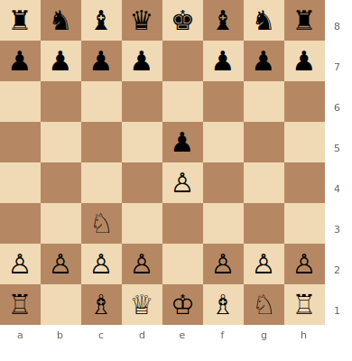
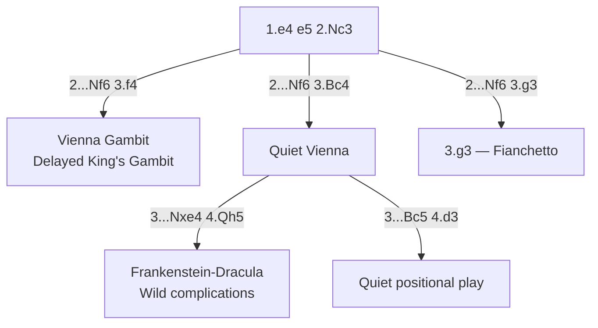

# Vienna Game

**1.e4 e5 2.Nc3**

White develops the knight to c3 before committing the f-pawn or d-pawn. This flexible move order allows White to play a delayed King's Gambit (f4) or a positional setup. A useful surprise weapon.

**Position after 1.e4 e5 2.Nc3 (Vienna Game)**



> **FEN:** `rnbqkbnr/pppp1ppp/8/4p3/4P3/2N5/PPPP1PPP/R1BQKBNR w - - 0 1`

**See also:** [King's Gambit](kings-gambit.md) | [Four Knights](four-knights.md) | [Italian Game](italian-game.md)

### Variation Tree



---

## Vienna Gambit (2...Nf6 3.f4)

```
1.e4 e5 2.Nc3 Nf6 3.f4 d5 4.fxe5 Nxe4 5.Nf3 (or 5.d3)
```

A delayed King's Gambit with the knight already developed. White aims to open the f-file while maintaining flexibility.

### Strategic Ideas

| White | Black |
|-------|-------|
| Open the f-file for attack | Challenge immediately with ...d5 |
| Nc3 supports e4 and potential f4 | Active piece play compensates for any structural issues |
| Can transpose to King's Gambit structures | Counter in the centre before White consolidates |

---

## Quiet Vienna (2...Nf6 3.Bc4 or 3.g3)

```
1.e4 e5 2.Nc3 Nf6 3.Bc4 Bc5 (or Nxe4) 4.d3
```

A slower approach. White avoids early commitments, keeping options for both f4 and d4 breaks. Often leads to manoeuvring positions.

---

## Frankenstein-Dracula Variation

```
1.e4 e5 2.Nc3 Nf6 3.Bc4 Nxe4 4.Qh5 Nd6 5.Bb3 Nc6 6.Nb5 g6 7.Qf3 f5 8.Qd5 Qe7 9.Nxc7+ Kd8 10.Nxa8 b6
```

One of the wildest lines in chess — both sides sacrifice material for initiative. Named for its monstrous complications.

## Famous Practitioners

Mikhail Chigorin, Rudolf Spielmann, and various modern players as a surprise weapon.

## Who Should Play It

Players who want an alternative to the mainline 2.Nf3 systems. The Vienna gives White flexibility and avoids well-known theoretical battles.

---

**Next:** [Four Knights Game](four-knights.md) | **Back to:** [Openings Index](../index.md)
